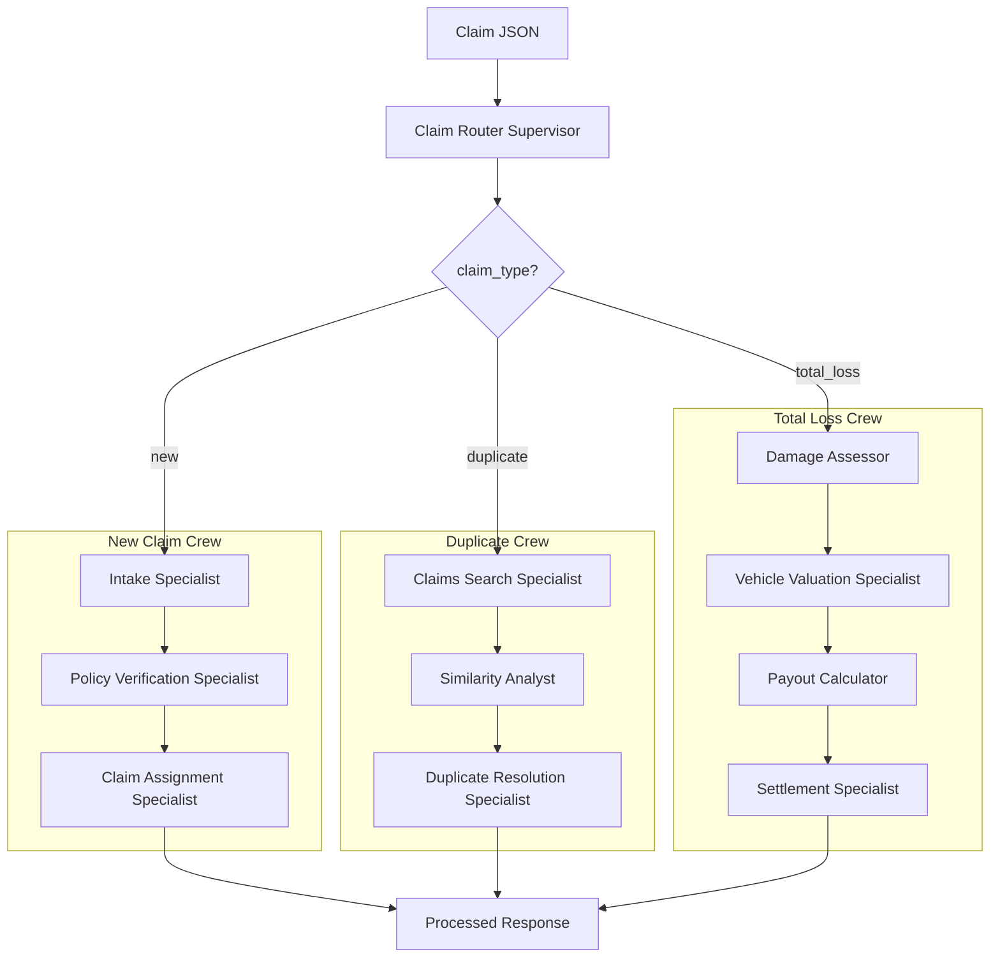

# Agentic Claim Representative POC

Proof of concept for an agentic AI system acting as a Claim Representative for auto insurance claims. Built with [CrewAI](https://crewai.com/) and Python.

## Features

- **Workflow routing**: A router agent classifies incoming claims as `new`, `duplicate`, or `total_loss` and routes to the appropriate workflow.
- **New claim workflow**: Intake validation, policy check, and claim ID assignment.
- **Duplicate claim workflow**: Search existing claims, compute similarity, and resolve (merge/reject).
- **Total loss workflow**: Damage assessment, vehicle valuation (mock KBB), payout calculation, and settlement.
- **Tools**: Policy DB query, claims search, similarity, vehicle value, report generation, and California compliance lookup—exposed as CrewAI tools and optionally via a local MCP server.

## Architecture



## Execution flow

Running the agent on a claim file (e.g. `python -m claim_agent.main tests/sample_claims/new_claim.json`) runs this flow:

1. **Router crew**  
   A single agent (Claim Router Supervisor) receives the claim JSON and classifies it as exactly one of: `new`, `duplicate`, or `total_loss`. It returns one word plus a one-sentence reasoning.

2. **Workflow crew** (depends on classification)  
   - **New claim crew**  
     - **Intake Specialist**: Validates required fields (policy_number, vin, vehicle_year, vehicle_make, vehicle_model, incident_date, incident_description, damage_description) and data types.  
     - **Policy Verification Specialist**: Uses `query_policy_db` to verify the policy is active and has valid coverage.  
     - **Claim Assignment Specialist**: Uses `generate_claim_id` (prefix `CLM`), sets status to `open`, then uses `generate_claim_report` to produce the final report.  
   - **Duplicate crew**: Searches existing claims, computes similarity, resolves (merge/reject).  
   - **Total loss crew**: Damage assessment, vehicle valuation (mock KBB), payout calculation, settlement.

3. **Output**  
   JSON written to stdout with:
   - `claim_type`: `new` | `duplicate` | `total_loss`
   - `router_output`: Classification + reasoning from the router
   - `workflow_output`: Summary from the workflow crew (e.g. claim ID, status, summary)
   - `summary`: Same as `workflow_output` for convenience

Example output for a **new** claim:

```json
{
  "claim_type": "new",
  "router_output": "new\nThis claim appears to be a first-time submission with no indications of previous reports or total loss status.",
  "workflow_output": "Claim ID: CLM-11EEF959, Status: open, Summary: Claim has been initiated successfully with a unique ID.",
  "summary": "Claim ID: CLM-11EEF959, Status: open, Summary: Claim has been initiated successfully with a unique ID."
}
```

## Requirements

- Python 3.10+
- [OpenRouter](https://openrouter.ai/) API key (or OpenAI-compatible API) for the LLM

## Setup

1. Clone the repo (or navigate to it) and enter the project directory:

   ```bash
   cd auto-agent
   ```

2. Create a virtual environment and install dependencies (includes `litellm` for OpenRouter/custom LLM endpoints):

   ```bash
   python -m venv .venv
   source .venv/bin/activate   # Windows: .venv\Scripts\activate
   pip install -e ".[dev]"
   ```

3. Copy environment template and set your API key:

   ```bash
   cp .env.example .env
   # Edit .env: set OPENAI_API_KEY to your OpenRouter key.
   # OPENAI_API_BASE and OPENAI_MODEL_NAME are pre-filled for OpenRouter.
   ```

## Usage

### CLI

Run the agent on a claim JSON file:

```bash
python -m claim_agent.main tests/sample_claims/new_claim.json
```

Or after installing the package:

```bash
claim-agent tests/sample_claims/new_claim.json
```

Output is JSON with `claim_type`, `router_output`, `workflow_output`, and `summary`.

### Sample claims

- `tests/sample_claims/new_claim.json` – standard new claim
- `tests/sample_claims/duplicate_claim.json` – possible duplicate (same VIN/date as a claim in mock DB). **Duplicate detection will only find it after you run the seed script** so that the historical claim exists in SQLite.
- `tests/sample_claims/total_loss_claim.json` – flood total loss

### Data

- **mock_db.json** (env: `MOCK_DB_PATH`): Used by tools for **policies** (policy validation) and **vehicle_values** (valuation). The **claims** array is reference/seed data only—it is not used for claim search or duplicate detection.
- **SQLite** (env: `CLAIMS_DB_PATH`, default `data/claims.db`): Persists claims created by the app (CLI/workflows). Claim search and duplicate detection use this database only. To make mock "historical" claims searchable, run the seed script (see below).
- **California compliance**: Reference data for CA auto claims rules, deadlines, and disclosures lives in `data/california_auto_compliance.json`. Agents can search it via the `search_california_compliance` tool. Override path with `CA_COMPLIANCE_PATH`.

To load the mock historical claims into SQLite (so they appear in claim search), run:

```bash
python scripts/seed_claims_from_mock_db.py
```

Use `CLAIMS_DB_PATH` to target a different SQLite file (default is `data/claims.db`).

```bash
export MOCK_DB_PATH=/path/to/your/mock_db.json
export CLAIMS_DB_PATH=data/claims.db
export CA_COMPLIANCE_PATH=/path/to/california_auto_compliance.json  # optional
```

## MCP server (optional)

Run the claim tools as an MCP server (stdio):

```bash
python -m claim_agent.mcp_server.server
```

CrewAI agents can connect to this server via `MCPServerStdio` for tool discovery.

## Testing

Install dev dependencies and run tests:

```bash
pip install -e ".[dev]"
export MOCK_DB_PATH=data/mock_db.json
pytest tests/ -v
```

Unit tests for tools run without an API key. Crew integration tests are skipped unless `OPENAI_API_KEY` is set.

## Project layout

```
auto-agent/
├── src/claim_agent/
│   ├── main.py           # CLI entry
│   ├── config/           # LLM and config
│   ├── agents/           # Router, intake, policy, duplicate, total loss
│   ├── crews/            # Main, new claim, duplicate, total loss crews
│   ├── tools/            # Policy, claims, valuation, document tools + logic
│   ├── mcp_server/       # MCP server (stdio)
│   └── models/           # ClaimType, ClaimInput, ClaimOutput, WorkflowState
├── data/
│   ├── mock_db.json
│   └── california_auto_compliance.json   # CA claims rules, deadlines, disclosures (searchable via tool)
├── scripts/
│   └── seed_claims_from_mock_db.py   # Load mock_db.claims into SQLite for claim search
├── tests/
│   ├── test_tools.py
│   ├── test_crews.py
│   └── sample_claims/
└── pyproject.toml
```

## License

MIT
