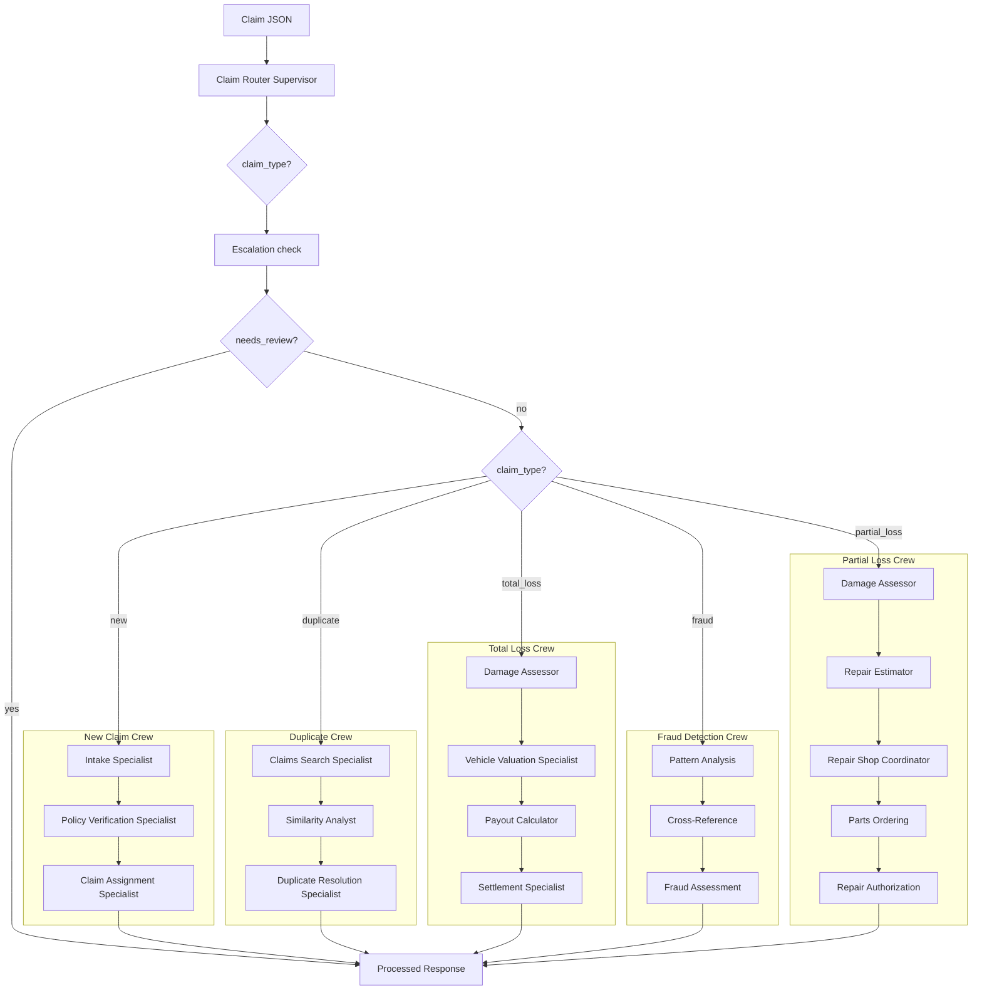

# Agentic Claim Representative POC

Proof of concept for an agentic AI system acting as a Claim Representative for auto insurance claims. Built with [CrewAI](https://crewai.com/) and Python.

## Features

- **Workflow routing**: A router agent classifies incoming claims as `new`, `duplicate`, `total_loss`, `fraud`, or `partial_loss` and routes to the appropriate workflow.
- **Escalation (HITL)**: After classification, an escalation check can flag claims for human review (e.g. fraud indicators, high payout). Escalated claims get status `needs_review` and skip the workflow crew until reviewed.
- **New claim workflow**: Intake validation, policy check, and claim ID assignment.
- **Duplicate claim workflow**: Search existing claims, compute similarity, and resolve (merge/reject).
- **Total loss workflow**: Damage assessment, vehicle valuation (mock KBB), payout calculation, and settlement.
- **Fraud detection workflow**: Pattern analysis (multiple claims, suspicious timing), cross-reference with fraud indicators, and fraud assessment with likelihood score and SIU referral recommendation.
- **Partial loss workflow**: Damage assessment, repair estimate (parts/labor), repair shop assignment, parts ordering, and repair authorization for repairable damage.
- **Tools**: Policy DB query, claims search, similarity, vehicle value, report generation, California compliance lookup, escalation evaluation, fraud tools (pattern analysis, cross-reference, assessment, fraud report), and partial-loss tools (damage evaluation, repair estimate, repair shops, parts catalog)—exposed as CrewAI tools and optionally via a local MCP server.

## Architecture



*For claims classified as **fraud**, the escalation check is skipped and the fraud detection crew runs directly.*

## Execution flow

Running the agent on a claim file (e.g. `python -m claim_agent.main process tests/sample_claims/new_claim.json`) runs this flow:

1. **Router crew**  
   A single agent (Claim Router Supervisor) receives the claim JSON and classifies it as exactly one of: `new`, `duplicate`, `total_loss`, `fraud`, or `partial_loss`. It returns one word plus a one-sentence reasoning.

2. **Escalation check (HITL)**  
   Before running a workflow crew, the system evaluates whether the claim needs human review (e.g. fraud indicators, high-value payout). If `needs_review` is true, the claim status is set to `needs_review`, escalation reasons and priority are returned, and the flow stops—no workflow crew runs. **Exception:** For claims classified as **fraud**, the escalation check is skipped and the fraud detection crew runs directly (it performs its own fraud assessment and SIU referral).

3. **Workflow crew** (only if not escalated; depends on classification)  
   - **New claim crew**  
     - **Intake Specialist**: Validates required fields (policy_number, vin, vehicle_year, vehicle_make, vehicle_model, incident_date, incident_description, damage_description; optional: estimated_damage) and data types.  
     - **Policy Verification Specialist**: Uses `query_policy_db` to verify the policy is active and has valid coverage.  
     - **Claim Assignment Specialist**: Uses `generate_claim_id` (prefix `CLM`), sets status to `open`, then uses `generate_report` to produce the final report.  
   - **Duplicate crew**: Searches existing claims, computes similarity, resolves (merge/reject).  
   - **Total loss crew**: Damage assessment, vehicle valuation (mock KBB), payout calculation, settlement.  
   - **Fraud detection crew**: Pattern analysis (multiple claims, suspicious timing), cross-reference with fraud indicators, fraud assessment with likelihood score and SIU referral.  
   - **Partial loss crew**: Damage assessment (repairable scope), repair estimate (parts/labor), repair shop assignment, parts ordering, repair authorization.

4. **Output**  
   JSON written to stdout. When **not escalated**:
   - `claim_id`: Assigned or existing claim ID
   - `claim_type`: `new` | `duplicate` | `total_loss` | `fraud` | `partial_loss`
   - `router_output`: Classification + reasoning from the router
   - `workflow_output`: Summary from the workflow crew (e.g. claim ID, status, summary)
   - `summary`: Same as `workflow_output` for convenience  

   When **escalated** (`needs_review`), the response also includes: `status` (`needs_review`), `escalation_reasons`, `priority` (low/medium/high/critical), `recommended_action`, `fraud_indicators`, and `workflow_output` holds escalation details (JSON).

Example output for a **new** (non-escalated) claim:

```json
{
  "claim_id": "CLM-11EEF959",
  "claim_type": "new",
  "router_output": "new\nThis claim appears to be a first-time submission with no indications of previous reports or total loss status.",
  "workflow_output": "Claim ID: CLM-11EEF959, Status: open, Summary: Claim has been initiated successfully with a unique ID.",
  "summary": "Claim ID: CLM-11EEF959, Status: open, Summary: Claim has been initiated successfully with a unique ID."
}
```

Example output when **escalated** (human review required):

```json
{
  "claim_id": "CLM-11EEF959",
  "claim_type": "new",
  "status": "needs_review",
  "router_output": "new\n...",
  "workflow_output": "{\"escalation_reasons\": [\"high_value\", \"low_confidence\"], \"priority\": \"high\", ...}",
  "summary": "Escalated for review: high_value, low_confidence.",
  "escalation_reasons": ["high_value", "low_confidence"],
  "priority": "high",
  "needs_review": true,
  "recommended_action": "Verify repair estimates with shop.",
  "fraud_indicators": []
}
```

## Requirements

- Python 3.10+
- [OpenRouter](https://openrouter.ai/) API key (or OpenAI-compatible API) for the LLM

## Setup

1. Clone the repo (or navigate to it) and enter the project directory:

   ```bash
   cd auto-agent
   ```

2. Create a virtual environment and install dependencies (includes `litellm` for OpenRouter/custom LLM endpoints):

   ```bash
   python -m venv .venv
   source .venv/bin/activate   # Windows: .venv\Scripts\activate
   pip install -e ".[dev]"
   ```

3. Copy environment template and set your API key:

   ```bash
   cp .env.example .env
   # Edit .env: set OPENAI_API_KEY to your OpenRouter key.
   # OPENAI_API_BASE and OPENAI_MODEL_NAME are pre-filled for OpenRouter.
   ```

## Usage

### CLI

Subcommands (install the package first: `pip install -e .`):

| Command | Description |
|---------|-------------|
| `claim-agent process <claim.json>` | Process a claim from a JSON file |
| `claim-agent status <claim_id>` | Print claim status (from SQLite) |
| `claim-agent history <claim_id>` | Print claim audit log |
| `claim-agent reprocess <claim_id>` | Re-run workflow for an existing claim |

Examples:

```bash
# Process a claim (recommended)
claim-agent process tests/sample_claims/new_claim.json
# or
python -m claim_agent.main process tests/sample_claims/new_claim.json

# Legacy: single file path still works
claim-agent tests/sample_claims/new_claim.json

# Status and history
claim-agent status CLM-11EEF959
claim-agent history CLM-11EEF959

# Re-run workflow for an existing claim
claim-agent reprocess CLM-11EEF959
```

Output is JSON: `claim_type`, `router_output`, `workflow_output`, `summary`; when escalated, also `status`, `escalation_reasons`, `priority`, etc.

### Sample claims

- `tests/sample_claims/new_claim.json` – standard new claim
- `tests/sample_claims/duplicate_claim.json` – possible duplicate (same VIN/date as a claim in mock DB). **Duplicate detection will only find it after you run the seed script** so that the historical claim exists in SQLite.
- `tests/sample_claims/total_loss_claim.json` – flood total loss
- `tests/sample_claims/fraud_claim.json` – claim with fraud indicators (staged accident, inflated estimates)
- `tests/sample_claims/partial_loss_claim.json` – repairable damage (generic)
- `tests/sample_claims/partial_loss_fender.json` – fender damage
- `tests/sample_claims/partial_loss_front_collision.json` – front collision

### Data

- **mock_db.json** (env: `MOCK_DB_PATH`): Used by tools for **policies** (policy validation) and **vehicle_values** (valuation). The **claims** array is reference/seed data only—it is not used for claim search or duplicate detection.
- **SQLite** (env: `CLAIMS_DB_PATH`, default `data/claims.db`): Persists claims created by the app (CLI/workflows). Claim search and duplicate detection use this database only. To make mock "historical" claims searchable, run the seed script (see below).
- **California compliance**: Reference data for CA auto claims rules, deadlines, and disclosures lives in `data/california_auto_compliance.json`. Agents can search it via the `search_california_compliance` tool. Override path with `CA_COMPLIANCE_PATH`.
- **State policy language**: Reference policy language samples live in `data/` as `california_auto_policy_language.json`, `florida_auto_policy_language.json`, `new_york_auto_policy_language.json`, and `texas_auto_policy_language.json`. These are for reference; tools currently use only `mock_db.json` and `california_auto_compliance.json`.

To load the mock historical claims into SQLite (so they appear in claim search), run:

```bash
python scripts/seed_claims_from_mock_db.py
```

Use `CLAIMS_DB_PATH` to target a different SQLite file (default is `data/claims.db`).

```bash
export MOCK_DB_PATH=/path/to/your/mock_db.json
export CLAIMS_DB_PATH=data/claims.db
export CA_COMPLIANCE_PATH=/path/to/california_auto_compliance.json  # optional
```

## MCP server (optional)

Run the claim tools as an MCP server (stdio):

```bash
python -m claim_agent.mcp_server.server
```

CrewAI agents can connect to this server via `MCPServerStdio` for tool discovery.

## Testing

Install dev dependencies and run tests:

```bash
pip install -e ".[dev]"
export MOCK_DB_PATH=data/mock_db.json
pytest tests/ -v
```

Unit tests for tools run without an API key. Crew integration tests are skipped unless `OPENAI_API_KEY` is set.

## Project layout

```
auto-agent/
├── src/claim_agent/
│   ├── main.py           # CLI entry (process, status, history, reprocess)
│   ├── config/           # LLM and agent/task config
│   ├── agents/           # Router, new claim, duplicate, total loss, fraud, partial loss, escalation
│   ├── crews/            # Main, new claim, duplicate, total loss, fraud detection, partial loss, escalation crews
│   ├── db/               # SQLite database, repository, constants
│   ├── tools/            # Policy, claims, valuation, document, escalation, fraud, partial_loss tools + logic
│   ├── mcp_server/       # MCP server (stdio)
│   └── models/           # ClaimType, ClaimInput, ClaimOutput, EscalationOutput, WorkflowState
├── data/
│   ├── mock_db.json
│   ├── california_auto_compliance.json   # CA claims rules, deadlines, disclosures (searchable via tool)
│   ├── california_auto_policy_language.json
│   ├── florida_auto_policy_language.json
│   ├── new_york_auto_policy_language.json
│   └── texas_auto_policy_language.json
├── scripts/
│   └── seed_claims_from_mock_db.py   # Load mock_db.claims into SQLite for claim search
├── tests/
│   ├── test_tools.py
│   ├── test_crews.py
│   ├── test_db.py
│   ├── test_main.py
│   ├── test_escalation.py
│   ├── test_fraud.py
│   ├── test_partial_loss_tools.py
│   └── sample_claims/
└── pyproject.toml
```

## License

MIT
