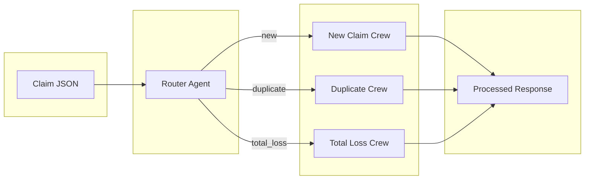
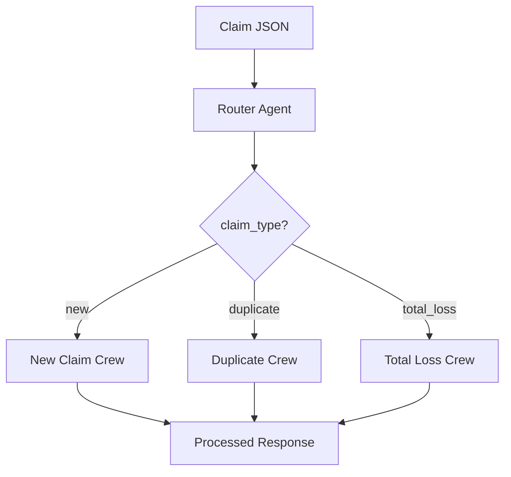

# Agentic Claim Representative POC

Proof of concept for an agentic AI system acting as a Claim Representative for auto insurance claims. Built with [CrewAI](https://crewai.com/) and Python.

## Features

- **Workflow routing**: A router agent classifies incoming claims as `new`, `duplicate`, or `total_loss` and routes to the appropriate workflow.
- **New claim workflow**: Intake validation, policy check, and claim ID assignment.
- **Duplicate claim workflow**: Search existing claims, compute similarity, and resolve (merge/reject).
- **Total loss workflow**: Damage assessment, vehicle valuation (mock KBB), payout calculation, and settlement.
- **Tools**: Policy DB query, claims search, similarity, vehicle value, report generation—exposed as CrewAI tools and optionally via a local MCP server.

## Architecture





## Requirements

- Python 3.10+
- [OpenRouter](https://openrouter.ai/) API key (or OpenAI-compatible API) for the LLM

## Setup

1. Clone the repo (or navigate to it) and enter the project directory:

   ```bash
   cd auto-agent
   ```

2. Create a virtual environment and install dependencies:

   ```bash
   python -m venv .venv
   source .venv/bin/activate   # Windows: .venv\Scripts\activate
   pip install -e .
   ```

3. Copy environment template and set your API key:

   ```bash
   cp .env.example .env
   # Edit .env: set OPENAI_API_KEY to your OpenRouter key.
   # OPENAI_API_BASE and OPENAI_MODEL_NAME are pre-filled for OpenRouter.
   ```

## Usage

### CLI

Run the agent on a claim JSON file:

```bash
python -m claim_agent.main tests/sample_claims/new_claim.json
```

Or after installing the package:

```bash
claim-agent tests/sample_claims/new_claim.json
```

Output is JSON with `claim_type`, `router_output`, `workflow_output`, and `summary`.

### Sample claims

- `tests/sample_claims/new_claim.json` – standard new claim
- `tests/sample_claims/duplicate_claim.json` – possible duplicate (same VIN/date as in mock DB)
- `tests/sample_claims/total_loss_claim.json` – flood total loss

### Mock data

Mock policy and claims data live in `data/mock_db.json`. Override path with:

```bash
export MOCK_DB_PATH=/path/to/your/mock_db.json
```

## MCP server (optional)

Run the claim tools as an MCP server (stdio):

```bash
python -m claim_agent.mcp_server.server
```

CrewAI agents can connect to this server via `MCPServerStdio` for tool discovery.

## Testing

Install dev dependencies and run tests:

```bash
pip install -e ".[dev]"
export MOCK_DB_PATH=data/mock_db.json
pytest tests/ -v
```

Unit tests for tools run without an API key. Crew integration tests are skipped unless `OPENAI_API_KEY` is set.

## Project layout

```
auto-agent/
├── src/claim_agent/
│   ├── main.py           # CLI entry
│   ├── config/           # LLM and config
│   ├── agents/           # Router, intake, policy, duplicate, total loss
│   ├── crews/            # Main, new claim, duplicate, total loss crews
│   ├── tools/            # Policy, claims, valuation, document tools + logic
│   ├── mcp_server/       # MCP server (stdio)
│   └── models/           # ClaimType, ClaimInput, ClaimOutput, WorkflowState
├── data/mock_db.json
├── tests/
│   ├── test_tools.py
│   ├── test_crews.py
│   └── sample_claims/
└── pyproject.toml
```

## License

MIT
