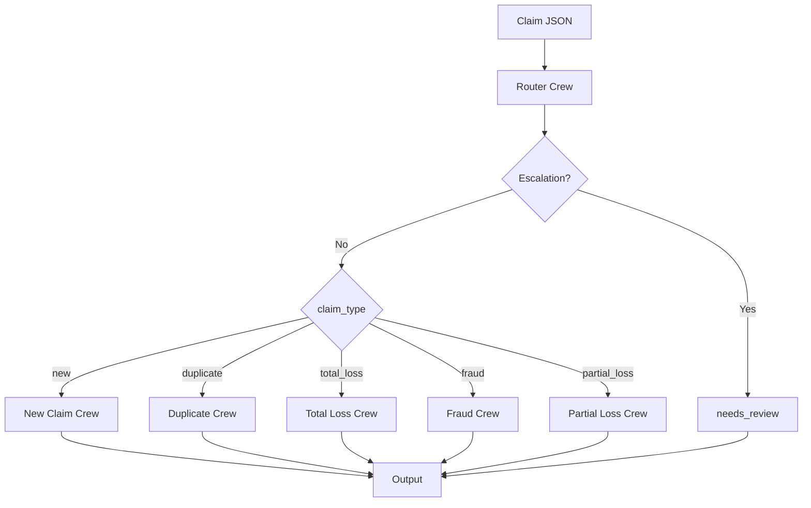

# Agentic Claim Representative POC

Proof of concept for an agentic AI system acting as a Claim Representative for auto insurance claims. Built with [CrewAI](https://crewai.com/) and Python.

## Features

- **Workflow Routing** - Router agent classifies claims and delegates to specialized crews
- **Human-in-the-Loop** - Escalation for fraud indicators, high-value, or low-confidence claims (configurable thresholds)
- **Five Claim Types** - New, duplicate, total loss, fraud, and partial loss workflows
- **Persistent State** - SQLite database with full audit trail
- **Observability** - Structured logging, correlation IDs, LLM tracing (LangSmith/LiteLLM), cost and latency metrics
- **Configuration** - Centralized settings for escalation, fraud, valuation, token budgets (see `.env.example`)
- **Security & Resilience** - Input sanitization, parameterized DB queries, retry for transient LLM failures
- **MCP Server** - Optional external tool access and health check via Model Context Protocol
- **RAG** - Semantic search over policy and compliance (see [RAG](docs/rag.md))

## Architecture



## Quick Start

```bash
# Setup
python -m venv .venv
source .venv/bin/activate
pip install -e ".[dev]"
cp .env.example .env
# Edit .env with your OpenRouter/OpenAI API key

# Process a claim
claim-agent process tests/sample_claims/partial_loss_parking.json

# Check status
claim-agent status CLM-11EEF959
```

## CLI Commands

| Command | Description |
|---------|-------------|
| `claim-agent process <file>` | Process a claim from JSON |
| `claim-agent status <id>` | Get claim status |
| `claim-agent history <id>` | Get claim audit log |
| `claim-agent reprocess <id>` | Re-run workflow |
| `claim-agent metrics [id]` | Show metrics (optional claim ID) |

## Sample Claims

| File | Type |
|------|------|
| `tests/sample_claims/new_claim.json` | New |
| `tests/sample_claims/partial_loss_parking.json` | Partial loss (parking) |
| `tests/sample_claims/duplicate_claim.json` | Duplicate |
| `tests/sample_claims/total_loss_claim.json` | Total loss |
| `tests/sample_claims/fraud_claim.json` | Fraud |
| `tests/sample_claims/partial_loss_claim.json` | Partial loss |
| `tests/sample_claims/partial_loss_fender.json` | Partial loss |
| `tests/sample_claims/partial_loss_front_collision.json` | Partial loss |

## Documentation

Detailed documentation is available in the [`docs/`](docs/) folder:

| Document | Description |
|----------|-------------|
| [Getting Started](docs/getting-started.md) | Installation and quick start |
| [Architecture](docs/architecture.md) | System design and patterns |
| [Crews](docs/crews.md) | Workflow crews and agents |
| [Claim Types](docs/claim-types.md) | Classification criteria |
| [Agent Flow](docs/agent-flow.md) | Execution flow |
| [Tools](docs/tools.md) | Tool reference |
| [Database](docs/database.md) | Schema and operations |
| [Configuration](docs/configuration.md) | Environment and centralized settings |
| [Observability](docs/observability.md) | Logging, tracing, metrics |
| [RAG](docs/rag.md) | Policy and compliance search |
| [MCP Server](docs/mcp-server.md) | External tool access and health check |

## Project Layout

```
src/claim_agent/
├── main.py           # CLI entry point
├── config/           # LLM (llm.py) and centralized settings (settings.py)
├── agents/           # Agent definitions
├── crews/            # Crew definitions
├── tools/            # CrewAI tools
├── utils/            # Sanitization, retry
├── db/               # SQLite database
├── models/           # Pydantic models (ClaimInput, ClaimType, etc.)
├── observability/   # Logging, tracing, metrics
└── mcp_server/      # Optional MCP server (includes health_check)
```

## Testing

```bash
# Unit tests (no API key needed)
export MOCK_DB_PATH=data/mock_db.json
pytest tests/ -v

# Integration tests (API key required)
pytest tests/test_crews.py -v
```

## Data Setup

To enable duplicate detection with historical claims:

```bash
python scripts/seed_claims_from_mock_db.py
```

## MCP Server (Optional)

Run claim tools as an MCP server:

```bash
python -m claim_agent.mcp_server.server
```

## Requirements

- Python 3.10+
- [OpenRouter](https://openrouter.ai/) or OpenAI API key

## License

MIT
