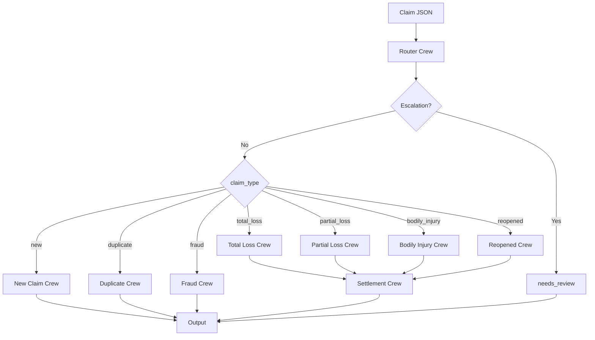

# Agentic Claim Representative POC

Proof of concept for an agentic AI system acting as a Claim Representative for auto insurance claims. Built with [CrewAI](https://crewai.com/) and Python.

**New here?** Use [Quick Start](#quick-start) below, then skim [Sample claims](#sample-claims) and the [docs index](#documentation).

### What you need

| | |
|--|--|
| **Python** | 3.10 or newer |
| **LLM** | A valid [OpenRouter](https://openrouter.ai/) or OpenAI API key in `.env` for **`claim-agent process`** / `serve` (agents call a real model). The **test suite** mocks the LLM and does not need a key. **Mock crew** simulates claimants/vision/webhooks—it does *not* replace the workflow LLM. |
| **Dashboard (optional)** | [Node.js](https://nodejs.org/) with `npm` for `cd frontend && npm run dev` |

More detail: [Getting Started](docs/getting-started.md). On Windows, activate the venv with `.venv\Scripts\activate` instead of `source .venv/bin/activate`.

## Features

- **Workflow Routing** - Router agent classifies claims and delegates to specialized crews
- **Human-in-the-Loop** - Escalation for fraud indicators, high-value, or low-confidence claims (configurable thresholds)
- **Seven Claim Types** - New, duplicate, total loss, fraud, partial loss, bodily injury, and reopened workflows
- **Persistent State** - SQLite by default for local dev; set `DATABASE_URL` for PostgreSQL in production (SQLAlchemy pooling, Alembic migrations). See [Database](docs/database.md).
- **Reserve Management** - Case reserves at FNOL, `reserve_history`, adjuster/supervisor authority limits, adequacy vs. estimate and payout (see [Database](docs/database.md), [Configuration](docs/configuration.md#reserve-management))
- **Payment ledger** - `claim_payments` disbursements, API issue/clear/void, authority limits, optional auto-row from settlement payout (see [Database](docs/database.md#claim_payments), [Configuration](docs/configuration.md#disbursements--payment-authority))
- **Observability** - Structured logging, correlation IDs, LLM tracing (LangSmith/LiteLLM), cost and latency metrics
- **Configuration** - Centralized settings for escalation, fraud, valuation, token budgets (see `.env.example`)
- **Security & Resilience** - Input sanitization, parameterized DB queries, retry for transient LLM failures; API rate limiting (in-memory by default, **`REDIS_URL`** + `pip install -e '.[redis]'` for shared limits across instances — see [Configuration](docs/configuration.md#api-rate-limiting))
- **MCP Server** - Optional external tool access and health check via Model Context Protocol
- **RAG** - Semantic search over policy and compliance (see [RAG](docs/rag.md))
- **Webhooks** - Outbound webhooks for status changes and repair authorization
- **Adapters** - Pluggable backends for policy, valuation, repair shops, parts, SIU (see `.env.example`)
- **File Attachments** - Photos, PDFs, estimates via CLI `--attachment` or API upload
- **Mock Crew** - Simulate external interactions (claimant, vision, image gen) for E2E testing without real services (see [Mock Crew Design](docs/mock-crew-design.md))

## Architecture


```mermaid
flowchart TB
    A[Claim JSON] --> B[Router Crew]
    B --> C{Escalation?}
    C -->|Yes| D[needs_review]
    C -->|No| E{claim_type}

    E -->|new| F[New Claim Crew]
    E -->|duplicate| G[Duplicate Crew]
    E -->|total_loss| H[Total Loss Crew]
    E -->|fraud| I[Fraud Crew]
    E -->|partial_loss| J[Partial Loss Crew]
    E -->|bodily_injury| BI[Bodily Injury Crew]
    E -->|reopened| R[Reopened Crew]

    F --> K[Output]
    G --> K
    H --> S[Settlement Crew]
    I --> K
    J --> S
    BI --> S
    R --> S
    S --> K
    D --> K
```

## Quick Start

```bash
# Setup (from repo root)
python -m venv .venv
source .venv/bin/activate   # Windows: .venv\Scripts\activate
pip install -e ".[dev]"
cp .env.example .env
```

**Run a claim (needs a real key):** In `.env`, set `OPENAI_API_KEY` to a real value (not the `your_openrouter_key` placeholder). For OpenRouter, keep `OPENAI_API_BASE` and `OPENAI_MODEL_NAME` aligned with `.env.example`.

```bash
claim-agent process tests/sample_claims/partial_loss_parking.json
claim-agent status CLM-XXXXXXXX   # use the claim_id printed by process
```

The first run may download embedding models used for RAG (~tens of MB); subsequent runs are faster.

**No API key yet?** Run the project tests (they mock the LLM)—see [Testing](#testing). Optional: add `MOCK_CREW_ENABLED=true`, `VISION_ADAPTER=mock`, and `MOCK_IMAGE_VISION_ANALYSIS_SOURCE=claim_context` to reduce external vision calls once you do have a key ([Mock Crew](#testing) snippet below).

## CLI Commands

| Command | Description |
|---------|-------------|
| `claim-agent serve [--reload] [--port <port>] [--host <host>] [--workers N]` | Start REST API server (`--workers` requires PostgreSQL) |
| `claim-agent process <file> [--attachment/-a <file> ...]` | Process a claim from JSON (optionally attach photos, PDFs, estimates) |
| `claim-agent status <id>` | Get claim status |
| `claim-agent history <id>` | Get claim audit log |
| `claim-agent reprocess <id> [--from-stage <stage>]` | Re-run workflow (optionally resume from a stage: `coverage_verification`, `economic_analysis`, `fraud_prescreening`, `duplicate_detection`, `router`, `escalation_check`, `workflow`, `task_creation`, `rental`, `liability_determination`, `settlement`, `subrogation`, `salvage`, `after_action`) |
| `claim-agent metrics [id]` | Show metrics (optional claim ID) |
| `claim-agent review-queue [--assignee X] [--priority P]` | List claims needing review |
| `claim-agent assign <id> <assignee>` | Assign claim to adjuster |
| `claim-agent approve <id> [--confirmed-claim-type X] [--confirmed-payout N] [--notes "..."]` | Approve, run handback, then workflow (supervisor) |
| `claim-agent reject <id> [--reason "..."]` | Reject claim |
| `claim-agent request-info <id> [--note "..."]` | Request more info |
| `claim-agent escalate-siu <id>` | Escalate to SIU |
| `claim-agent retention-enforce [--dry-run] [--years N] [--include-litigation-hold]` | Archive claims older than retention period |
| `claim-agent document-retention-enforce [--dry-run] [--as-of YYYY-MM-DD]` | Soft-archive claim documents past `retention_date` (does not delete files) |
| `claim-agent retention-purge [--dry-run] [--years N] [--include-litigation-hold] [--export-before-purge]` | Purge archived claims past purge horizon (anonymize PII) |
| `claim-agent retention-export [--dry-run] [--years N] [--include-litigation-hold]` | Export eligible archived claims to S3/Glacier (requires retention export settings) |
| `claim-agent retention-report [--years N] [--purge-years N] [--audit-purge-years N] [--include-litigation-hold-audit]` | Retention audit report (counts by tier, litigation hold, pending archive/purge) |
| `claim-agent audit-log-export --output/-o FILE [--dry-run] [--years N] ...` | Export audit log rows for purged claims past audit horizon (NDJSON) |
| `claim-agent audit-log-purge [--dry-run] [--years N] [--ack-exported] ...` | Delete eligible audit log rows (requires `AUDIT_LOG_PURGE_ENABLED=true` and `--ack-exported`) |
| `claim-agent litigation-hold --claim-id X` plus `--on` or `--off` | Set or clear litigation hold (exactly one of `--on` / `--off`) |
| `claim-agent dsar-access --claimant-email X [--claim-id Y \| --policy P --vin V] [--fulfill]` | Submit DSAR access request (right-to-know) |
| `claim-agent dsar-deletion --claimant-email X [--claim-id Y \| --policy P --vin V] [--fulfill]` | Submit DSAR deletion request (right-to-delete) |
| `claim-agent diary-escalate [--db PATH]` | Run deadline escalation (notify overdue, escalate to supervisor) |
| `claim-agent ucspa-deadlines [--days N] [--webhooks / --no-webhooks]` | Check UCSPA deadlines; webhooks on by default (`--no-webhooks` to suppress) |
| `claim-agent run-scheduler` | Run scheduler as a dedicated single-instance foreground process (requires `SCHEDULER_ENABLED=true`; do not run with the API server) |

**Global options** (apply before any command): `--debug` (enable debug logging), `--json` (JSON log format).

## Sample Claims

| File | Type |
|------|------|
| `tests/sample_claims/new_claim.json` | New |
| `tests/sample_claims/partial_loss_parking.json` | Partial loss (parking) |
| `tests/sample_claims/duplicate_claim.json` | Duplicate |
| `tests/sample_claims/total_loss_claim.json` | Total loss |
| `tests/sample_claims/fraud_claim.json` | Fraud |
| `tests/sample_claims/partial_loss_claim.json` | Partial loss |
| `tests/sample_claims/partial_loss_fender.json` | Partial loss |
| `tests/sample_claims/partial_loss_front_collision.json` | Partial loss |
| `tests/sample_claims/bodily_injury_claim.json` | Bodily injury (BI workflow) |
| `tests/sample_claims/reopened_claim.json` | Reopened (prior settled claim) |
| `tests/sample_claims/coverage_denied_theft.json` | Coverage denied (theft) |
| `tests/sample_claims/territory_denied_mexico.json` | Territory / jurisdiction |
| `tests/sample_claims/multi_vehicle_incident.json` | Multi-vehicle / incident grouping |

## Documentation

Detailed documentation is available in the [`docs/`](docs/) folder:

| Document | Description |
|----------|-------------|
| [Getting Started](docs/getting-started.md) | Installation and quick start |
| [Architecture](docs/architecture.md) | System design and patterns |
| [Crews](docs/crews.md) | Workflow crews and agents |
| [Skills](docs/skills.md) | Agent prompts and operational procedures |
| [Claim Types](docs/claim-types.md) | Classification criteria |
| [Agent Flow](docs/agent-flow.md) | Execution flow |
| [Adjuster Workflow](docs/adjuster-workflow.md) | Human review workflow |
| [Tools](docs/tools.md) | Tool reference |
| [Webhooks](docs/webhooks.md) | Outbound webhooks |
| [Adapters](docs/adapters.md) | Pluggable integrations |
| [Database](docs/database.md) | Schema and operations |
| [State Machine](docs/state-machine.md) | Claim status transitions and guards |
| [Configuration](docs/configuration.md) | Environment and centralized settings |
| [Observability](docs/observability.md) | Logging, tracing, metrics |
| [PII and Retention](docs/pii-and-retention.md) | PII masking and data retention |
| [RAG](docs/rag.md) | Policy and compliance search |
| [MCP Server](docs/mcp-server.md) | External tool access and health check |
| [Mock Crew Design](docs/mock-crew-design.md) | Mock external interactions for testing |
| [Mock crew requirements](docs/mock-crew-requirements.md) | Requirements checklist and traceability |
| [Mock crew implementation plan](docs/mock-crew-implementation-plan.md) | Phased mock crew implementation |
| [Alerting](docs/alerting.md) | Alert configuration |
| [Unified portal](docs/unified_portal.md) | Single login entry for claimant and repair shop portals |
| [Adapter SLA](docs/adapter_sla.md) | Integration latency and availability targets |
| [Actuarial reserve reporting](docs/actuarial-reserve-reporting.md) | Reserve report API endpoints |
| [Eval suite gaps](docs/eval-suite-gaps.md) | Evaluation suite status and known gaps |
| [Review Queue](docs/review-queue.md) | Human review queue operations |
| [User Types](docs/user-types.md) | Personas and access levels |
| [Pilot Data Seeding](docs/pilot_data_seeding.md) | Generating realistic test data |
| [Deployment](docs/deployment.md) | Deployment and infrastructure |
| [Disaster Recovery](docs/disaster-recovery.md) | Backup, restore, and DR procedures |
| [Performance Benchmarks](docs/performance-benchmarks.md) | Performance testing and targets |
| [Runbooks](docs/runbooks.md) | Operational runbooks |
| [Compliance API](docs/compliance-api.md) | Regulatory compliance endpoints |
| [API Integration Guide](docs/api-integration-guide.md) | REST API integration guide |
| [Claims Route Refactoring](docs/claims-route-refactoring.md) | Route module split design |

## Project Layout

```
src/claim_agent/
├── main.py           # CLI entry point
├── context.py        # ClaimContext / dependency injection for CLI, API, and workflow
├── events.py         # Event definitions
├── exceptions.py     # ClaimAgentError and domain exceptions
├── rbac_roles.py     # RBAC role name constants
├── scheduler.py      # APScheduler integration (used by run-scheduler)
├── api/              # REST API (FastAPI routes, auth, deps)
├── config/           # LLM (llm.py), protocol (llm_protocol.py), settings (settings.py, settings_model.py)
├── agents/           # Agent definitions
├── crews/            # Crew definitions
├── skills/           # Agent prompts (markdown)
├── tools/            # CrewAI tools
├── chat/             # Chat agent for claimant portal
├── compliance/       # UCSPA and regulatory compliance
├── privacy/          # Cross-border transfer and DPA-related helpers
├── data/             # Data loaders
├── diary/            # Diary/calendar system (auto-create, escalation)
├── workflow/         # Routing, escalation, orchestrators (SIU, supplemental, dispute, handback, …)
├── services/         # Business logic services (adjuster, DSAR)
├── adapters/         # Policy, valuation, repair shop, parts, SIU adapters
├── mock_crew/        # Mock claimant, image gen, vision (testing)
├── rag/              # RAG pipeline (policy/compliance search)
├── storage/          # Local and S3 storage for attachments
├── notifications/    # Webhooks and claimant notifications
├── utils/            # Sanitization, retry
├── db/               # Database layer (SQLite default; PostgreSQL when DATABASE_URL is set)
├── models/           # Pydantic models (ClaimInput, ClaimType, etc.)
├── observability/    # Logging, tracing, metrics
└── mcp_server/       # Optional MCP server (includes health_check)
```

## Testing

```bash
# Unit tests (no API key needed). Prefer the venv’s pytest:
export MOCK_DB_PATH=data/mock_db.json
.venv/bin/pytest tests/ -v --ignore=tests/integration --ignore=tests/e2e --ignore=tests/load \
  -m "not slow and not integration and not llm and not e2e and not load"

# Integration tests (mocked LLM, no API key needed)
.venv/bin/pytest tests/integration/ -v -m "integration and not slow and not llm"

# E2E tests (submit claims via API, mocked LLM, no API key needed)
.venv/bin/pytest tests/e2e/ -v -m e2e

# Load tests (concurrent claim submissions, throughput, latency)
LOAD_TEST_CONCURRENCY=20 .venv/bin/pytest tests/load/ -v -m load -s
```

With the venv activated, `python -m pytest …` works the same way. Note: a bare `pytest` run (without explicit `-m`) uses `pyproject.toml` defaults which only exclude `llm` and `slow`; the explicit commands above are the recommended invocations for each test tier.

E2E tests submit claims via the REST API and assert claim_id, status, and audit history. Load tests report throughput (claims/sec), latency percentiles (p50, p99), and error rate. Set `LOAD_TEST_CONCURRENCY` for concurrency (default 10). Use `LOAD_TEST_OUTPUT=report.json` to write metrics to a file.

**Mock Crew** – For testing without real people or external APIs, enable the Mock Crew:

```bash
VISION_ADAPTER=mock                    # Use mock vision (no vision API calls)
# Or for full mock crew:
MOCK_CREW_ENABLED=true
MOCK_IMAGE_VISION_ANALYSIS_SOURCE=claim_context
MOCK_CREW_SEED=42                      # Reproducible outputs
```

See [Mock Crew Design](docs/mock-crew-design.md) and [Implementation Plan](docs/mock-crew-implementation-plan.md).

## Evaluation

Run the claim processing evaluation (requires API key).

```bash
# Quick (one scenario per type)
.venv/bin/python scripts/evaluate_claim_processing.py --quick --output evaluation_report.json

# All scenarios
.venv/bin/python scripts/evaluate_claim_processing.py --all --output evaluation_report.json

# List scenarios or run sample claim files
.venv/bin/python scripts/evaluate_claim_processing.py --list
.venv/bin/python scripts/evaluate_claim_processing.py --sample-claims --output evaluation_report.json
```

## Data Setup

### Pilot Data Seeding

For pilot environments, generate realistic historical claims for duplicate detection, reporting, and analytics:

```bash
# Generate 100 claims spanning 6 months (default)
python scripts/seed_pilot_data.py

# Custom configuration
python scripts/seed_pilot_data.py --count 200 --months 12

# Reproducible generation (e.g. demos / tests)
python scripts/seed_pilot_data.py --seed 42

# Clean reset with fresh data
python scripts/seed_pilot_data.py --clean
```

See [Pilot Data Seeding](docs/pilot_data_seeding.md) for detailed documentation.

### Mock Data Seeding

For quick test data from predefined claims in `mock_db.json`:

```bash
python scripts/seed_claims_from_mock_db.py
```

## Frontend (Dashboard & Adjuster Workbench)

A React + Vite frontend provides a claims management dashboard, an adjuster workbench (assignment queue, diary/calendar, per-claim notes/reserves/payments/documents), and reference pages for docs, skills, and system config. **Requires Node.js and npm** (install dependencies once with `cd frontend && npm install`).

```bash
# Terminal 1: Start backend (use --reload for dev auto-reload)
claim-agent serve --reload
# Or: claim-agent serve  (production, no reload)

# Terminal 2: Start frontend (dev)
cd frontend && npm run dev
```

Visit http://localhost:5173. The Vite dev server proxies `/api` to the backend.

### Portal vs simulation

The SPA exposes **several distinct surfaces**; do not confuse them:

| Surface | Route(s) | Purpose | API |
|---------|----------|---------|-----|
| Adjuster / operator UI | `/`, `/claims`, `/workbench`, `/workbench/queue`, `/workbench/diary` | Dashboard, workbench, claim operations | Authenticated `/api/v1/claims` (and related) |
| **Claimant self-service** | `/portal/login`, `/portal/claims`, … | Token / policy+VIN / email verification; status, documents, messages, repair status, payments, rental slice, disputes (as implemented) | `/api/v1/portal/*` |
| **Repair shop portal** | `/repair-portal/…` | Per-claim magic token access for repair shops | `/api/v1/repair-portal/*` |
| **Third-party portal** | `/third-party-portal/…` | Counterparty / lienholder access | `/api/v1/third-party-portal/*` |
| **Role simulation** | `/simulate` | Demo/testing: pick customer, repair shop, or third party and browse claims **without** claimant verification | Same internal hooks as the dashboard (e.g. `useClaims`), **not** `/api/v1/portal/*` |

Portal API behavior is covered by [`tests/test_portal_api.py`](tests/test_portal_api.py). Repair shop portal routes are covered by [`tests/test_repair_portal_api.py`](tests/test_repair_portal_api.py). Enable claimant routes with `CLAIMANT_PORTAL_ENABLED` and repair shop routes with `REPAIR_SHOP_PORTAL_ENABLED` (see `.env.example`).

**REST API**: The backend exposes a REST API for programmatic access. OpenAPI spec: http://localhost:8000/api/v1/openapi.json. Interactive docs: http://localhost:8000/api/v1/openapi/docs. Legacy `/api/…` paths redirect to `/api/v1/…`. When auth is enabled (CLAIMS_API_KEY or API_KEYS), an API key is required to access OpenAPI docs.

**Production**: Build with `cd frontend && npm run build`. The backend serves `frontend/dist` when present.

**Security**: Set `CLAIMS_API_KEY` in `.env` to require API key auth (X-API-Key or Authorization: Bearer). Set `CORS_ORIGINS` for production frontend origins.

## Database Migrations

Schema changes use [Alembic](https://alembic.sqlalchemy.org/):

```bash
alembic upgrade head   # Apply migrations
alembic revision -m "description"  # Create new migration
```

## MCP Server (Optional)

Run claim tools as an MCP server:

```bash
python -m claim_agent.mcp_server.server
```

## License

MIT
