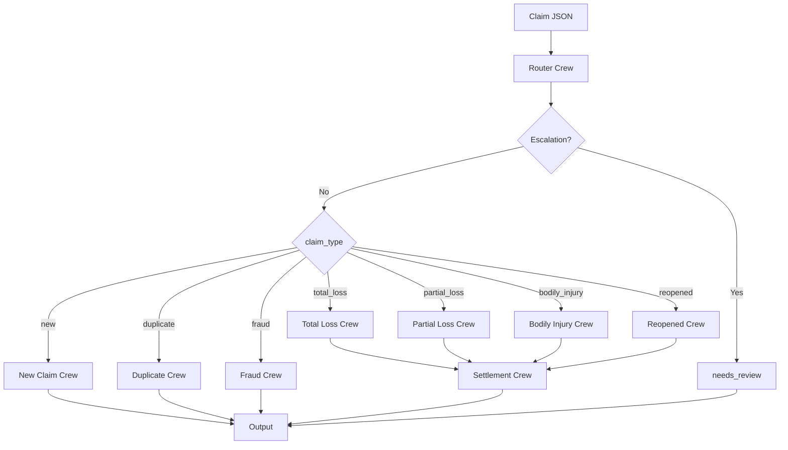

# Agentic Claim Representative POC

Proof of concept for an agentic AI system acting as a Claim Representative for auto insurance claims. Built with [CrewAI](https://crewai.com/) and Python.

## Features

- **Workflow Routing** - Router agent classifies claims and delegates to specialized crews
- **Human-in-the-Loop** - Escalation for fraud indicators, high-value, or low-confidence claims (configurable thresholds)
- **Seven Claim Types** - New, duplicate, total loss, fraud, partial loss, bodily injury, and reopened workflows
- **Persistent State** - SQLite database with full audit trail
- **Observability** - Structured logging, correlation IDs, LLM tracing (LangSmith/LiteLLM), cost and latency metrics
- **Configuration** - Centralized settings for escalation, fraud, valuation, token budgets (see `.env.example`)
- **Security & Resilience** - Input sanitization, parameterized DB queries, retry for transient LLM failures
- **MCP Server** - Optional external tool access and health check via Model Context Protocol
- **RAG** - Semantic search over policy and compliance (see [RAG](docs/rag.md))
- **Webhooks** - Outbound webhooks for status changes and repair authorization
- **Adapters** - Pluggable backends for policy, valuation, repair shops, parts, SIU (see `.env.example`)
- **File Attachments** - Photos, PDFs, estimates via CLI `--attachment` or API upload
- **Mock Crew** - Simulate external interactions (claimant, vision, image gen) for E2E testing without real services (see [Mock Crew Design](docs/mock-crew-design.md))

## Architecture


```mermaid
flowchart TB
    A[Claim JSON] --> B[Router Crew]
    B --> C{Escalation?}
    C -->|Yes| D[needs_review]
    C -->|No| E{claim_type}

    E -->|new| F[New Claim Crew]
    E -->|duplicate| G[Duplicate Crew]
    E -->|total_loss| H[Total Loss Crew]
    E -->|fraud| I[Fraud Crew]
    E -->|partial_loss| J[Partial Loss Crew]
    E -->|bodily_injury| BI[Bodily Injury Crew]
    E -->|reopened| R[Reopened Crew]

    F --> K[Output]
    G --> K
    H --> S[Settlement Crew]
    I --> K
    J --> S
    BI --> S
    R --> S
    S --> K
    D --> K
```

## Quick Start

```bash
# Setup
python -m venv .venv
source .venv/bin/activate
pip install -e ".[dev]"
cp .env.example .env
# Edit .env with your OpenRouter/OpenAI API key

# Process a claim
claim-agent process tests/sample_claims/partial_loss_parking.json

# Check status (use the claim_id from the process output)
claim-agent status CLM-11EEF959
```

## CLI Commands

| Command | Description |
|---------|-------------|
| `claim-agent serve [--reload] [--port <port>] [--host <host>]` | Start REST API server |
| `claim-agent process <file> [--attachment <file> ...]` | Process a claim from JSON (optionally attach photos, PDFs, estimates) |
| `claim-agent status <id>` | Get claim status |
| `claim-agent history <id>` | Get claim audit log |
| `claim-agent reprocess <id> [--from-stage <stage>]` | Re-run workflow (optionally resume from router, escalation_check, workflow, or settlement) |
| `claim-agent metrics [id]` | Show metrics (optional claim ID) |
| `claim-agent review-queue [--assignee X] [--priority P]` | List claims needing review |
| `claim-agent assign <id> <assignee>` | Assign claim to adjuster |
| `claim-agent approve <id> [--confirmed-claim-type X] [--confirmed-payout N] [--notes "..."]` | Approve, run handback, then workflow (supervisor) |
| `claim-agent reject <id> [--reason "..."]` | Reject claim |
| `claim-agent request-info <id> [--note "..."]` | Request more info |
| `claim-agent escalate-siu <id>` | Escalate to SIU |
| `claim-agent retention-enforce [--dry-run] [--years N] [--include-litigation-hold]` | Archive claims older than retention period |
| `claim-agent retention-report [--years N]` | Retention audit report (counts by tier, litigation hold, pending archive) |
| `claim-agent litigation-hold --claim-id X --on|--off` | Set or clear litigation hold on a claim |
| `claim-agent dsar-access --claimant-email X [--claim-id Y \| --policy P --vin V] [--fulfill]` | Submit DSAR access request (right-to-know) |
| `claim-agent dsar-deletion --claimant-email X [--claim-id Y \| --policy P --vin V] [--fulfill]` | Submit DSAR deletion request (right-to-delete) |
| `claim-agent diary-escalate [--db PATH]` | Run deadline escalation (notify overdue, escalate to supervisor) |
| `claim-agent ucspa-deadlines [--days N] [--webhooks]` | Check UCSPA deadlines, optionally dispatch webhook alerts |

## Sample Claims

| File | Type |
|------|------|
| `tests/sample_claims/new_claim.json` | New |
| `tests/sample_claims/partial_loss_parking.json` | Partial loss (parking) |
| `tests/sample_claims/duplicate_claim.json` | Duplicate |
| `tests/sample_claims/total_loss_claim.json` | Total loss |
| `tests/sample_claims/fraud_claim.json` | Fraud |
| `tests/sample_claims/partial_loss_claim.json` | Partial loss |
| `tests/sample_claims/partial_loss_fender.json` | Partial loss |
| `tests/sample_claims/partial_loss_front_collision.json` | Partial loss |
| `tests/sample_claims/bodily_injury_claim.json` | Bodily injury (BI workflow) |
| `tests/sample_claims/reopened_claim.json` | Reopened (prior settled claim) |

## Documentation

Detailed documentation is available in the [`docs/`](docs/) folder:

| Document | Description |
|----------|-------------|
| [Getting Started](docs/getting-started.md) | Installation and quick start |
| [Architecture](docs/architecture.md) | System design and patterns |
| [Crews](docs/crews.md) | Workflow crews and agents |
| [Skills](docs/skills.md) | Agent prompts and operational procedures |
| [Claim Types](docs/claim-types.md) | Classification criteria |
| [Agent Flow](docs/agent-flow.md) | Execution flow |
| [Adjuster Workflow](docs/adjuster-workflow.md) | Human review workflow |
| [Tools](docs/tools.md) | Tool reference |
| [Webhooks](docs/webhooks.md) | Outbound webhooks |
| [Adapters](docs/adapters.md) | Pluggable integrations |
| [Database](docs/database.md) | Schema and operations |
| [State Machine](docs/state-machine.md) | Claim status transitions and guards |
| [Configuration](docs/configuration.md) | Environment and centralized settings |
| [Observability](docs/observability.md) | Logging, tracing, metrics |
| [PII and Retention](docs/pii-and-retention.md) | PII masking and data retention |
| [RAG](docs/rag.md) | Policy and compliance search |
| [MCP Server](docs/mcp-server.md) | External tool access and health check |
| [Mock Crew Design](docs/mock-crew-design.md) | Mock external interactions for testing |
| [Alerting](docs/alerting.md) | Alert configuration |

## Project Layout

```
src/claim_agent/
├── main.py           # CLI entry point
├── context.py        # Workflow context helpers
├── events.py         # Event definitions
├── exceptions.py     # ClaimAgentError and domain exceptions
├── api/              # REST API (FastAPI routes, auth, deps)
├── config/           # LLM (llm.py) and centralized settings (settings.py)
├── agents/           # Agent definitions
├── crews/            # Crew definitions
├── skills/           # Agent prompts (markdown)
├── tools/            # CrewAI tools
├── chat/             # Chat agent for claimant portal
├── compliance/       # UCSPA and regulatory compliance
├── data/             # Data loaders
├── diary/            # Diary/calendar system (auto-create, escalation)
├── workflow/         # Orchestrators (claim_review, siu, supplemental, handback)
├── services/         # Business logic services (adjuster, DSAR)
├── adapters/         # Policy, valuation, repair shop, parts, SIU adapters
├── mock_crew/        # Mock claimant, image gen, vision (testing)
├── rag/              # RAG pipeline (policy/compliance search)
├── storage/          # Local and S3 storage for attachments
├── notifications/    # Webhooks and claimant notifications
├── utils/            # Sanitization, retry
├── db/               # SQLite database
├── models/           # Pydantic models (ClaimInput, ClaimType, etc.)
├── observability/    # Logging, tracing, metrics
└── mcp_server/       # Optional MCP server (includes health_check)
```

## Testing

```bash
# Unit tests (no API key needed)
# MOCK_DB_PATH defaults to data/mock_db.json if unset
export MOCK_DB_PATH=data/mock_db.json
pytest tests/ -v --ignore=tests/integration --ignore=tests/e2e --ignore=tests/load \
  -m "not slow and not integration and not llm and not e2e and not load"

# Integration tests (mocked LLM, no API key needed)
pytest tests/integration/ -v -m "integration and not slow and not llm"

# E2E tests (submit claims via API, mocked LLM, no API key needed)
pytest tests/e2e/ -v -m e2e

# Load tests (concurrent claim submissions, throughput, latency)
LOAD_TEST_CONCURRENCY=20 pytest tests/load/ -v -m load -s
```

E2E tests submit claims via the REST API and assert claim_id, status, and audit history. Load tests report throughput (claims/sec), latency percentiles (p50, p99), and error rate. Set `LOAD_TEST_CONCURRENCY` for concurrency (default 10). Use `LOAD_TEST_OUTPUT=report.json` to write metrics to a file.

**Mock Crew** – For testing without real people or external APIs, enable the Mock Crew:

```bash
VISION_ADAPTER=mock                    # Use mock vision (no vision API calls)
# Or for full mock crew:
MOCK_CREW_ENABLED=true
MOCK_IMAGE_VISION_ANALYSIS_SOURCE=claim_context
MOCK_CREW_SEED=42                      # Reproducible outputs
```

See [Mock Crew Design](docs/mock-crew-design.md) and [Implementation Plan](docs/mock-crew-implementation-plan.md).

## Evaluation

Run the claim processing evaluation (requires API key).

```bash
# Quick (one scenario per type)
.venv/bin/python scripts/evaluate_claim_processing.py --quick --output evaluation_report.json

# All scenarios
.venv/bin/python scripts/evaluate_claim_processing.py --all --output evaluation_report.json

# List scenarios or run sample claim files
.venv/bin/python scripts/evaluate_claim_processing.py --list
.venv/bin/python scripts/evaluate_claim_processing.py --sample-claims --output evaluation_report.json
```

## Data Setup

To enable duplicate detection with historical claims:

```bash
python scripts/seed_claims_from_mock_db.py
```

## Observability UI (Dashboard)

A React + Vite frontend provides a dashboard for claims, docs, skills, and system config.

```bash
# Terminal 1: Start backend (use --reload for dev auto-reload)
claim-agent serve --reload
# Or: claim-agent serve  (production, no reload)

# Terminal 2: Start frontend (dev)
cd frontend && npm run dev
```

Visit http://localhost:5173. The Vite dev server proxies `/api` to the backend.

**REST API**: The backend exposes a REST API for programmatic access. OpenAPI spec: http://localhost:8000/api/openapi.json. Interactive docs: http://localhost:8000/api/openapi/docs. When auth is enabled (CLAIMS_API_KEY or API_KEYS), an API key is required to access OpenAPI docs.

**Production**: Build with `cd frontend && npm run build`. The backend serves `frontend/dist` when present.

**Security**: Set `CLAIMS_API_KEY` in `.env` to require API key auth (X-API-Key or Authorization: Bearer). Set `CORS_ORIGINS` for production frontend origins.

## Database Migrations

Schema changes use [Alembic](https://alembic.sqlalchemy.org/):

```bash
alembic upgrade head   # Apply migrations
alembic revision -m "description"  # Create new migration
```

## MCP Server (Optional)

Run claim tools as an MCP server:

```bash
python -m claim_agent.mcp_server.server
```

## Requirements

- Python 3.10+
- [OpenRouter](https://openrouter.ai/) or OpenAI API key

## License

MIT
