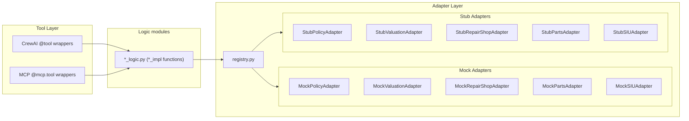

# Adapters

The adapter layer decouples tool logic from external data sources. Each adapter defines an abstract interface for one external system; concrete implementations can be swapped via environment variables without changing any tool or business logic.

For tool documentation, see [Tools](tools.md). For overall architecture, see [Architecture](architecture.md).

## Architecture



## Adapter Interfaces

All interfaces are defined as abstract base classes in `src/claim_agent/adapters/base.py`.

| Adapter | Methods | Return Type | Purpose |
|---------|---------|-------------|---------|
| **PolicyAdapter** | `get_policy(policy_number)` | `dict \| None` | Policy lookup (coverage, deductible, status) |
| **ValuationAdapter** | `get_vehicle_value(vin, year, make, model)` | `dict \| None` | Vehicle market value (value, condition) |
| **RepairShopAdapter** | `get_shops()`, `get_shop(shop_id)`, `get_labor_operations()` | `dict` / `dict \| None` / `dict` | Repair shop network and labor catalog |
| **PartsAdapter** | `get_catalog()` | `dict` | Parts catalog (part_id -> part data) |
| **SIUAdapter** | `create_case(claim_id, indicators)` | `str` | SIU case creation, returns case ID |

### PolicyAdapter

```python
class PolicyAdapter(ABC):
    def get_policy(self, policy_number: str) -> dict[str, Any] | None:
        """Return policy data or None if not found.
        
        Expected keys:
        - status: Policy status (active, inactive, cancelled, etc.)
        - coverages: List of coverage types (e.g., ["liability", "collision", "comprehensive"])
        - collision_deductible, comprehensive_deductible: Deductible amounts
        - named_insured: List of dicts with name, email, phone (optional)
        - drivers: List of dicts with name, license_number, relationship (optional)
        """
```

**Named Insured / Driver Verification**: When `named_insured` and/or `drivers` are present in the policy response, coverage verification will check if the claimant matches. If the claimant is not listed, the claim is routed to `under_investigation` for manual review. This prevents unauthorized individuals from filing claims on a policy.

### ValuationAdapter

```python
class ValuationAdapter(ABC):
    def get_vehicle_value(
        self, vin: str, year: int, make: str, model: str
    ) -> dict[str, Any] | None:
        """Return {value, condition, source?, comparables?} or None if no match.
        comparables: list of {vin, year, make, model, price, mileage, source}."""
```

**CCC/Mitchell/Audatex integration**: Stubs in `adapters/valuation_stubs/` document the expected contract for total loss valuation providers. Each returns ACV + comparables list. Replace with real API calls for production.

### RepairShopAdapter

```python
class RepairShopAdapter(ABC):
    def get_shops(self) -> dict[str, dict[str, Any]]:
        """Return {shop_id: shop_data, ...}."""

    def get_shop(self, shop_id: str) -> dict[str, Any] | None:
        """Return shop data or None."""

    def get_labor_operations(self) -> dict[str, dict[str, Any]]:
        """Return {op_id: {base_hours, ...}, ...}."""
```

### PartsAdapter

```python
class PartsAdapter(ABC):
    def get_catalog(self) -> dict[str, dict[str, Any]]:
        """Return {part_id: part_data, ...}."""
```

### SIUAdapter

```python
class SIUAdapter(ABC):
    def create_case(self, claim_id: str, indicators: list[str]) -> str:
        """Create SIU case, return case_id."""
```

## Implementations

### Mock Adapters (default)

Located in `src/claim_agent/adapters/mock/`. Each adapter reads from `mock_db.json` via `load_mock_db()`, preserving the same behavior as the original direct data access.

| Class | File | Data Source |
|-------|------|-------------|
| `MockPolicyAdapter` | `mock/policy.py` | `mock_db["policies"]` |
| `MockValuationAdapter` | `mock/valuation.py` | `mock_db["vehicle_values"]` |
| `MockRepairShopAdapter` | `mock/repair_shop.py` | `mock_db["repair_shops"]`, `mock_db["labor_operations"]` |
| `MockPartsAdapter` | `mock/parts.py` | `mock_db["parts_catalog"]` |
| `MockSIUAdapter` | `mock/siu.py` | No-op; returns generated case ID |

### Stub Adapters

Located in `src/claim_agent/adapters/stub.py`. Every method raises `NotImplementedError` with a message describing what the real integration should connect to. Use these as starting points when building production adapters.

### Real Adapters

Located in `src/claim_agent/adapters/real/`. Production-ready implementations:

| Class | File | Description |
|-------|------|-------------|
| `RestPolicyAdapter` | `real/policy_rest.py` | REST PAS integration with auth, retry, circuit breaker |

## Configuration

Adapter selection is controlled by environment variables. Each defaults to `mock`. Unknown values raise `ValueError` at first use.

| Variable | Values | Default | Description |
|----------|--------|---------|-------------|
| `POLICY_ADAPTER` | `mock`, `stub`, `rest` | `mock` | Policy database backend |
| `VALUATION_ADAPTER` | `mock`, `stub` | `mock` | Vehicle valuation backend |
| `REPAIR_SHOP_ADAPTER` | `mock`, `stub` | `mock` | Repair shop network backend |
| `PARTS_ADAPTER` | `mock`, `stub` | `mock` | Parts catalog backend |
| `SIU_ADAPTER` | `mock`, `stub` | `mock` | SIU case management backend |
| `CLAIM_SEARCH_ADAPTER` | `mock`, `stub` | `mock` | Claim search backend (fraud cross-reference) |
| `VISION_ADAPTER` | `real`, `mock` | `real` | Vision analysis (litellm or claim-context derived) |
| `OCR_ADAPTER` | `mock`, `stub` | `mock` | OCR for document extraction |

### REST Policy Adapter

When `POLICY_ADAPTER=rest`, configure the PAS REST API:

| Variable | Description | Default |
|----------|-------------|---------|
| `POLICY_REST_BASE_URL` | PAS API base URL | (required) |
| `POLICY_REST_AUTH_HEADER` | Auth header name | `Authorization` |
| `POLICY_REST_AUTH_VALUE` | Bearer token or API key | (empty) |
| `POLICY_REST_PATH_TEMPLATE` | Path with `{policy_number}` placeholder | `/policies/{policy_number}` |
| `POLICY_REST_RESPONSE_KEY` | JSON key for policy (e.g. `data`) | (none) |
| `POLICY_REST_TIMEOUT` | Request timeout seconds | `15` |

See [Adapter SLA Requirements](adapter_sla.md) for latency and availability targets.

Example `.env`:

```bash
POLICY_ADAPTER=mock
VALUATION_ADAPTER=mock
REPAIR_SHOP_ADAPTER=mock
PARTS_ADAPTER=mock
SIU_ADAPTER=mock
```

## Registry

The registry (`src/claim_agent/adapters/registry.py`) provides factory functions that return thread-safe singletons:

```python
from claim_agent.adapters import (
    get_policy_adapter,
    get_valuation_adapter,
    get_repair_shop_adapter,
    get_parts_adapter,
    get_siu_adapter,
)

policy = get_policy_adapter().get_policy("POL-001")
value = get_valuation_adapter().get_vehicle_value("VIN123", 2022, "Toyota", "Camry")
```

Call `reset_adapters()` to clear cached singletons (useful in tests).

## Adding a New Adapter

To integrate a real external system:

1. **Create a new module** (e.g. `src/claim_agent/adapters/real_policy.py`):

```python
from claim_agent.adapters.base import PolicyAdapter

class RestPolicyAdapter(PolicyAdapter):
    def __init__(self, base_url: str, api_key: str):
        self._base_url = base_url
        self._api_key = api_key

    def get_policy(self, policy_number: str) -> dict | None:
        # Call your REST API here
        ...
```

2. **Register the backend** in `registry.py` (and add `rest` to `VALID_ADAPTER_BACKENDS` in `config/settings.py`):

```python
def get_policy_adapter() -> PolicyAdapter:
    ...
    backend = _resolve_backend("policy")
    if backend == "rest":
        from claim_agent.adapters.real_policy import RestPolicyAdapter
        _policy_adapter = RestPolicyAdapter(
            base_url=os.environ["POLICY_API_URL"],
            api_key=os.environ["POLICY_API_KEY"],
        )
    elif backend == "stub":
        ...
```

3. **Set the env var**:

```bash
POLICY_ADAPTER=rest
POLICY_API_URL=https://policies.example.com/api/v1
POLICY_API_KEY=sk-...
```

No changes to `logic.py`, tools, or agents are needed.

## Directory Structure

```
src/claim_agent/adapters/
├── __init__.py           # Re-exports registry functions
├── base.py               # Abstract base classes (5 adapters)
├── http_client.py        # AdapterHttpClient: auth, retry, circuit breaker
├── registry.py           # Thread-safe factory functions
├── stub.py               # Stub adapters (NotImplementedError)
├── mock/
│   ├── __init__.py        # Re-exports mock adapter classes
│   ├── policy.py          # MockPolicyAdapter
│   ├── valuation.py       # MockValuationAdapter
│   ├── repair_shop.py     # MockRepairShopAdapter
│   ├── parts.py           # MockPartsAdapter
│   └── siu.py             # MockSIUAdapter
└── real/
    ├── __init__.py
    └── policy_rest.py     # RestPolicyAdapter (PAS REST integration)
```

## How logic.py Uses Adapters

Tool implementation functions in `logic.py` call adapter methods instead of accessing `load_mock_db()` directly:

| Function | Adapter Call |
|----------|-------------|
| `query_policy_db_impl` | `get_policy_adapter().get_policy()` |
| `fetch_vehicle_value_impl` | `get_valuation_adapter().get_vehicle_value()` |
| `get_available_repair_shops_impl` | `get_repair_shop_adapter().get_shops()` |
| `assign_repair_shop_impl` | `get_repair_shop_adapter().get_shop()` |
| `generate_repair_authorization_impl` | `get_repair_shop_adapter().get_shop()` |
| `get_parts_catalog_impl` | `get_parts_adapter().get_catalog()` |
| `create_parts_order_impl` | `get_parts_adapter().get_catalog()` |
| `calculate_repair_estimate_impl` | `get_repair_shop_adapter()` + `get_parts_adapter()` |
| `perform_fraud_assessment_impl` | `get_siu_adapter().create_case()` (when referral is needed); then `ClaimRepository().update_claim_siu_case_id()` and `siu_case_created` audit |

## Testing

Adapter tests are in `tests/test_adapters.py` and cover:

- ABC enforcement (cannot instantiate abstract classes)
- Mock adapter correctness (known/unknown lookups)
- Stub adapter behavior (raises `NotImplementedError`)
- Registry singleton behavior and env-var-driven selection
- `reset_adapters()` clears cached instances

The `conftest.py` autouse fixture calls `reset_adapters()` before each test to prevent singleton leakage between tests.

## SIU Integration

When the fraud workflow sets `siu_referral=true`, `perform_fraud_assessment_impl` calls `get_siu_adapter().create_case()`. On success, it persists the case ID via `ClaimRepository().update_claim_siu_case_id()`, which:

1. Updates `claims.siu_case_id`
2. Inserts an audit log entry with action `siu_case_created` and details `"SIU case created: {case_id}"`

The assessment result includes `siu_case_id_persisted: true` when persistence succeeds, or `siu_case_id_persisted: false` when it fails (DB error, claim deleted, etc.). Callers can use this to detect and handle inconsistent state.
