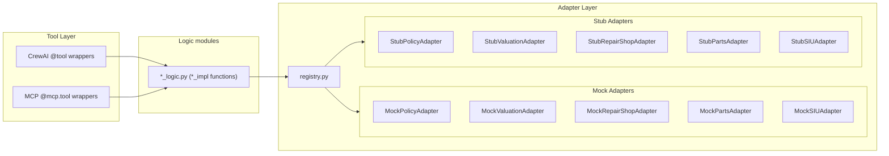

# Adapters

The adapter layer decouples tool logic from external data sources. Each adapter defines an abstract interface for one external system; concrete implementations can be swapped via environment variables without changing any tool or business logic.

For tool documentation, see [Tools](tools.md). For overall architecture, see [Architecture](architecture.md).

## Architecture



## Adapter Interfaces

All interfaces are defined as abstract base classes in `src/claim_agent/adapters/base.py`.

| Adapter | Methods | Return Type | Purpose |
|---------|---------|-------------|---------|
| **OCRAdapter** | `extract_structured_data(file_path, document_type)` | `dict \| None` | OCR / structured extraction (estimates, police reports, medical documents) |
| **PolicyAdapter** | `get_policy(policy_number)` | `dict \| None` | Policy lookup (coverage, deductible, status) |
| **ValuationAdapter** | `get_vehicle_value(vin, year, make, model)` | `dict \| None` | Vehicle market value (value, condition) |
| **RepairShopAdapter** | `get_shops()`, `get_shop(shop_id)`, `get_labor_operations()` | `dict` / `dict \| None` / `dict` | Repair shop network and labor catalog |
| **PartsAdapter** | `get_catalog()` | `dict` | Parts catalog (part_id → part data) |
| **SIUAdapter** | `create_case(claim_id, indicators)`; optional `get_case`, `add_investigation_note`, `update_case_status` (defaults raise `NotImplementedError`) | `str` / various | SIU case management |
| **FraudReportingAdapter** | `file_state_bureau_report(...)`, `file_nicb_report(...)`, `file_niss_report(...)` (keyword-only) | `dict` | Fraud filings (state bureau, NICB, NISS) |
| **StateBureauAdapter** | `submit_fraud_report(...)` (keyword-only) | `dict` | Per–state insurance fraud bureau submissions |
| **ClaimSearchAdapter** | `search_claims(vin?, claimant_name?, date_range?)` (keyword-only) | `list[dict]` | Cross-carrier claim search (NICB/ISO-style) |
| **NMVTISAdapter** | `submit_total_loss_report(...)` (keyword-only) | `dict` | Federal NMVTIS insurer reporting (totaled/salvage vehicles) |
| **CMSReportingAdapter** | `evaluate_settlement_reporting(...)` (keyword-only) | `dict` | Medicare/CMS reporting eligibility (MMSEA Section 111 style) |
| **ReverseImageAdapter** | `match_web_occurrences(image)` | `list[dict]` | Optional reverse-image / stock-photo lookup for fraud forensics (feature-flagged) |
| **ERPAdapter** | `push_repair_assignment`, `push_estimate_update`, `push_repair_status`, `pull_pending_events`; `resolve_shop_id` (default identity map) | `dict` / `list[dict]` | Repair / shop management (ERP) sync |
| **GapInsuranceAdapter** | `submit_shortfall_claim(...)`; optional `get_claim_status` (default raises `NotImplementedError`) | `dict` / `dict \| None` | Gap carrier coordination after auto total loss (loan/lease shortfall) |
| **MedicalRecordsAdapter** | `query_medical_records(claim_id, claimant_id?, date_range?)` | `dict \| None` | Medical records for bodily injury (PHI) |

### PolicyAdapter

```python
class PolicyAdapter(ABC):
    def get_policy(self, policy_number: str) -> dict[str, Any] | None:
        """Return policy data or None if not found.
        
        Expected keys:
        - status: Policy status (active, inactive, cancelled, etc.)
        - coverages: List of coverage types (e.g., ["liability", "collision", "comprehensive"])
        - collision_deductible, comprehensive_deductible: Deductible amounts
        - named_insured: List of dicts with name, email, phone (optional)
        - drivers: List of dicts with name, license_number, relationship (optional)
        """
```

**Named Insured / Driver Verification**: When `named_insured` and/or `drivers` are present in the policy response, coverage verification will check if the claimant matches. If the claimant is not listed, the claim is routed to `under_investigation` for manual review. This prevents unauthorized individuals from filing claims on a policy.

**FNOL policyholder party**: On `ClaimRepository.create_claim`, if the intake `parties` list does not already include a `policyholder`, the repository loads the policy (via the configured policy adapter when no `policy=` argument is passed) and, when `named_insured` is present, prepends a policyholder party built from the **first** named insured with a resolvable display name (`name`, then `full_name`, then `display_name`). **Mock** adapter: policies in `data/mock_db.json` include sample `named_insured`. **REST** adapter: returns whatever the PAS JSON includes under `named_insured` (or nested behind `POLICY_REST_RESPONSE_KEY`). **Stub** adapter: `get_policy` exists but raises `NotImplementedError`, so no auto-policyholder from the adapter.

**Policy term (incident date)**: Optional `effective_date` and `expiration_date` (ISO `YYYY-MM-DD`, inclusive bounds) may be returned; `term_start` / `term_end` are accepted as aliases and normalized in `query_policy_db_impl`. When both are present on the policy response and the claim includes a parseable `incident_date`, FNOL coverage verification denies if the loss falls outside the term. If both term fields are omitted, verification skips this check (legacy backends). If only one of `effective_date` / `expiration_date` (or `term_start` / `term_end`) is provided, the policy term configuration is treated as invalid and the claim is routed to `under_investigation` for manual review. In `data/mock_db.json`, `_meta.policy_term_defaults` supplies default term dates for policies that omit them; `load_mock_db()` merges those defaults before adapters read policy records (empty or whitespace-only term strings count as omitted for default merge).

**Policy territory (`incident_location` / `loss_state`)**: For `territory: "US"`, matching includes US states, DC, and common US insular areas (e.g. Puerto Rico / PR, U.S. Virgin Islands / VI, Guam, American Samoa, Northern Mariana Islands). For `territory: "USA_Canada"`, matching includes the same US geography plus Canada (the string `Canada` or any province/territory by English name or two-letter code, e.g. Ontario / ON). `excluded_territories` uses the same normalization so exclusions can list codes or names. Policies may define only `excluded_territories` (no positive `territory`); in that case only carve-outs are enforced.

### ValuationAdapter

```python
class ValuationAdapter(ABC):
    def get_vehicle_value(
        self, vin: str, year: int, make: str, model: str
    ) -> dict[str, Any] | None:
        """Return {value, condition, source?, comparables?} or None if no match.
        comparables: list of {vin, year, make, model, price, mileage, source}."""
```

**CCC/Mitchell/Audatex integration**: Set `VALUATION_ADAPTER` to `ccc`, `mitchell`, or `audatex` and configure `VALUATION_REST_BASE_URL` (optional `VALUATION_REST_PATH_TEMPLATE`, `VALUATION_REST_RESPONSE_KEY`, auth headers). The implementation (`adapters/real/valuation_rest.py`) performs a GET, unwraps an optional JSON envelope, and normalizes vendor keys (`acv`, `vehicle_value`, `comparables` / `comps`, etc.) into `{value, condition, source, comparables}`. Reference-only classes remain under `adapters/valuation_stubs/`.

### RepairShopAdapter

```python
class RepairShopAdapter(ABC):
    def get_shops(self) -> dict[str, dict[str, Any]]:
        """Return {shop_id: shop_data, ...}."""

    def get_shop(self, shop_id: str) -> dict[str, Any] | None:
        """Return shop data or None."""

    def get_labor_operations(self) -> dict[str, dict[str, Any]]:
        """Return {op_id: {base_hours, ...}, ...}."""
```

### PartsAdapter

```python
class PartsAdapter(ABC):
    def get_catalog(self) -> dict[str, dict[str, Any]]:
        """Return {part_id: part_data, ...}."""
```

### SIUAdapter

```python
class SIUAdapter(ABC):
    def create_case(self, claim_id: str, indicators: list[str]) -> str:
        """Create SIU case, return case_id."""
```

### NMVTISAdapter

National Motor Vehicle Title Information System reporting (49 U.S.C. 30502; 28 CFR Part 25). The claim-agent wires submission from `record_dmv_salvage_report` and from terminal salvage dispositions (`auction_complete`, `owner_retained`, `scrapped`) via `salvage_logic._attempt_nmvtis_submission`, with retries and persistence under `claims.total_loss_metadata` (`nmvtis_reference`, `nmvtis_status`, `nmvtis_last_error`, etc.). Operators can retry with the `submit_nmvtis_report` tool. Production requires integration with the DOJ/AAMVA-designated NMVTIS data provider (not included here).

### GapInsuranceAdapter

Used when `calculate_payout` detects a loan/lease **shortfall** (payout below balance) and the policy includes **gap** coverage (`gap_insurance` on the policy record). The logic layer calls `submit_shortfall_claim` and merges carrier metadata into the payout JSON (`gap_claim_id`, `gap_claim_status`, `gap_approved_amount`, `gap_remaining_shortfall`, `gap_denial_reason`, or `gap_coordination_error` if the adapter is a stub or the call fails). Production implementations should call the dealer F&I platform, lender, or standalone GAP administrator API.

### ReverseImageAdapter

Optional fraud signal used during photo forensics. When `REVERSE_IMAGE_ADAPTER` is set to `mock` (or any non-`stub` backend), the vision analysis pipeline calls `match_web_occurrences` after EXIF analysis to check whether a submitted photo appears on stock-photo sites, social media, or prior-claim indexes. A high match score (`≥ 0.8`) adds a `reverse_image_stock_photo_match` anomaly to `photo_forensics.anomalies`, which feeds the fraud-scoring logic.

The adapter is **never called automatically when `REVERSE_IMAGE_ADAPTER=stub`** so FNOL processing is never blocked on external API latency or availability. When the env var is not set, the default backend is `mock` (safe for dev/test); set it to `stub` in environments where no external provider should be contacted.

**Environment variable:** `REVERSE_IMAGE_ADAPTER` — supported values: `mock` (deterministic test data, no network), `stub` (raises `NotImplementedError`; use as a placeholder for a real integration), `rest` (`RestReverseImageAdapter`; configure `REVERSE_IMAGE_REST_*`).

**Privacy and API-key posture:**

* Images may contain PII (licence plates, faces, GPS EXIF data). The **REST** implementation (`RestReverseImageAdapter`) strips EXIF from JPEG, PNG, and WebP bytes before `post_multipart` by default (`REVERSE_IMAGE_REST_SCRUB_EXIF_BEFORE_UPLOAD`, default `true`). Set `REVERSE_IMAGE_REST_SCRUB_EXIF_BEFORE_UPLOAD=false` only if your provider contract requires raw metadata. Other backends (mock/stub) do not upload externally.
* Verify that the production provider's Data Processing Agreement (DPA) covers your jurisdiction (see cross-border transfer controls in `src/claim_agent/privacy/cross_border.py`).
* API keys must be stored in secrets management (e.g. environment secrets, AWS Secrets Manager, Vault) and **never** committed to source code.
* Disclose reverse-image lookups in the applicable privacy notice and include them in DSAR records where regulatorily required.

```python
# Example: custom production adapter
from pathlib import Path
from claim_agent.adapters.base import ReverseImageAdapter

class MyReverseImageAdapter(ReverseImageAdapter):
    def match_web_occurrences(self, image: bytes | Path) -> list[dict]:
        # Call your provider (e.g. Google Vision similarWebPages, TinEye)
        ...
```

## Implementations

### Mock Adapters (default)

Located in `src/claim_agent/adapters/mock/`. Each adapter reads from `mock_db.json` via `load_mock_db()`, preserving the same behavior as the original direct data access.

| Class | File | Data Source |
|-------|------|-------------|
| `MockPolicyAdapter` | `mock/policy.py` | `mock_db["policies"]` (often includes `named_insured` for FNOL policyholder seeding) |
| `MockValuationAdapter` | `mock/valuation.py` | `mock_db["vehicle_values"]` |
| `MockRepairShopAdapter` | `mock/repair_shop.py` | `mock_db["repair_shops"]`, `mock_db["labor_operations"]` |
| `MockPartsAdapter` | `mock/parts.py` | `mock_db["parts_catalog"]` |
| `MockSIUAdapter` | `mock/siu.py` | No-op; returns generated case ID |
| `MockFraudReportingAdapter` | `mock/fraud_reporting.py` | Deterministic mock filing IDs for state bureau, NICB, and NISS |
| `MockStateBureauAdapter` | `mock/state_bureau.py` | Simulated per-state bureau responses; test hooks for transient failures |
| `MockClaimSearchAdapter` | `mock/claim_search.py` | Deterministic VIN/name-based sample matches (no external ClaimSearch) |
| `MockNMVTISAdapter` | `mock/nmvtis.py` | Returns synthetic `NMVTIS-MOCK-*` references; optional transient failures for retry tests |
| `MockCMSReportingAdapter` | `mock/cms_reporting.py` | Heuristic Section 111–style eligibility; no COBC submission |
| `MockReverseImageAdapter` | `mock/reverse_image.py` | Deterministic stock-photo / social-media matches; no network calls |
| `MockERPAdapter` | `mock/erp.py` | In-memory ERP: records pushes, seedable `pull_pending_events` queue |
| `MockGapInsuranceAdapter` | `mock/gap_insurance.py` | In-memory gap carrier; simulates approve / partial / deny by shortfall amount |
| `MockOCRAdapter` | `mock/ocr.py` | Sample structured payloads by `document_type` (estimate, police_report, medical_record) |
| `MockMedicalRecordsAdapter` | `mock/medical_records.py` | Deterministic fabricated records from `claim_id` (dev/test only; not real PHI) |

### Stub Adapters

Located in `src/claim_agent/adapters/stub.py`. Stub methods are present on the class but their bodies raise `NotImplementedError` with a message describing what the real integration should connect to. Use these as starting points when building production adapters.

### Real Adapters

Located in `src/claim_agent/adapters/real/`. Production-ready implementations:

| Class | File | Description |
|-------|------|-------------|
| `RestPolicyAdapter` | `real/policy_rest.py` | REST PAS integration with auth, retry, circuit breaker |
| `RestFraudReportingAdapter` | `real/fraud_reporting_rest.py` | REST fraud filing gateway (state bureau, NICB, NISS paths) |
| `RestStateBureauAdapter` | `real/state_bureau_rest.py` | REST per-state fraud bureau endpoints (`STATE_BUREAU_*_ENDPOINT`) |
| `RestClaimSearchAdapter` | `real/claim_search_rest.py` | REST cross-carrier claim search |
| `RestRepairShopAdapter` | `real/repair_shop_rest.py` | REST repair shop network and labor catalog |
| `RestPartsAdapter` | `real/parts_rest.py` | REST parts catalog |
| `RestSIUAdapter` | `real/siu_rest.py` | REST SIU case management (create case, notes, status) |
| `RestNMVTISAdapter` | `real/nmvtis_rest.py` | REST NMVTIS reporting gateway |
| `RestGapInsuranceAdapter` | `real/gap_insurance_rest.py` | REST gap carrier submit/status |
| `RestOCRAdapter` | `real/ocr_rest.py` | REST document extraction |
| `RestCMSReportingAdapter` | `real/cms_rest.py` | REST Medicare/CMS settlement reporting evaluation |
| `RestReverseImageAdapter` | `real/reverse_image_rest.py` | REST reverse-image / match provider |
| `RestERPAdapter` | `real/erp_rest.py` | REST ERP / shop management sync |
| `RestMedicalRecordsAdapter` | `real/medical_records_rest.py` | REST medical records (HIE / provider portal) |
| `RestValuationAdapter` | `real/valuation_rest.py` | REST valuation gateway (CCC/Mitchell/Audatex-style JSON) |

## Configuration

Adapter selection is controlled by environment variables. Most default to `mock`; `VISION_ADAPTER` defaults to `real`. Unknown values raise `ValueError` at first use.

| Variable | Values | Default | Description |
|----------|--------|---------|-------------|
| `POLICY_ADAPTER` | `mock`, `stub`, `rest` | `mock` | Policy database backend |
| `VALUATION_ADAPTER` | `mock`, `stub`, `ccc`, `mitchell`, `audatex` | `mock` | Vehicle valuation backend |
| `REPAIR_SHOP_ADAPTER` | `mock`, `stub`, `rest` | `mock` | Repair shop network backend |
| `PARTS_ADAPTER` | `mock`, `stub`, `rest` | `mock` | Parts catalog backend |
| `SIU_ADAPTER` | `mock`, `stub`, `rest` | `mock` | SIU case management backend |
| `STATE_BUREAU_ADAPTER` | `mock`, `stub`, `rest` | `mock` | State insurance fraud bureau filing (per-state endpoints when `rest`) |
| `CLAIM_SEARCH_ADAPTER` | `mock`, `stub`, `rest` | `mock` | Cross-carrier claim search (fraud cross-reference) |
| `FRAUD_REPORTING_ADAPTER` | `mock`, `stub`, `rest` | `mock` | Fraud reporting gateway (state bureau, NICB, NISS) |
| `NMVTIS_ADAPTER` | `mock`, `stub`, `rest` | `mock` | NMVTIS federal salvage / total-loss reporting |
| `GAP_INSURANCE_ADAPTER` | `mock`, `stub`, `rest` | `mock` | Gap (loan/lease) carrier coordination after total loss |
| `VISION_ADAPTER` | `real`, `mock` | `real` | Vision analysis (litellm or claim-context derived) |
| `OCR_ADAPTER` | `mock`, `stub`, `rest` | `mock` | OCR for document extraction |
| `CMS_ADAPTER` | `mock`, `stub`, `rest` | `mock` | Medicare/CMS Section 111–style settlement reporting |
| `ERP_ADAPTER` | `mock`, `stub`, `rest` | `mock` | Repair / shop management (ERP) sync |
| `REVERSE_IMAGE_ADAPTER` | `mock`, `stub`, `rest` | `mock` | Reverse-image / stock-photo fraud signal |
| `MEDICAL_RECORDS_ADAPTER` | `mock`, `stub`, `rest` | `mock` | Medical records for bodily injury (PHI); use `rest` for real HIE/portal |

### REST Policy Adapter

When `POLICY_ADAPTER=rest`, configure the PAS REST API:

| Variable | Description | Default |
|----------|-------------|---------|
| `POLICY_REST_BASE_URL` | PAS API base URL | (required) |
| `POLICY_REST_AUTH_HEADER` | Auth header name | `Authorization` |
| `POLICY_REST_AUTH_VALUE` | Bearer token or API key | (empty) |
| `POLICY_REST_PATH_TEMPLATE` | Path with `{policy_number}` placeholder | `/policies/{policy_number}` |
| `POLICY_REST_RESPONSE_KEY` | JSON key for policy (e.g. `data`) | (none) |
| `POLICY_REST_TIMEOUT` | Request timeout seconds | `15` |

### REST valuation (CCC / Mitchell / Audatex)

When `VALUATION_ADAPTER` is `ccc`, `mitchell`, or `audatex`, configure the valuation gateway:

| Variable | Description | Default |
|----------|-------------|---------|
| `VALUATION_REST_BASE_URL` | Gateway base URL | (required) |
| `VALUATION_REST_AUTH_HEADER` | Auth header name | `Authorization` |
| `VALUATION_REST_AUTH_VALUE` | Bearer token or API key | (empty) |
| `VALUATION_REST_PATH_TEMPLATE` | Path/query with `{vin}`, `{year}`, `{make}`, `{model}` (URL-encoded) | Provider default |
| `VALUATION_REST_RESPONSE_KEY` | Optional JSON envelope key | (none) |
| `VALUATION_REST_TIMEOUT` | Request timeout seconds | `15` |

See [Adapter SLA Requirements](adapter_sla.md) for latency and availability targets.

Example `.env`:

```bash
POLICY_ADAPTER=mock
VALUATION_ADAPTER=mock
REPAIR_SHOP_ADAPTER=mock
PARTS_ADAPTER=mock
SIU_ADAPTER=mock
STATE_BUREAU_ADAPTER=mock
CLAIM_SEARCH_ADAPTER=mock
FRAUD_REPORTING_ADAPTER=mock
NMVTIS_ADAPTER=mock
GAP_INSURANCE_ADAPTER=mock
OCR_ADAPTER=mock
CMS_ADAPTER=mock
ERP_ADAPTER=mock
REVERSE_IMAGE_ADAPTER=mock
MEDICAL_RECORDS_ADAPTER=mock
VISION_ADAPTER=real
```

## Registry

The registry (`src/claim_agent/adapters/registry.py`) provides factory functions that return thread-safe singletons:

```python
from claim_agent.adapters import (
    get_policy_adapter,
    get_valuation_adapter,
    get_repair_shop_adapter,
    get_parts_adapter,
    get_siu_adapter,
)

policy = get_policy_adapter().get_policy("POL-001")
value = get_valuation_adapter().get_vehicle_value("VIN123", 2022, "Toyota", "Camry")
```

Call `reset_adapters()` to clear cached singletons (useful in tests).

## Adding a New Adapter

To integrate a real external system, follow the pattern used for policy PAS REST:

1. **Implement the adapter** in `src/claim_agent/adapters/real/` (e.g. the existing `policy_rest.py` defines `RestPolicyAdapter` using shared HTTP client settings).

2. **Register the `rest` backend** in `registry.py`: add a `rest_factory` to `_get_or_create_adapter(...)` that imports your class and builds it from `get_settings()` (see `_policy_rest_factory` for policy).

3. **Wire settings**: add the adapter key to `ADAPTER_ENV_KEYS`, a `Field` on settings, and include the adapter name in `REST_CAPABLE_ADAPTERS` in `config/settings_model.py` when `rest` is supported. `VALID_ADAPTER_BACKENDS` (`mock`, `stub`, `rest`) is defined in `config/settings_model.py`.

Example factory shape for policy (actual code lives in `registry.py`):

```python
def _policy_rest_factory() -> PolicyAdapter:
    from claim_agent.adapters.real.policy_rest import RestPolicyAdapter
    from claim_agent.config import get_settings

    cfg = get_settings().policy_rest
    return RestPolicyAdapter(
        base_url=cfg.base_url,
        auth_header=cfg.auth_header,
        auth_value=cfg.auth_value.get_secret_value(),
        path_template=cfg.path_template or None,
        response_key=cfg.response_key or None,
        timeout=cfg.timeout,
        circuit_failure_threshold=cfg.circuit_failure_threshold,
        circuit_recovery_timeout=cfg.circuit_recovery_timeout,
    )
```

4. **Configure** via `.env` when using the REST policy adapter:

```bash
POLICY_ADAPTER=rest
POLICY_REST_BASE_URL=https://pas.example.com/api/v1
POLICY_REST_AUTH_VALUE=Bearer sk-your-pas-token
```

No changes to `logic.py`, tools, or agents are needed.

## Directory Structure

```
src/claim_agent/adapters/
├── __init__.py           # Re-exports registry functions
├── base.py               # Abstract base classes (15 adapter interfaces)
├── http_client.py        # AdapterHttpClient: auth, retry, circuit breaker
├── registry.py           # Thread-safe factory functions
├── stub.py               # Stub adapters (NotImplementedError)
├── mock/
│   ├── __init__.py
│   ├── policy.py
│   ├── valuation.py
│   ├── repair_shop.py
│   ├── parts.py
│   ├── siu.py
│   ├── fraud_reporting.py
│   ├── state_bureau.py
│   ├── claim_search.py
│   ├── nmvtis.py
│   ├── cms_reporting.py
│   ├── reverse_image.py
│   ├── erp.py
│   ├── gap_insurance.py
│   ├── ocr.py
│   └── medical_records.py
└── real/
    ├── __init__.py
    ├── policy_rest.py
    ├── valuation_rest.py
    ├── fraud_reporting_rest.py
    ├── state_bureau_rest.py
    ├── claim_search_rest.py
    ├── repair_shop_rest.py
    ├── parts_rest.py
    ├── siu_rest.py
    ├── nmvtis_rest.py
    ├── gap_insurance_rest.py
    ├── ocr_rest.py
    ├── cms_rest.py
    ├── reverse_image_rest.py
    ├── erp_rest.py
    └── medical_records_rest.py
```

## How logic.py Uses Adapters

Tool implementation functions in `logic.py` call adapter methods instead of accessing `load_mock_db()` directly:

`query_policy_db_impl` returns a typed `PolicyLookupResult` (`PolicyLookupSuccess` | `PolicyLookupFailure` from `claim_agent.models.policy_lookup`). CrewAI’s `query_policy_db` tool and the MCP server call `model_dump_json()` at the boundary so agents still receive JSON.

| Function | Adapter Call |
|----------|-------------|
| `query_policy_db_impl` | `get_policy_adapter().get_policy()` |
| `fetch_vehicle_value_impl` | `get_valuation_adapter().get_vehicle_value()` |
| `get_available_repair_shops_impl` | `get_repair_shop_adapter().get_shops()` |
| `assign_repair_shop_impl` | `get_repair_shop_adapter().get_shop()` |
| `generate_repair_authorization_impl` | `get_repair_shop_adapter().get_shop()` |
| `get_parts_catalog_impl` | `get_parts_adapter().get_catalog()` |
| `create_parts_order_impl` | `get_parts_adapter().get_catalog()` |
| `calculate_repair_estimate_impl` | `get_repair_shop_adapter()` + `get_parts_adapter()` |
| `perform_fraud_assessment_impl` | `get_siu_adapter().create_case()` (when referral is needed); then `ClaimRepository().update_claim_siu_case_id()` and `siu_case_created` audit |

## Testing

Adapter tests are in `tests/test_adapters.py` and cover:

- ABC enforcement (cannot instantiate abstract classes)
- Mock adapter correctness (known/unknown lookups)
- Stub adapter behavior (raises `NotImplementedError`)
- Registry singleton behavior and env-var-driven selection
- `reset_adapters()` clears cached instances

The `conftest.py` autouse fixture calls `reset_adapters()` before each test to prevent singleton leakage between tests.

## SIU Integration

When the fraud workflow sets `siu_referral=true`, `perform_fraud_assessment_impl` calls `get_siu_adapter().create_case()`. On success, it persists the case ID via `ClaimRepository().update_claim_siu_case_id()`, which:

1. Updates `claims.siu_case_id`
2. Inserts an audit log entry with action `siu_case_created` and details `"SIU case created: {case_id}"`

The assessment result includes `siu_case_id_persisted: true` when persistence succeeds, or `siu_case_id_persisted: false` when it fails (DB error, claim deleted, etc.). Callers can use this to detect and handle inconsistent state.
