# Agent Flow

This document describes the execution flow of the claim processing system, from input to output.

For crew details, see [Crews](crews.md). For claim classification, see [Claim Types](claim-types.md).

## High-Level Flow

```mermaid
flowchart TB
    subgraph Input
        A[CLI: claim-agent process]
        B[Pydantic Validation]
    end
    
    subgraph Init["Initialization"]
        C[Create claim in SQLite]
        D[Generate CLM-ID]
        E[Status: pending → processing]
    end
    
    subgraph Classification
        F[Router Crew]
        G{claim_type}
    end
    
    subgraph Escalation["Escalation Check"]
        H{Fraud type?}
        I[Evaluate escalation]
        J{needs_review?}
    end
    
    subgraph Workflow
        K[Select Crew]
        L[Execute Tasks]
    end
    
    subgraph Finalize
        M[Save Result]
        N[Update Status]
        O[Return JSON]
    end
    
    A --> B --> C --> D --> E --> F --> G --> H
    H -->|Yes| K
    H -->|No| I --> J
    J -->|Yes| O
    J -->|No| K --> L --> M --> N --> O
```



## Step-by-Step Execution

### 1. Input Validation

```python
claim-agent process tests/sample_claims/partial_loss_parking.json

# Validates with Pydantic
from claim_agent.models.claim import ClaimInput
ClaimInput.model_validate(claim_data)
```

See [Claim Types - Required Fields](claim-types.md#required-fields) for field requirements.

### 2. Claim Initialization

```python
repo = ClaimRepository()
claim_id = repo.create_claim(claim_input)  # Returns CLM-XXXXXXXX
repo.update_claim_status(claim_id, STATUS_PROCESSING)
```

Creates audit log entries. See [Database](database.md) for schema.

### 3. Classification (Router Crew)


Output: `"partial_loss\nBumper damage is repairable"`

### 4. Escalation Check (HITL)

**Skipped for fraud claims** (fraud crew does its own assessment).


| Criteria | Priority |
|----------|----------|
| Fraud indicators | high |
| High value (>$25k) | high |
| Low confidence | medium |
| Ambiguous similarity | medium |

### 5. Workflow Execution

```python
if claim_type == "new":
    crew = create_new_claim_crew(llm)
elif claim_type == "duplicate":
    crew = create_duplicate_crew(llm)
elif claim_type == "fraud":
    crew = create_fraud_detection_crew(llm)
elif claim_type == "partial_loss":
    crew = create_partial_loss_crew(llm)
else:
    crew = create_total_loss_crew(llm)

workflow_result = crew.kickoff(inputs={"claim_data": json.dumps(claim_data)})
```

See [Crews](crews.md) for crew details.

### 6. Finalization

```python
repo.save_workflow_result(claim_id, claim_type, router_output, workflow_output)
repo.update_claim_status(claim_id, final_status, details=workflow_output)
```

**Status Mapping:**

| Claim Type | Final Status |
|------------|--------------|
| new | open |
| duplicate | duplicate |
| total_loss | closed |
| fraud | fraud_suspected |
| partial_loss | partial_loss |

## Agent Communication

Agents communicate through **task context**:

```python
search_task = Task(description="Search claims...", agent=search_agent)

similarity_task = Task(
    description="Compare descriptions...",
    agent=similarity_agent,
    context=[search_task],  # Receives search_task output
)

resolve_task = Task(
    description="Decide merge/reject...",
    agent=resolution_agent,
    context=[search_task, similarity_task],  # Receives both
)
```

## Tool Usage


See [Tools](tools.md) for complete tool reference.

## Error Handling


On error, the database records:
- `claims.status = "failed"`
- `claim_audit_log.new_status = "failed"`

## Reprocessing

```bash
claim-agent reprocess CLM-11EEF959
```


Uses same claim ID, doesn't create new record.

## Output Formats

### Successful (Not Escalated)

```json
{
  "claim_id": "CLM-11EEF959",
  "claim_type": "new",
  "router_output": "new\nFirst-time submission...",
  "workflow_output": "Claim ID: CLM-11EEF959, Status: open...",
  "summary": "Claim ID: CLM-11EEF959, Status: open..."
}
```

### Escalated (Needs Review)

```json
{
  "claim_id": "CLM-11EEF959",
  "claim_type": "new",
  "status": "needs_review",
  "escalation_reasons": ["high_value"],
  "priority": "high",
  "needs_review": true,
  "recommended_action": "Review payout amount.",
  "fraud_indicators": []
}
```

## Sequence Diagram


