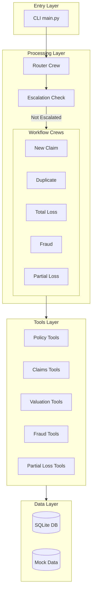
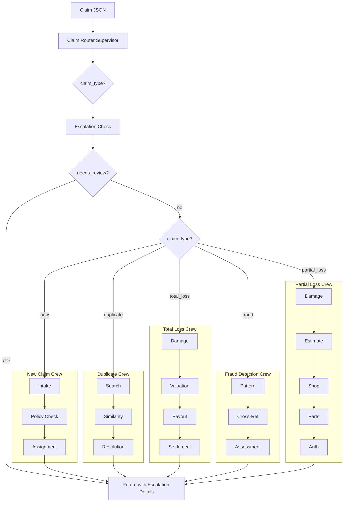

# Architecture Overview

The Agentic Claim Representative is a proof-of-concept AI system for processing auto insurance claims. Built with [CrewAI](https://crewai.com/) and Python, it uses a multi-agent architecture where specialized agents collaborate to handle different aspects of claim processing.

## System Components



## Core Architectural Patterns

### Router-Delegator Pattern

The system uses a **router-delegator pattern**:
- A **Router Crew** classifies incoming claims into one of five types
- Based on classification, the appropriate **Workflow Crew** is invoked
- Each workflow crew contains specialized agents for that claim type

See [Crews](crews.md) for detailed crew documentation.

### Human-in-the-Loop (HITL)

After classification but before workflow execution:
- An **escalation check** evaluates if the claim needs human review
- Claims flagged for escalation are marked `needs_review` and bypass automated processing
- Escalation criteria: fraud indicators, high-value payouts, low confidence scores

See [Agent Flow - Escalation](agent-flow.md#4-escalation-check-hitl) for details.

### Agent Composition

Each crew consists of multiple **specialized agents** that:
- Have specific roles, goals, and backstories defined in **skill files**
- Use dedicated tools to accomplish tasks
- Pass context between sequential tasks

See [Skills](skills.md) for agent prompt definitions.

### Persistent State

The system maintains state through:
- **SQLite database** for claim records and audit logs
- **Workflow runs** table for preserving processing history
- **Status tracking** with full audit trail

See [Database](database.md) for schema details.

## Main Flow Diagram



## Directory Structure

```
src/claim_agent/
├── main.py              # CLI entry point
├── config/              # LLM and YAML configs
│   └── llm.py           # LLM configuration
├── agents/              # Agent factory functions
├── crews/               # Crew definitions
├── skills/              # Agent prompt definitions (markdown)
│   ├── __init__.py      # Skill loading utilities
│   └── *.md             # Individual agent skills
├── tools/               # CrewAI tools
│   ├── logic.py         # Core implementation
│   └── *_tools.py       # Tool wrappers
├── db/                  # Database layer
│   ├── database.py      # SQLite connection
│   ├── repository.py    # CRUD operations
│   └── constants.py     # Status constants
├── models/              # Pydantic models
│   └── claim.py         # ClaimInput, ClaimOutput, etc.
└── mcp_server/          # Optional MCP server
```

## Technology Stack

| Component | Technology | Documentation |
|-----------|------------|---------------|
| Agent Framework | CrewAI | [Crews](crews.md) |
| Agent Prompts | Markdown Skills | [Skills](skills.md) |
| LLM Provider | OpenRouter / OpenAI | [Configuration](configuration.md) |
| Database | SQLite | [Database](database.md) |
| Data Validation | Pydantic | [Claim Types](claim-types.md#required-fields) |
| MCP Server | FastMCP | [MCP Server](mcp-server.md) |

## Key Design Decisions

### Why Multi-Agent Architecture?

1. **Separation of Concerns** - Each agent focuses on a specific task
2. **Modularity** - Easy to add/modify agents without affecting others
3. **Realistic Simulation** - Mirrors real insurance claim handling teams
4. **Scalability** - Crews can be extended with additional agents

### Why Router-Based Classification?

1. **Single Entry Point** - All claims enter through the same interface
2. **Flexible Routing** - Easy to add new claim types
3. **Clear Handoff** - Explicit delegation to specialized workflows

### Why Human-in-the-Loop?

1. **Risk Mitigation** - High-value or suspicious claims need human oversight
2. **Regulatory Compliance** - Insurance often requires human review
3. **Auditability** - All escalations are logged with reasons

### Why SQLite?

1. **Simplicity** - No external database server needed
2. **Portability** - Single file, easy to backup/restore
3. **Sufficient for POC** - Handles demonstration data volumes
4. **Easy Migration** - Schema migrates easily to PostgreSQL
