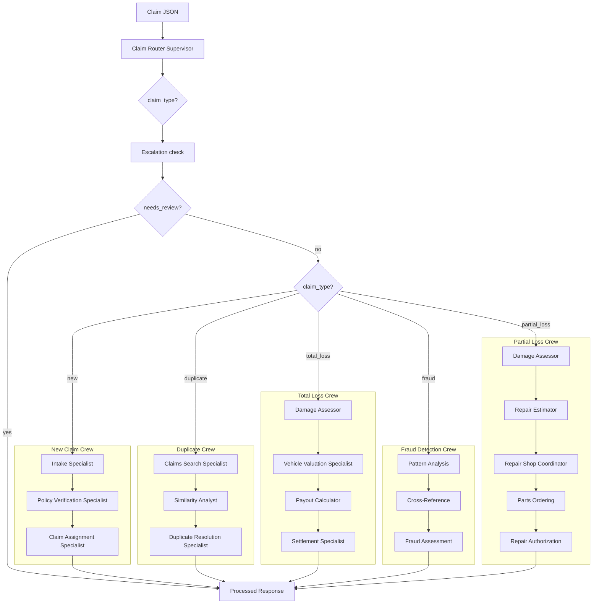

# Architecture Overview

The Agentic Claim Representative is a proof-of-concept AI system for processing auto insurance claims. Built with [CrewAI](https://crewai.com/) and Python, it uses a multi-agent architecture where specialized agents collaborate to handle different aspects of claim processing.

## System Components

```
┌─────────────────────────────────────────────────────────────────────────────┐
│                           Claim Processing System                            │
├─────────────────────────────────────────────────────────────────────────────┤
│                                                                              │
│  ┌──────────────┐     ┌──────────────────┐     ┌──────────────────────────┐ │
│  │  CLI Entry   │────▶│  Router Crew     │────▶│  Escalation Check (HITL) │ │
│  │  (main.py)   │     │  (Classification)│     │  (evaluate_escalation)   │ │
│  └──────────────┘     └──────────────────┘     └──────────────────────────┘ │
│                                                          │                   │
│                                                          ▼                   │
│  ┌──────────────────────────────────────────────────────────────────────┐   │
│  │                        Workflow Crews                                 │   │
│  ├──────────────┬──────────────┬──────────────┬──────────────┬─────────┤   │
│  │  New Claim   │  Duplicate   │  Total Loss  │    Fraud     │ Partial │   │
│  │    Crew      │    Crew      │    Crew      │    Crew      │  Loss   │   │
│  │              │              │              │              │  Crew   │   │
│  └──────────────┴──────────────┴──────────────┴──────────────┴─────────┘   │
│                                                                              │
│  ┌──────────────────────────────────────────────────────────────────────┐   │
│  │                           Tools Layer                                 │   │
│  ├──────────────┬──────────────┬──────────────┬──────────────┬─────────┤   │
│  │   Policy     │   Claims     │  Valuation   │    Fraud     │ Partial │   │
│  │   Tools      │   Tools      │   Tools      │    Tools     │  Loss   │   │
│  │              │              │              │              │  Tools  │   │
│  └──────────────┴──────────────┴──────────────┴──────────────┴─────────┘   │
│                                                                              │
│  ┌──────────────────────────────────────────────────────────────────────┐   │
│  │                         Data Layer                                    │   │
│  ├─────────────────────────────────┬────────────────────────────────────┤   │
│  │        SQLite Database          │          Mock Data Files           │   │
│  │   (claims, audit_log, runs)     │   (policies, compliance, values)   │   │
│  └─────────────────────────────────┴────────────────────────────────────┘   │
│                                                                              │
└─────────────────────────────────────────────────────────────────────────────┘
```

## Core Architectural Patterns

### 1. Router-Delegator Pattern

The system uses a **router-delegator pattern** where:
- A **Router Crew** classifies incoming claims into one of five types
- Based on classification, the appropriate **Workflow Crew** is invoked
- Each workflow crew contains specialized agents for that claim type

### 2. Human-in-the-Loop (HITL)

After classification but before workflow execution:
- An **escalation check** evaluates if the claim needs human review
- Claims flagged for escalation are marked `needs_review` and bypass automated processing
- Escalation criteria include: fraud indicators, high-value payouts, low confidence scores

### 3. Agent Composition

Each crew consists of multiple **specialized agents** that:
- Have specific roles, goals, and backstories
- Use dedicated tools to accomplish tasks
- Pass context between sequential tasks

### 4. Persistent State

The system maintains state through:
- **SQLite database** for claim records and audit logs
- **Workflow runs** table for preserving processing history
- **Status tracking** with full audit trail

## Flow Diagram



## Directory Structure

```
src/claim_agent/
├── main.py              # CLI entry point (process, status, history, reprocess)
├── config/
│   ├── llm.py           # LLM configuration (OpenRouter/OpenAI)
│   ├── agents.yaml      # Agent role definitions (reference)
│   └── tasks.yaml       # Task definitions (reference)
├── agents/              # Agent factory functions
│   ├── router.py        # Claim Router Supervisor
│   ├── new_claim.py     # Intake, Policy, Assignment agents
│   ├── duplicate.py     # Search, Similarity, Resolution agents
│   ├── total_loss.py    # Damage, Valuation, Payout, Settlement agents
│   ├── fraud.py         # Pattern, Cross-ref, Assessment agents
│   ├── partial_loss.py  # Damage, Estimate, Shop, Parts, Auth agents
│   └── escalation.py    # Escalation review agent
├── crews/               # Crew definitions
│   ├── main_crew.py     # Router crew and workflow orchestration
│   ├── new_claim_crew.py
│   ├── duplicate_crew.py
│   ├── total_loss_crew.py
│   ├── fraud_detection_crew.py
│   ├── partial_loss_crew.py
│   └── escalation_crew.py
├── tools/               # CrewAI tools (wrappers around logic)
│   ├── __init__.py      # Lazy-loaded tool exports
│   ├── logic.py         # Core implementation functions
│   ├── policy_tools.py
│   ├── claims_tools.py
│   ├── valuation_tools.py
│   ├── document_tools.py
│   ├── escalation_tools.py
│   ├── fraud_tools.py
│   ├── partial_loss_tools.py
│   └── compliance_tools.py
├── db/                  # Database layer
│   ├── database.py      # SQLite connection and schema
│   ├── repository.py    # Claim CRUD, audit logging
│   └── constants.py     # Status constants
├── models/              # Pydantic models
│   └── claim.py         # ClaimInput, ClaimOutput, EscalationOutput, WorkflowState
└── mcp_server/          # MCP server (optional)
    └── server.py        # FastMCP stdio server
```

## Technology Stack

| Component | Technology |
|-----------|------------|
| Agent Framework | CrewAI |
| LLM Provider | OpenRouter / OpenAI Compatible |
| Database | SQLite |
| Data Validation | Pydantic |
| CLI | Python argparse |
| Environment | python-dotenv |
| MCP Server | FastMCP (optional) |

## Key Design Decisions

### Why Multi-Agent Architecture?

1. **Separation of Concerns**: Each agent focuses on a specific task
2. **Modularity**: Easy to add/modify agents without affecting others
3. **Realistic Simulation**: Mirrors real insurance claim handling teams
4. **Scalability**: Crews can be extended with additional agents

### Why Router-Based Classification?

1. **Single Entry Point**: All claims enter through the same interface
2. **Flexible Routing**: Easy to add new claim types
3. **Clear Handoff**: Explicit delegation to specialized workflows

### Why Human-in-the-Loop?

1. **Risk Mitigation**: High-value or suspicious claims need human oversight
2. **Regulatory Compliance**: Insurance often requires human review for certain thresholds
3. **Auditability**: All escalations are logged with reasons

### Why SQLite?

1. **Simplicity**: No external database server needed
2. **Portability**: Single file, easy to backup/restore
3. **Sufficient for POC**: Handles the data volume for demonstration
4. **Easy Migration**: Schema is simple enough to migrate to PostgreSQL if needed
