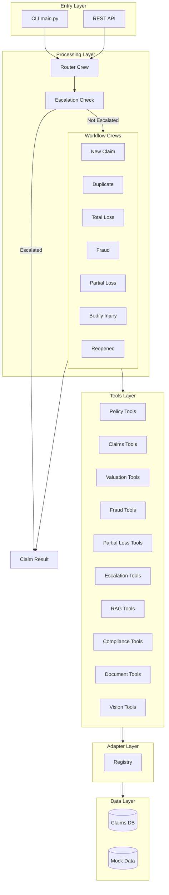
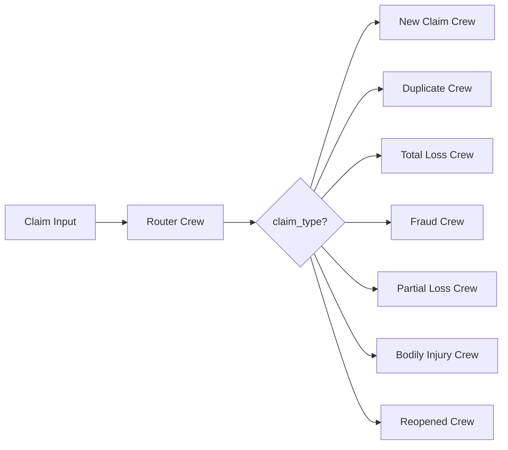
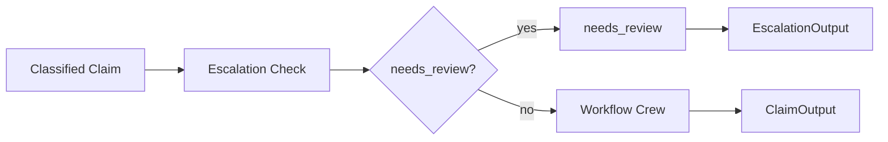
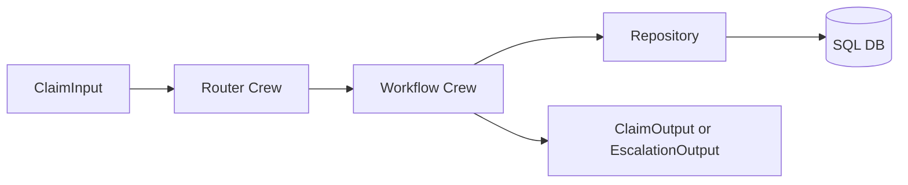
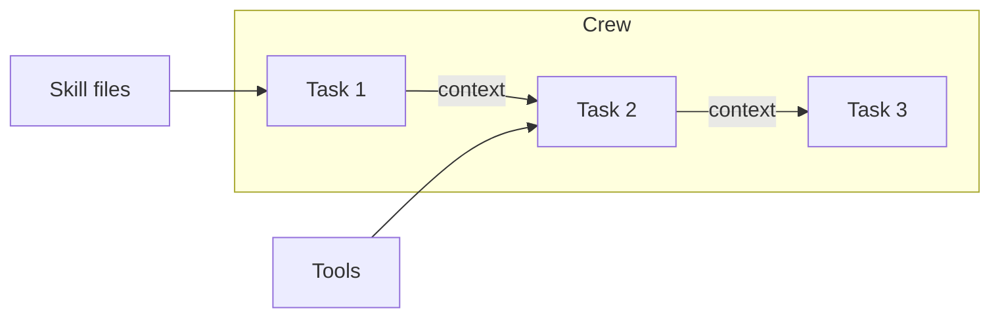
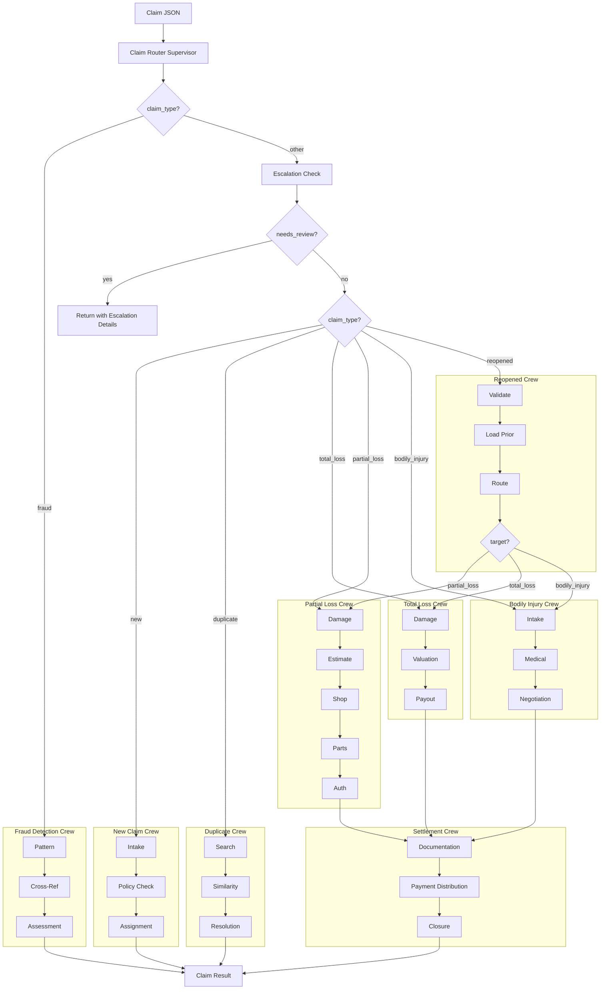

# Architecture Overview

The Agentic Claim Representative is a proof-of-concept AI system for processing auto insurance claims. Built with [CrewAI](https://crewai.com/) and Python, it uses a multi-agent architecture where specialized agents collaborate to handle different aspects of claim processing.

## System Components


```mermaid
flowchart TB
    subgraph Entry["Entry Layer"]
        CLI[CLI main.py]
        API[REST API]
    end

    subgraph Processing["Processing Layer"]
        Router[Router Crew]
        Escalation[Escalation Check]

        subgraph Workflows["Workflow Crews"]
            New[New Claim]
            Dup[Duplicate]
            TL[Total Loss]
            Fraud[Fraud]
            PL[Partial Loss]
            BI[Bodily Injury]
            Reopened[Reopened]
        end
    end

    subgraph Tools["Tools Layer"]
        Policy[Policy Tools]
        Claims[Claims Tools]
        Valuation[Valuation Tools]
        FraudTools[Fraud Tools]
        PLTools[Partial Loss Tools]
        EscalationTools[Escalation Tools]
        RAGTools[RAG Tools]
        ComplianceTools[Compliance Tools]
        DocumentTools[Document Tools]
        VisionTools[Vision Tools]
    end

    subgraph Adapters["Adapter Layer"]
        AdapterRegistry[Registry]
    end

    subgraph Data["Data Layer"]
        DB[(Claims DB)]
        MockDB[(Mock Data)]
    end

    ClaimResult[Claim Result]

    CLI --> Router
    API --> Router
    Router --> Escalation
    Escalation -->|Escalated| ClaimResult
    Escalation -->|Not Escalated| Workflows
    Workflows --> ClaimResult
    Workflows --> Tools
    Tools --> Adapters
    Adapters --> Data
```

**Orchestration note:** In `workflow/orchestrator.py`, several stages run **before** the Router Crew: **coverage verification** (FNOL coverage gate), **economic analysis** (high-value / total-loss thresholds), **fraud prescreening**, and **duplicate detection** (duplicate candidate search). After the Router and escalation check, the pipeline runs the primary **workflow crew**, then **task creation**, **rental**, **liability determination** (before settlement), **settlement**, **subrogation**, **salvage** (when applicable), and **after-action**. The diagrams below emphasize routing and crews; this is the full stage order in code.

**Data Layer:** The claims database is **SQLite by default** (`data/claims.db`) or **PostgreSQL** when `DATABASE_URL` is set (same schema via Alembic). Mock Data (`MOCK_DB_PATH`, e.g. `data/mock_db.json`) provides reference data (policies, vehicle values, fraud indicators) for tool lookups; it is supplementary, not a replacement for the claims database. Additional tool groups: Document, Vision.

## Core Architectural Patterns

### Router-Delegator Pattern

The system uses a **router-delegator pattern**:
- A **Router Crew** classifies incoming claims into one of seven types: `new`, `duplicate`, `total_loss`, `fraud`, `partial_loss`, `bodily_injury`, and `reopened`
- Based on classification, the appropriate **Workflow Crew** is invoked
- Each workflow crew contains specialized agents for that claim type


```mermaid
flowchart LR
    ClaimIn[Claim Input] --> Router[Router Crew]
    Router --> Type{claim_type?}
    Type --> NewCrew[New Claim Crew]
    Type --> DupCrew[Duplicate Crew]
    Type --> TLCrew[Total Loss Crew]
    Type --> FraudCrew[Fraud Crew]
    Type --> PLCrew[Partial Loss Crew]
    Type --> BICrew[Bodily Injury Crew]
    Type --> ReopenedCrew[Reopened Crew]
```

See [Crews](crews.md) for detailed crew documentation.

### Human-in-the-Loop (HITL)

After classification but before workflow execution:
- An **escalation check** evaluates if the claim needs human review
- Claims flagged for escalation are marked `needs_review` and bypass automated processing
- Escalation criteria: fraud indicators, high-value payouts, low confidence scores, ambiguous duplicate similarity (e.g. similarity in a gray band where merge vs. separate claim is unclear)


```mermaid
flowchart LR
    Classified[Classified Claim] --> Esc[Escalation Check]
    Esc --> Need{needs_review?}
    Need -->|yes| Review[needs_review]
    Need -->|no| Workflow[Workflow Crew]
    Workflow --> Out[ClaimOutput]
    Review --> EscOut[EscalationOutput]
```

See [Agent Flow - Escalation](agent-flow.md#4-escalation-check-hitl) for details.

### Data Flow

Claim data flows through the system as follows. The Router Crew receives **sanitized claim JSON** validated against the `ClaimInput` schema (`models/claim.py`) and classifies the claim; it passes that data and classification to the selected workflow crew. Within each crew, context is shared between tasks (see Agent Composition below for details on the context mechanism). Persistent state (claim records, workflow runs) is stored in the configured SQL database via the repository layer. Successful completion yields a **`ClaimOutput`** with `claim_id`, `status`, `actions_taken`, optional `payout_amount`, and liability fields when populated. Escalated paths return **`EscalationOutput`**: `claim_id`, `needs_review`, `escalation_reasons`, `priority`, `recommended_action`, and `fraud_indicators` (`actions_taken` is on `ClaimOutput` only, not on `EscalationOutput`).


```mermaid
flowchart LR
    ClaimInput[ClaimInput] --> Router[Router Crew]
    Router --> Crew[Workflow Crew]
    Crew --> Repo[Repository]
    Repo --> DB[(SQL DB)]
    Crew --> Out["ClaimOutput or EscalationOutput"]
```

### Agent Composition

Each crew consists of multiple **specialized agents** that:
- Have specific roles, goals, and backstories defined in **skill files**
- Use dedicated tools to accomplish tasks
- Pass context between sequential tasks via **CrewAI's sequential task context mechanism**: each task declares a `context` parameter listing prior tasks; the output of those tasks is automatically injected as input context for the next agent. For example, in the Total Loss crew, the payout task receives context from both the damage assessment and valuation tasks. Tasks specify an `expected_output` string to guide the LLM; structured Pydantic output is used where the workflow needs to parse results (e.g., escalation reports).


```mermaid
flowchart LR
    subgraph Crew [Crew]
        T1[Task 1] -->|context| T2[Task 2] -->|context| T3[Task 3]
    end
    Skills[Skill files] --> T1
    Tools[Tools] --> T2
```

See [Skills](skills.md) for agent prompt definitions.

### Persistent State

The system maintains state through:
- **SQLite database** for claim records and audit logs
- **Workflow runs** table for preserving processing history
- **Status tracking** with full audit trail

See [Database](database.md) for schema details.

### Observability

The `observability/` module provides structured logging, tracing, and metrics. **ClaimLogger** and **claim_context** attach `claim_id` and `claim_type` to all log lines (JSON or human-readable format). **LangSmith** integration (optional) records LLM traces; a **LiteLLM callback** captures token usage and cost per call. **ClaimMetrics** aggregates per-claim and global stats: LLM call count, tokens, estimated cost (USD), and latency percentiles. See [Observability](observability.md) for configuration and usage.

## Main Flow Diagram


```mermaid
flowchart TB
    A[Claim JSON] --> B[Claim Router Supervisor]
    B --> C{claim_type?}
    C -->|fraud| FR1
    C -->|"other"| D[Escalation Check]
    D --> E{needs_review?}
    E -->|yes| G[Return with Escalation Details]
    E -->|no| H{claim_type?}
    ClaimResult[Claim Result]

    subgraph New["New Claim Crew"]
        D1[Intake] --> D2[Policy Check] --> D3[Assignment]
    end

    subgraph Dup["Duplicate Crew"]
        E1[Search] --> E2[Similarity] --> E3[Resolution]
    end

    subgraph Total["Total Loss Crew"]
        F1[Damage] --> F2[Valuation] --> F3[Payout]
    end

    subgraph FraudCrew["Fraud Detection Crew"]
        FR1[Pattern] --> FR2[Cross-Ref] --> FR3[Assessment]
    end

    subgraph Partial["Partial Loss Crew"]
        P1[Damage] --> P2[Estimate] --> P3[Shop] --> P4[Parts] --> P5[Auth]
    end

    subgraph BICrew["Bodily Injury Crew"]
        B1[Intake] --> B2[Medical] --> B3[Negotiation]
    end

    subgraph Reopened["Reopened Crew"]
        R1[Validate] --> R2[Load Prior] --> R3[Route] --> R4{target?}
    end

    subgraph Settlement["Settlement Crew"]
        S1[Documentation] --> S2[Payment Distribution] --> S3[Closure]
    end

    H -->|new| D1
    H -->|duplicate| E1
    H -->|total_loss| F1
    H -->|partial_loss| P1
    H -->|bodily_injury| B1
    H -->|reopened| R1
    D3 --> ClaimResult
    E3 --> ClaimResult
    F3 --> S1
    FR3 --> ClaimResult
    P5 --> S1
    B3 --> S1
    R4 -->|partial_loss| P1
    R4 -->|total_loss| F1
    R4 -->|bodily_injury| B1
    S3 --> ClaimResult
```

The high-level diagram above starts at the Router; see the **Orchestration note** under System Components for **pre-router** stages (coverage, economics, fraud prescreening, duplicates) and **post–workflow crew** stages (tasks, rental, liability, settlement chain, after-action).

## Directory Structure

```tree
src/claim_agent/
├── main.py              # CLI entry point
├── context.py           # ClaimContext for CLI/API
├── events.py            # Event handling
├── exceptions.py        # ClaimAgentError and domain exceptions
├── api/                 # REST API (FastAPI routes, auth, deps)
├── config/              # LLM and configuration
│   ├── llm.py           # LLM configuration
│   ├── llm_protocol.py  # LLM protocol abstraction
│   ├── settings.py      # Centralized settings (escalation, fraud, valuation, token budgets)
│   ├── settings_model.py # Pydantic settings models
│   ├── agents.yaml      # CrewAI agent role/goal/backstory definitions
│   └── tasks.yaml       # CrewAI task description and expected output definitions
├── adapters/            # Pluggable external-system adapters
│   ├── base.py          # Abstract interfaces (Policy, Valuation, RepairShop, Parts, SIU)
│   ├── registry.py      # Thread-safe factory functions (env-var-driven)
│   ├── stub.py          # Stub adapters (NotImplementedError placeholders)
│   └── mock/            # Mock adapters backed by mock_db.json
├── agents/              # Agent factory functions
├── chat/                # Chat agent for conversational claimant UX (distinct from the `/portal` self-service SPA)
├── compliance/          # UCSPA and regulatory compliance (deadlines, etc.)
├── privacy/             # Cross-border transfer and DPA-related helpers
├── crews/               # Crew definitions
├── data/                # Data loaders
├── diary/               # Diary/calendar system (auto-create, escalation)
├── workflow/            # Orchestration, routing, escalation (run_claim_workflow)
├── services/            # Business logic services (adjuster actions, DSAR, etc.)
├── skills/              # Agent prompt definitions (markdown)
│   ├── __init__.py      # Skill loading utilities
│   └── *.md             # Individual agent skills
├── tools/               # CrewAI tools
│   ├── *_logic.py       # Core implementation (policy_logic, claims_logic, valuation_logic, etc.; uses adapters)
│   └── *_tools.py       # Tool wrappers
├── storage/             # Local and S3 storage for attachments
├── notifications/       # Webhooks and claimant notifications
├── utils/               # Shared utilities
│   ├── sanitization.py  # Input sanitization for claim data
│   ├── retry.py         # LLM retry with exponential backoff
│   └── attachments.py   # Attachment type inference
├── db/                  # Database layer
│   ├── database.py      # SQLite connection (schema init once per path)
│   ├── repository.py    # CRUD operations (parameterized queries)
│   ├── constants.py     # Status constants
│   ├── audit_events.py  # Audit event recording
│   └── claim_data.py    # Claim data helpers
├── models/              # Pydantic models
│   ├── claim.py         # ClaimInput, ClaimOutput, ClaimType, etc.
│   └── workflow_output.py # Structured workflow outputs
├── rag/                 # RAG pipeline (policy/compliance search)
├── observability/       # Logging, tracing, metrics
└── mcp_server/          # Optional MCP server
```

## Observability UI and portals

The React + Vite app under `frontend/` is not a single product surface:

- **Adjuster / operator UI** — Routes under the main layout (`/`, `/claims`, workbench, docs, skills, etc.) use authenticated internal APIs (`/api/v1/claims` and related), same pattern as the observability dashboard.
- **Claimant self-service** — Routes `/portal/login`, `/portal/claims`, and `/portal/claims/:claimId` (`frontend/src/pages/Portal*.tsx`) talk to **`/api/v1/portal/*`**, implemented in `src/claim_agent/api/routes/portal.py`, with claimant verification (access token, policy+VIN, or email depending on configuration). This is the real policyholder-facing flow.
- **Role simulation** — `/simulate` (`frontend/src/pages/Simulation.tsx`) switches among `frontend/src/pages/simulation/*` (customer, repair shop, third party). Those views reuse dashboard-style data hooks (e.g. `useClaims`); they are **simulation-only** and do **not** use portal verification or `/api/v1/portal/*`.

For API contract coverage of the portal, see [`tests/test_portal_api.py`](../tests/test_portal_api.py). A concise route table lives in the [README](../README.md#portal-vs-simulation).

## Technology Stack

| Component | Technology | Documentation |
|-----------|------------|---------------|
| Agent Framework | CrewAI | [Crews](crews.md) |
| Agent Prompts | Markdown Skills | [Skills](skills.md) |
| LLM Provider | OpenRouter / OpenAI | [Configuration](configuration.md) |
| Database | SQLite | [Database](database.md) |
| Data Validation | Pydantic | [Claim Types](claim-types.md#required-fields) |
| Python | ≥3.10 | `pyproject.toml` |
| CLI | Typer | `main.py` |
| MCP Server | FastMCP | [MCP Server](mcp-server.md) |
| External Integrations | Adapter Pattern | [Adapters](adapters.md) |
| Observability & portals UI | React + Vite | This section; [README](../README.md#frontend-dashboard--adjuster-workbench) |

## Key Design Decisions

### Why Multi-Agent Architecture?

1. **Separation of Concerns** - Each agent focuses on a specific task
2. **Modularity** - Easy to add/modify agents without affecting others
3. **Realistic Simulation** - Mirrors real insurance claim handling teams
4. **Scalability** - Crews can be extended with additional agents

### Why Router-Based Classification?

1. **Single Entry Point** - All claims enter through the same interface
2. **Flexible Routing** - Easy to add new claim types
3. **Clear Handoff** - Explicit delegation to specialized workflows

### Why Human-in-the-Loop?

1. **Risk Mitigation** - High-value or suspicious claims need human oversight
2. **Regulatory Compliance** - Insurance often requires human review
3. **Auditability** - All escalations are logged with reasons

### Why Adapter Pattern for External Data?

1. **Pluggability** - Swap mock data for real services (KBB, policy DB, SIU) without changing tool logic
2. **Testability** - Mock adapters keep all tests self-contained; no external dependencies
3. **Configuration** - Backend selection via env vars (`POLICY_ADAPTER=mock|stub`)
4. **Consistency** - Mirrors the existing `StorageAdapter` pattern used for attachments

See [Adapters](adapters.md) for interfaces, implementations, and integration guide.

### Why SQLite?

1. **Simplicity** - No external database server needed
2. **Portability** - Single file, easy to backup/restore
3. **Sufficient for POC** - Handles demonstration data volumes
4. **Easy Migration** - Schema migrates easily to PostgreSQL

## Security and Resilience

- **Input sanitization** – Incoming claim data is sanitized (control characters, field length, prompt-injection patterns) before processing. See `claim_agent.utils.sanitization`.
- **Parameterized queries** – The repository uses explicit parameterized queries; no dynamic SQL string building.
- **Error messages** – Policy lookup and similar failures return generic messages to callers; detailed errors are logged internally.
- **Token budgets** – Configurable max tokens and LLM calls per claim prevent runaway usage. See [Configuration](configuration.md#centralized-settings).
- **Retry** – Transient LLM failures are retried with exponential backoff via `claim_agent.utils.retry`.
