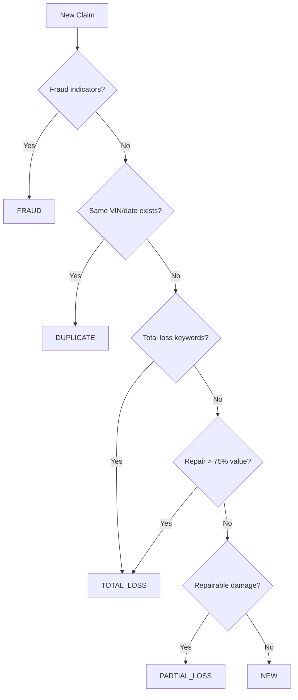

# Claim Types

The system supports five distinct claim types, each handled by a specialized workflow crew.

For crew details and agent composition, see [Crews](crews.md).

## Overview

| Type | Description | Final Status | Crew |
|------|-------------|--------------|------|
| `new` | First-time submission | `open` | [New Claim](crews.md#new-claim-crew) |
| `duplicate` | Duplicate of existing | `duplicate` | [Duplicate](crews.md#duplicate-crew) |
| `total_loss` | Unrepairable vehicle | `closed` | [Total Loss](crews.md#total-loss-crew) |
| `fraud` | Suspected fraud | `fraud_suspected` | [Fraud](crews.md#fraud-detection-crew) |
| `partial_loss` | Repairable damage | `partial_loss` | [Partial Loss](crews.md#partial-loss-crew) |

---

## Classification Decision Tree



---

## New Claim

Standard first-time claim submissions with no red flags.

### Classification Criteria

- First-time submission for this incident
- No duplicate indicators (different VIN or date)
- No fraud indicators in description
- Damage not clearly total or partial loss

### Required Fields

| Field | Type | Description |
|-------|------|-------------|
| `policy_number` | string | Insurance policy number |
| `vin` | string | Vehicle identification number |
| `vehicle_year` | integer | Year of vehicle |
| `vehicle_make` | string | Vehicle manufacturer |
| `vehicle_model` | string | Vehicle model |
| `incident_date` | string | Date of incident (YYYY-MM-DD) |
| `incident_description` | string | Description of the incident |
| `damage_description` | string | Description of vehicle damage |
| `estimated_damage` | float | Estimated repair cost (optional) |

### Example

```json
{
  "policy_number": "POL-001",
  "vin": "1HGBH41JXMN109186",
  "vehicle_year": 2021,
  "vehicle_make": "Honda",
  "vehicle_model": "Accord",
  "incident_date": "2025-01-15",
  "incident_description": "Rear-ended at stop light",
  "damage_description": "Minor rear bumper damage",
  "estimated_damage": 2500
}
```

---

## Duplicate Claim

Claims matching existing claims in the system.

### Classification Criteria

- Same VIN as an existing claim
- Same or similar incident date
- Similar incident description

### Similarity Scoring

| Score | Interpretation | Action |
|-------|----------------|--------|
| 0-50 | Low similarity | Process as new |
| 51-79 | Moderate | Review recommended |
| 80-100 | High similarity | Likely duplicate |

### Example

```json
{
  "policy_number": "POL-001",
  "vin": "1HGBH41JXMN109186",
  "incident_date": "2025-01-10",
  "incident_description": "Rear-ended at intersection on Main St",
  "damage_description": "Bumper and taillight damage"
}
```

---

## Total Loss

Vehicle is unrepairable or repair cost exceeds value.

### Classification Criteria

**Keywords:** totaled, flood, submerged, fire, burned, destroyed, frame damage, rollover

**Cost-based:** Repair cost > 75% of vehicle value

### Payout Formula

```
Payout = Vehicle Market Value - Policy Deductible

Example: $25,000 value - $1,000 deductible = $24,000 payout
```

### Example

```json
{
  "policy_number": "POL-002",
  "vin": "5YJSA1DN1CFP01234",
  "vehicle_year": 2020,
  "vehicle_make": "Tesla",
  "vehicle_model": "Model 3",
  "incident_date": "2025-01-20",
  "incident_description": "Flash flood while parked in underground garage",
  "damage_description": "Vehicle submerged for 3 hours. Electrical systems damaged.",
  "estimated_damage": 45000
}
```

---

## Fraud

Claims with indicators suggesting fraudulent activity.

### Classification Criteria

**Staged Accident Indicators:**
- "staged accident" language
- Multiple occupants with vague details
- Witnesses who "left the scene"
- Inconsistent damage vs. description

**Financial Red Flags:**
- Inflated damage estimates
- Prior fraud history on VIN/policy
- Damage estimate >> vehicle value

**Pattern Anomalies:**
- Multiple claims within 90 days
- New policy with quick filing

### Fraud Likelihood Levels

| Level | Score | Action |
|-------|-------|--------|
| Low | 0-25 | Process normally |
| Medium | 26-50 | Flag for review |
| High | 51-75 | Refer to SIU |
| Critical | 76-100 | Block claim |

### Example

```json
{
  "policy_number": "POL-FRAUD-001",
  "vin": "3VWDX7AJ5DM999999",
  "vehicle_year": 2019,
  "vehicle_make": "Volkswagen",
  "vehicle_model": "Jetta",
  "incident_date": "2025-01-22",
  "incident_description": "Staged accident. Multiple occupants complained of whiplash.",
  "damage_description": "Front bumper destroyed. Engine, transmission, frame damage.",
  "estimated_damage": 35000
}
```

---

## Partial Loss

Repairable vehicle damage.

### Classification Criteria

**Keywords:** bumper, fender, door, mirror, light, windshield, dent, scratch, crack

**Cost:** Typically < $10,000, repair cost < 75% of vehicle value

### Damage Severity

| Severity | Examples | Repair Days |
|----------|----------|-------------|
| Minor | Scratches, dents, mirrors | 3 days |
| Moderate | Bumper, fender, lights | 5 days |
| Severe | Door, hood, panels | 7 days |

### Cost Breakdown

```
Total = Parts Cost + Labor Cost
Customer Pays = Deductible (or Total if Total < Deductible)
Insurance Pays = Total - Customer Pays
```

### Part Types

| Type | Description | Cost |
|------|-------------|------|
| OEM | Original manufacturer | Higher |
| Aftermarket | Third-party | Lower |
| Refurbished | Reconditioned | Lowest |

### Example

```json
{
  "policy_number": "POL-003",
  "vin": "2T1BURHE5JC073987",
  "vehicle_year": 2022,
  "vehicle_make": "Toyota",
  "vehicle_model": "Corolla",
  "incident_date": "2025-01-25",
  "incident_description": "Backed into pole in parking lot",
  "damage_description": "Rear bumper cracked, taillight broken",
  "estimated_damage": 1800
}
```

---

## Sample Claims

The project includes sample claims for testing in `tests/sample_claims/`:

| File | Type |
|------|------|
| `partial_loss_parking.json` | partial_loss |
| `duplicate_claim.json` | duplicate |
| `total_loss_claim.json` | total_loss |
| `fraud_claim.json` | fraud |
| `partial_loss_claim.json` | partial_loss |
| `partial_loss_fender.json` | partial_loss |
| `partial_loss_front_collision.json` | partial_loss |

See [Getting Started](getting-started.md#sample-claims) for usage.
