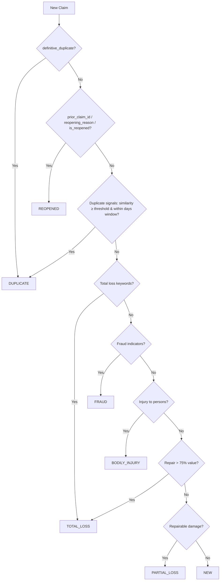

# Claim Types

The system supports seven distinct claim types, each handled by a specialized workflow crew.

For crew details and agent composition, see [Crews](crews.md).

## Claim data fields

Definitions for the claim payload and fields used across workflows. Inline field names in documentation link here.

| Field | Type | Description |
|-------|------|-------------|
| [claim_data](#claim_data) | object | Full claim payload JSON passed through the workflow |
| [policy_number](#policy_number) | string | Insurance policy number |
| [vin](#vin) | string | Vehicle identification number |
| [vehicle_year](#vehicle_year) | integer | Year of vehicle |
| [vehicle_make](#vehicle_make) | string | Vehicle manufacturer |
| [vehicle_model](#vehicle_model) | string | Vehicle model |
| [incident_date](#incident_date) | string (YYYY-MM-DD) | Date of incident |
| [incident_description](#incident_description) | string | Description of the incident |
| [damage_description](#damage_description) | string | Description of vehicle damage |
| [estimated_damage](#estimated_damage) | float | Estimated repair cost (optional) |
| [reserve_amount](#reserve_amount) | float | Reserve (estimated ultimate cost); set at FNOL and adjusted at material changes |
| [attachments](#attachments) | array | Optional attachments (photos, PDFs, estimates) |
| [parties](#parties) | array | Optional claim parties (claimant, policyholder, witness, attorney, provider, lienholder) |
| [claim_type](#claim_type) | string | Classification (new, duplicate, total_loss, etc.); set by router or reviewer |

### claim_data

The full claim payload object (JSON) passed through the workflow. Contains the fields listed above.

### policy_number

Insurance policy number (string). Required for new claims.

### vin

Vehicle identification number (string). Required for new claims.

### vehicle_year

Year of vehicle (integer). Required for new claims.

### vehicle_make

Vehicle manufacturer (string). Required for new claims.

### vehicle_model

Vehicle model (string). Required for new claims.

### incident_date

Date of incident (YYYY-MM-DD). Required for new claims. Validated as date by Pydantic.

### incident_description

Description of the incident (string). Required for new claims.

### damage_description

Description of vehicle damage (string). Required for new claims.

### estimated_damage

Estimated repair cost in dollars (float, optional).

### reserve_amount

Reserve (estimated ultimate cost) in dollars. Set at FNOL from `estimated_damage` when configured; adjusted via `set_reserve`/`adjust_reserve` at material changes. Used for actuarial tracking, loss projections, and reserve adequacy checks. See [Database](database.md#reserve_history).

### attachments

Optional list of attachments (photos, PDFs, estimates). Default empty array.

### parties

Optional list of claim parties. Each party has: `party_type` (claimant, policyholder, witness, attorney, provider, lienholder), `name`, `email`, `phone`, `role`, `consent_status`, `authorization_status`. Used for communication routing (e.g., if claimant has attorney, contact attorney) and payment disbursement. See [Database](database.md#claim_parties).

Party-to-party links (e.g., claimant represented by attorney) are stored in **`claim_party_relationships`** after both parties exist. Use `POST /api/v1/claims/{claim_id}/party-relationships` and `DELETE /api/v1/claims/{claim_id}/party-relationships/{id}` (adjuster roles), or `ClaimRepository.add_claim_party_relationship` / `delete_claim_party_relationship`. They are not set on the FNOL payload; create parties first, then add edges by party id.

### claim_type

Classification result (e.g. `new`, `duplicate`, `total_loss`). Set by router or by reviewer override; intake endpoints should not accept this from untrusted input.

---

## Overview

| Type | Description | Final Status | Crew |
|------|-------------|--------------|------|
| `new` | First-time submission | `open` | [New Claim](crews.md#new-claim-crew) |
| `duplicate` | Duplicate of existing | `duplicate` | [Duplicate](crews.md#duplicate-crew) |
| `total_loss` | Unrepairable vehicle | `settled` | [Total Loss](crews.md#total-loss-crew) → [Settlement](crews.md#settlement-crew) |
| `fraud` | Suspected fraud | `fraud_suspected` | [Fraud](crews.md#fraud-detection-crew) |
| `partial_loss` | Repairable damage | `settled` | [Partial Loss](crews.md#partial-loss-crew) → [Settlement](crews.md#settlement-crew) |
| `bodily_injury` | Injury to persons | `settled` | [Bodily Injury](crews.md#bodily-injury-crew) → [Settlement](crews.md#settlement-crew) |
| `reopened` | Reopened settled claim | varies | [Reopened](crews.md#reopened-crew) → routes to partial_loss/total_loss/bodily_injury |

---

## Classification Decision Tree

The router evaluates in priority order: definitive_duplicate → reopened → duplicate → total_loss → fraud → bodily_injury → partial_loss → new.


```mermaid
flowchart TD
    A[New Claim] --> B{definitive_duplicate?}
    B -->|Yes| C[DUPLICATE]
    B -->|No| D{prior_claim_id / reopening_reason / is_reopened?}
    D -->|Yes| E[REOPENED]
    D -->|No| H{Duplicate signals: similarity ≥ threshold & within days window?}
    H -->|Yes| C
    H -->|No| I{Total loss keywords?}
    I -->|Yes| J[TOTAL_LOSS]
    I -->|No| F{Fraud indicators?}
    F -->|Yes| G[FRAUD]
    F -->|No| K{Injury to persons?}
    K -->|Yes| L[BODILY_INJURY]
    K -->|No| M{Repair > 75% value?}
    M -->|Yes| J
    M -->|No| N{Repairable damage?}
    N -->|Yes| O[PARTIAL_LOSS]
    N -->|No| P[NEW]
```

---

## New Claim

Standard first-time claim submissions with no red flags. For the formal workflow specification (entry conditions, flow sequence, acceptance criteria), see [New Claim Crew](crews.md#new-claim-crew).

### Classification Criteria

- First-time submission for this incident
- No duplicate indicators (different VIN or date)
- No fraud indicators in description
- Damage not clearly total or partial loss

### Required Fields

| Field | Type | Description |
|-------|------|-------------|
| `policy_number` | string | Insurance policy number |
| `vin` | string | Vehicle identification number |
| `vehicle_year` | integer | Year of vehicle |
| `vehicle_make` | string | Vehicle manufacturer |
| `vehicle_model` | string | Vehicle model |
| `incident_date` | string (YYYY-MM-DD) | Date of incident; validated as date by Pydantic |
| `incident_description` | string | Description of the incident |
| `damage_description` | string | Description of vehicle damage |
| `estimated_damage` | float | Estimated repair cost (optional) |

### Example

```json
{
  "policy_number": "POL-001",
  "vin": "1HGBH41JXMN109186",
  "vehicle_year": 2021,
  "vehicle_make": "Honda",
  "vehicle_model": "Accord",
  "incident_date": "2025-01-15",
  "incident_description": "Rear-ended at stop light",
  "damage_description": "Minor rear bumper damage",
  "estimated_damage": 2500
}
```

---

## Duplicate Claim

Claims matching existing claims in the system. For the formal workflow specification (entry conditions, flow sequence, acceptance criteria), see [Duplicate Crew](crews.md#duplicate-crew).

### Classification Criteria

- Router duplicate classification uses **similarity scoring and a configurable days window**, not a naive “same VIN and same date” match. Pre-routing populates `existing_claims_for_vin` when **description similarity** meets a threshold **and** **incident dates** are within the configured window (stricter threshold for high-value claims); same VIN with different damage types is excluded. Thresholds and window come from routing / duplicate-detection settings (see `workflow/routing.py`).

### Similarity Thresholds

| Score | Interpretation | Action |
|-------|----------------|--------|
| 0-50 | Low similarity | Not duplicate, process normally |
| 51-79 | Moderate | Review recommended (may escalate) |
| 80-100 | High similarity | Likely duplicate, recommend merge/reject |

### Example

```json
{
  "policy_number": "POL-001",
  "vin": "1HGBH41JXMN109186",
  "incident_date": "2025-01-10",
  "incident_description": "Rear-ended at intersection on Main St",
  "damage_description": "Bumper and taillight damage"
}
```

---

## Total Loss

Vehicle is unrepairable or repair cost exceeds value. For the formal workflow specification (entry conditions, flow sequence, acceptance criteria), see [Total Loss Crew](crews.md#total-loss-crew).

### Classification Criteria

**Keywords:** totaled, flood, submerged, fire, burned, destroyed, frame damage, rollover

**Cost-based:** Repair cost > 75% of vehicle value

### Payout Formula

```
Payout = Vehicle Market Value - Policy Deductible

Example: $25,000 value - $1,000 deductible = $24,000 payout
```

### Example

```json
{
  "policy_number": "POL-002",
  "vin": "5YJSA1DN1CFP01234",
  "vehicle_year": 2020,
  "vehicle_make": "Tesla",
  "vehicle_model": "Model 3",
  "incident_date": "2025-01-20",
  "incident_description": "Flash flood while parked in underground garage",
  "damage_description": "Vehicle submerged for 3 hours. Electrical systems damaged.",
  "estimated_damage": 45000
}
```

---

## Fraud

Claims with indicators suggesting fraudulent activity. For the formal workflow specification (entry conditions, flow sequence, acceptance criteria), see [Fraud Detection Crew](crews.md#fraud-detection-crew).

### Classification Criteria

**Staged Accident Indicators:**
- "staged accident" language
- Multiple occupants with vague details
- Witnesses who "left the scene"
- Inconsistent damage vs. description

**Financial Red Flags:**
- Inflated damage estimates
- Prior fraud history on VIN/policy
- Damage estimate >> vehicle value

**Pattern Anomalies:**
- Multiple claims within 90 days
- New policy with quick filing

### Fraud Likelihood Levels

| Level | Score | Action |
|-------|-------|--------|
| Low | 0-25 | Process normally |
| Medium | 26-50 | Flag for review |
| High | 51-75 | Refer to SIU |
| Critical | 76-100 | Block claim |

### Example

```json
{
  "policy_number": "POL-FRAUD-001",
  "vin": "3VWDX7AJ5DM999999",
  "vehicle_year": 2019,
  "vehicle_make": "Volkswagen",
  "vehicle_model": "Jetta",
  "incident_date": "2025-01-22",
  "incident_description": "Staged accident. Multiple occupants complained of whiplash.",
  "damage_description": "Front bumper destroyed. Engine, transmission, frame damage.",
  "estimated_damage": 35000
}
```

---

## Partial Loss

Repairable vehicle damage. For the formal workflow specification (entry conditions, flow sequence, acceptance criteria), see [Partial Loss Crew](crews.md#partial-loss-crew).

### Classification Criteria

**Keywords:** bumper, fender, door, mirror, light, windshield, dent, scratch, crack

**Cost:** Typically < $10,000, repair cost < 75% of vehicle value

### Damage Severity → Repair Days

| Severity | Repair Days | Examples |
|----------|-------------|----------|
| Minor | 3 days | Scratches, dents, mirrors |
| Moderate | 5 days | Bumper, fender, lights |
| Severe | 7 days | Door, hood, multiple panels |

### Cost Breakdown

```
Total = Parts Cost + Labor Cost
Customer Pays = Deductible (or Total if Total < Deductible)
Insurance Pays = Total - Customer Pays
```

### Part Types

| Type | Description | Cost |
|------|-------------|------|
| OEM | Original manufacturer | Higher |
| Aftermarket | Third-party | Lower |
| Refurbished | Reconditioned | Lowest |

### Supplemental (Sub-Workflow)

When additional damage is discovered during repair, the [Supplemental Crew](crews.md#supplemental-crew) handles it as a sub-workflow. Invoke via `POST /api/v1/claims/{claim_id}/supplemental` with:

```json
{
  "supplemental_damage_description": "Hidden frame damage discovered during bumper removal",
  "reported_by": "shop"
}
```

Allowed claim statuses: `processing`, `settled`. California CCR 2695.8 requires prompt inspection and authorization.

### Example

```json
{
  "policy_number": "POL-003",
  "vin": "2T1BURHE5JC073987",
  "vehicle_year": 2022,
  "vehicle_make": "Toyota",
  "vehicle_model": "Corolla",
  "incident_date": "2025-01-25",
  "incident_description": "Backed into pole in parking lot",
  "damage_description": "Rear bumper cracked, taillight broken",
  "estimated_damage": 1800
}
```

---

## Bodily Injury

Claims involving injury to persons. For workflow details, see [Bodily Injury Crew](crews.md#bodily-injury-crew).

### Classification Criteria

- Incident or damage description mentions: injured, injury, whiplash, broken bone, fracture, hospital, medical treatment, back pain, neck pain, concussion, soft tissue, laceration, ambulance, ER visit, bodily harm, passenger injured, driver injured
- `injury_related` or `bodily_injury` is true in claim data when present
- Injury to people is a significant component (not just vehicle damage)

### Example

```json
{
  "policy_number": "POL-004",
  "vin": "2HGFG3B54CH501234",
  "vehicle_year": 2020,
  "vehicle_make": "Toyota",
  "vehicle_model": "Camry",
  "incident_date": "2025-02-01",
  "incident_description": "Rear-ended at intersection. Driver and passenger both injured. Ambulance transported driver to ER for whiplash and back pain.",
  "damage_description": "Rear bumper and trunk damaged. Driver sustained whiplash and cervical strain. Passenger had minor soft tissue injury. Both sought medical treatment.",
  "estimated_damage": 4500
}
```

---

## Reopened

Settled claims being reopened for new damage, policyholder appeal, or similar. The Reopened crew validates the reason, loads the prior claim, and routes to partial_loss, total_loss, or bodily_injury. For workflow details, see [Reopened Crew](crews.md#reopened-crew).

### Classification Criteria

- **OR logic (any one is enough):** If `definitive_duplicate` is not true, the router classifies as `reopened` when **any** of the following appear in claim data: `prior_claim_id`, `reopening_reason`, or `is_reopened` true—matching `workflow/routing.py` (not all three required).

### Example

```json
{
  "policy_number": "POL-003",
  "vin": "2T1BURHE5JC073987",
  "prior_claim_id": "CLM-XXXXXXXX",
  "reopening_reason": "new_damage",
  "incident_date": "2025-02-10",
  "incident_description": "Additional damage discovered during repair",
  "damage_description": "Hidden frame damage discovered during bumper removal"
}
```

---

## Sample Claims

The project includes sample claims for testing in `tests/sample_claims/`:

| File | Type |
|------|------|
| `new_claim.json` | new |
| `partial_loss_parking.json` | partial_loss |
| `duplicate_claim.json` | duplicate |
| `total_loss_claim.json` | total_loss |
| `fraud_claim.json` | fraud |
| `partial_loss_claim.json` | partial_loss |
| `partial_loss_fender.json` | partial_loss |
| `partial_loss_front_collision.json` | partial_loss |
| `bodily_injury_claim.json` | bodily_injury |
| `reopened_claim.json` | reopened |
| `multi_vehicle_incident.json` | (multi-vehicle / incident grouping) |
| `coverage_denied_theft.json` | coverage denied (theft) |
| `territory_denied_mexico.json` | territory / jurisdiction |

See [Getting Started](getting-started.md#sample-claims) for usage.
