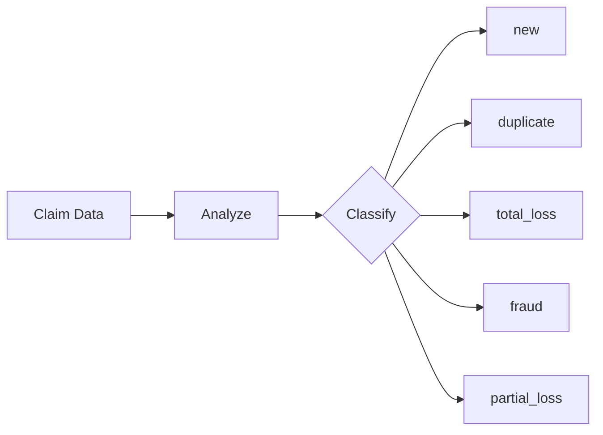
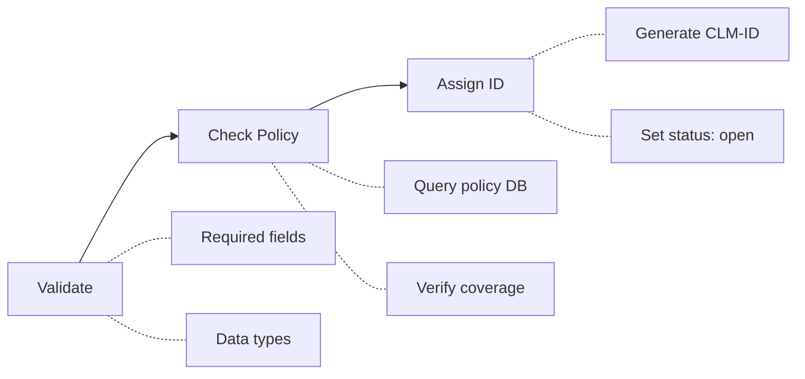
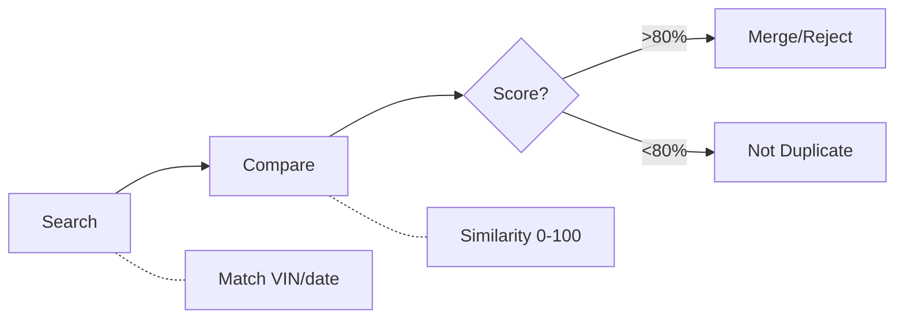
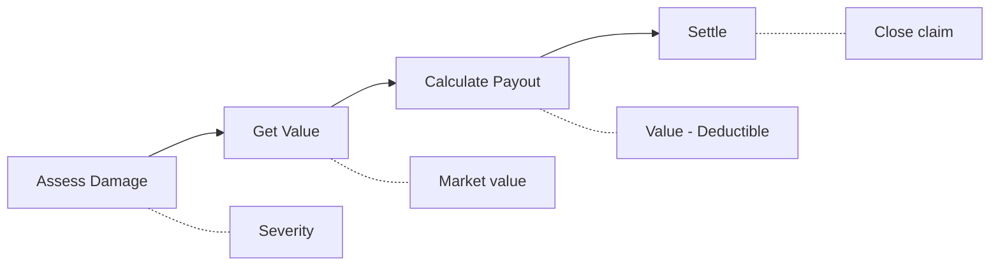
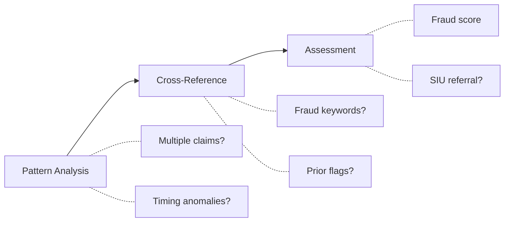
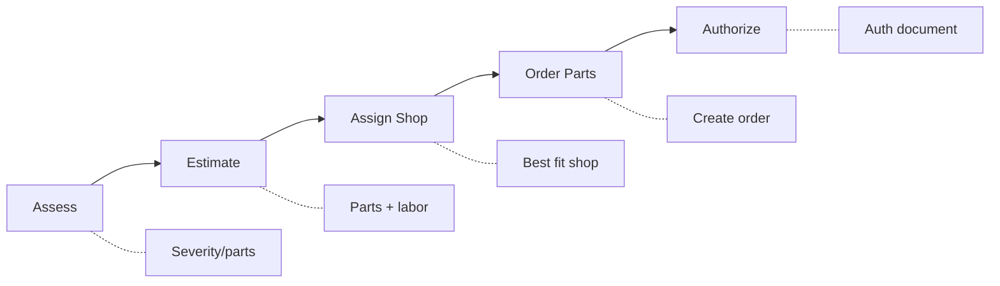

# Crews

Crews are collections of agents that work together to accomplish a specific workflow. Each crew handles a particular type of claim processing.

For classification criteria and claim examples, see [Claim Types](claim-types.md).

## Overview

| Crew | Agents | Purpose |
|------|--------|---------|
| [Router](#router-crew) | 1 | Classify incoming claims |
| [New Claim](#new-claim-crew) | 3 | Process first-time claims |
| [Duplicate](#duplicate-crew) | 3 | Handle potential duplicates |
| [Total Loss](#total-loss-crew) | 4 | Process total loss claims |
| [Fraud Detection](#fraud-detection-crew) | 3 | Analyze suspicious claims |
| [Partial Loss](#partial-loss-crew) | 5 | Handle repairable damage |

---

## Router Crew

**Location**: `src/claim_agent/crews/main_crew.py`

The Router Crew is the entry point for all claim processing. It contains a single agent that classifies claims into one of five types.

### Agent

| Agent | Role | Goal |
|-------|------|------|
| Claim Router Supervisor | Classify claims | Route to appropriate workflow |

### Flow



For classification criteria, see [Claim Types](claim-types.md).

---

## New Claim Crew

**Location**: `src/claim_agent/crews/new_claim_crew.py`

Handles first-time claim submissions through validation, policy verification, and assignment.

### Agents

| Agent | Tools Used |
|-------|------------|
| Intake Specialist | - |
| Policy Verification Specialist | [`query_policy_db`](tools.md#query_policy_db) |
| Claim Assignment Specialist | [`generate_claim_id`](tools.md#generate_claim_id), [`generate_report`](tools.md#generate_report) |

### Flow



---

## Duplicate Crew

**Location**: `src/claim_agent/crews/duplicate_crew.py`

Identifies and resolves potential duplicate claims.

### Agents

| Agent | Tools Used |
|-------|------------|
| Claims Search Specialist | [`search_claims_db`](tools.md#search_claims_db) |
| Similarity Analyst | [`compute_similarity`](tools.md#compute_similarity) |
| Duplicate Resolution Specialist | - |

### Flow



### Similarity Threshold

- **>80%**: Likely duplicate, recommend merge
- **<80%**: Not duplicate, process normally

---

## Total Loss Crew

**Location**: `src/claim_agent/crews/total_loss_crew.py`

Processes claims where the vehicle is a total loss.

### Agents

| Agent | Tools Used |
|-------|------------|
| Damage Assessor | [`evaluate_damage`](tools.md#evaluate_damage) |
| Vehicle Valuation Specialist | [`fetch_vehicle_value`](tools.md#fetch_vehicle_value) |
| Payout Calculator | [`calculate_payout`](tools.md#calculate_payout) |
| Settlement Specialist | [`generate_claim_id`](tools.md#generate_claim_id), [`generate_report`](tools.md#generate_report) |

### Flow



### Payout Calculation

```
Payout = Vehicle Market Value - Policy Deductible
```

---

## Fraud Detection Crew

**Location**: `src/claim_agent/crews/fraud_detection_crew.py`

Analyzes claims flagged for potential fraud. This crew runs **directly without escalation check** (it performs its own assessment).

### Agents

| Agent | Tools Used |
|-------|------------|
| Pattern Analysis Specialist | [`analyze_claim_patterns`](tools.md#analyze_claim_patterns) |
| Cross-Reference Specialist | [`cross_reference_fraud_indicators`](tools.md#cross_reference_fraud_indicators), [`detect_fraud_indicators`](tools.md#detect_fraud_indicators) |
| Fraud Assessment Specialist | [`perform_fraud_assessment`](tools.md#perform_fraud_assessment), [`generate_fraud_report`](tools.md#generate_fraud_report) |

### Flow



### Fraud Likelihood Levels

| Level | Score | Action |
|-------|-------|--------|
| Low | 0-25 | Process normally |
| Medium | 26-50 | Flag for review |
| High | 51-75 | SIU referral |
| Critical | 76-100 | Block claim |

---

## Partial Loss Crew

**Location**: `src/claim_agent/crews/partial_loss_crew.py`

Handles claims for repairable vehicle damage.

### Agents

| Agent | Tools Used |
|-------|------------|
| Damage Assessor | [`evaluate_damage`](tools.md#evaluate_damage), [`fetch_vehicle_value`](tools.md#fetch_vehicle_value) |
| Repair Estimator | [`calculate_repair_estimate`](tools.md#calculate_repair_estimate), [`get_parts_catalog`](tools.md#get_parts_catalog) |
| Repair Shop Coordinator | [`get_available_repair_shops`](tools.md#get_available_repair_shops), [`assign_repair_shop`](tools.md#assign_repair_shop) |
| Parts Ordering Specialist | [`get_parts_catalog`](tools.md#get_parts_catalog), [`create_parts_order`](tools.md#create_parts_order) |
| Repair Authorization Specialist | [`generate_repair_authorization`](tools.md#generate_repair_authorization), [`generate_report`](tools.md#generate_report) |

### Flow



### Damage Severity Levels

| Severity | Repair Days | Examples |
|----------|-------------|----------|
| Minor | 3 days | Scratches, dents, mirrors |
| Moderate | 5 days | Bumper, fender, lights |
| Severe | 7 days | Door, hood, multiple panels |

---

## Creating a Custom Crew

To add a new claim type workflow, see [Architecture](architecture.md) for the overall pattern, then:

1. **Create agents** in `src/claim_agent/agents/your_type.py`
2. **Create crew** in `src/claim_agent/crews/your_type_crew.py`
3. **Register** in `main_crew.py` `run_claim_workflow()`
4. **Update router** to recognize the new type
