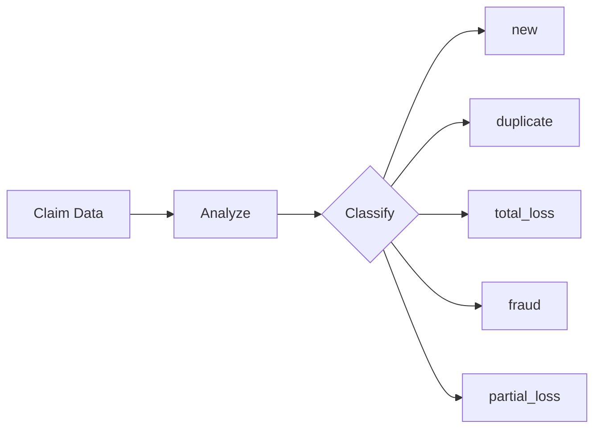
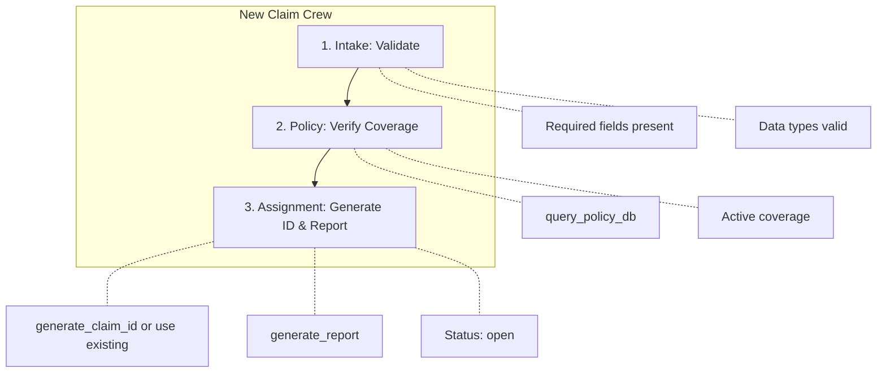
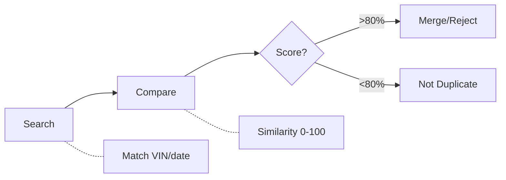
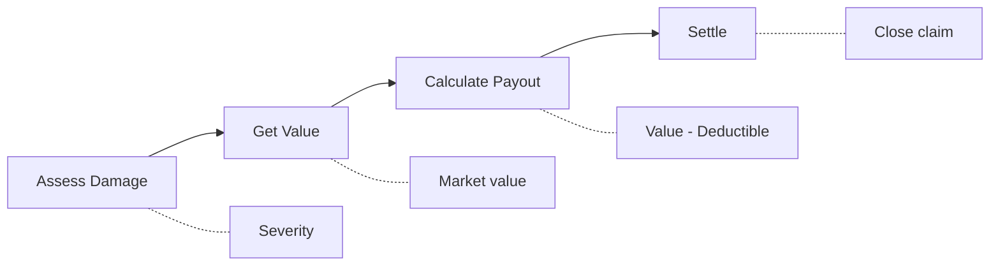
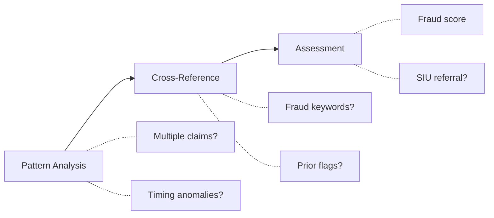
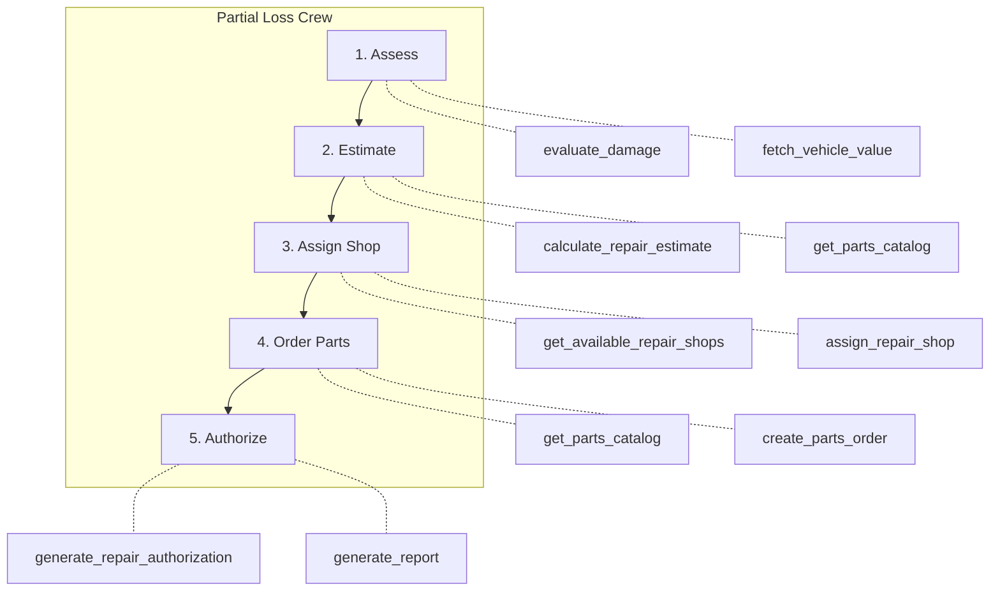

# Crews

Crews are collections of agents that work together to accomplish a specific workflow. Each crew handles a particular type of claim processing.

For classification criteria and claim examples, see [Claim Types](claim-types.md). For agent prompt definitions, see [Skills](skills.md).

## Overview

| Crew | Agents | Purpose |
|------|--------|---------|
| [Router](#router-crew) | 1 | Classify incoming claims |
| [New Claim](#new-claim-crew) | 3 | Process first-time claims |
| [Duplicate](#duplicate-crew) | 3 | Handle potential duplicates |
| [Total Loss](#total-loss-crew) | 4 | Process total loss claims |
| [Fraud Detection](#fraud-detection-crew) | 3 | Analyze suspicious claims |
| [Partial Loss](#partial-loss-crew) | 5 | Handle repairable damage |

---

## Router Crew

**Location**: `src/claim_agent/crews/main_crew.py`

The Router Crew is the entry point for all claim processing. It contains a single agent that classifies claims into one of five types.

### Agent

| Agent | Role | Goal |
|-------|------|------|
| Claim Router Supervisor | Classify claims | Route to appropriate workflow |

### Flow


```mermaid
flowchart LR
    A[Claim Data] --> B[Analyze] --> C{Classify}
    C --> D[new]
    C --> E[duplicate]
    C --> F[total_loss]
    C --> G[fraud]
    C --> H[partial_loss]
```

For classification criteria, see [Claim Types](claim-types.md).

---

## New Claim Crew

**Location**: `src/claim_agent/crews/new_claim_crew.py`

Handles first-time claim submissions through validation, policy verification, and assignment. This section is the **formal specification** for the New Claim workflow.

### Entry Conditions

- **Claim type:** `new` (from Router classification)
- **Classification criteria:**
  - First-time submission for this incident
  - No duplicate indicators (different VIN or date from existing claims)
  - No fraud indicators in description
  - Damage not clearly total or partial loss
- **Escalation:** If `needs_review` from escalation check, return early with escalation details (no crew execution)

### Agents

| Agent | Tools Used |
|-------|------------|
| Intake Specialist | - |
| Policy Verification Specialist | [`query_policy_db`](tools.md#query_policy_db) |
| Claim Assignment Specialist | [`generate_claim_id`](tools.md#generate_claim_id), [`generate_report`](tools.md#generate_report) |

### Flow Sequence


```mermaid
flowchart TB
    subgraph NewClaim["New Claim Crew"]
        A[1. Intake: Validate] --> B[2. Policy: Verify Coverage]
        B --> C[3. Assignment: Generate ID & Report]
    end
    
    A -.- A1[Required fields present]
    A -.- A2[Data types valid]
    
    B -.- B1[query_policy_db]
    B -.- B2[Active coverage]
    
    C -.- C1[generate_claim_id or use existing]
    C -.- C2[generate_report]
    C -.- C3[Status: open]
```

### Step 1: Intake Validation

| Aspect | Specification |
|--------|---------------|
| **Agent** | Intake Specialist |
| **Input** | `claim_data` JSON |
| **Required fields** | `policy_number`, `vin`, `vehicle_year`, `vehicle_make`, `vehicle_model`, `incident_date`, `incident_description`, `damage_description` |
| **Output** | `valid` with no missing fields, OR list of missing/invalid fields |
| **Tools** | None |

### Step 2: Policy Verification

| Aspect | Specification |
|--------|---------------|
| **Agent** | Policy Verification Specialist |
| **Input** | `claim_data` + validation result |
| **Action** | Query policy DB for `policy_number` |
| **Output** | Policy validity, coverage type, deductible |
| **Tools** | `query_policy_db` |

### Step 3: Assignment

| Aspect | Specification |
|--------|---------------|
| **Agent** | Claim Assignment Specialist |
| **Input** | `claim_data` (with `claim_id` if provided), validation + policy results |
| **Action** | Use `claim_id` from `claim_data` if present; else call `generate_claim_id` (prefix `CLM`) |
| **Output** | Claim ID, status `open`, one-line summary |
| **Tools** | `generate_claim_id`, `generate_report` |

### Exit Conditions

| Outcome | Status | Notes |
|---------|--------|-------|
| Success | `open` | Claim ID assigned, report generated |
| Escalated | `needs_review` | Returned before crew execution (main flow) |
| Failed | `failed` | Error during crew execution |

### Integration with Main Flow

The New Claim crew is invoked **after**:

1. Pydantic validation (CLI)
2. Claim creation in SQLite (`repo.create_claim`)
3. Router classification → `claim_type == "new"`
4. Escalation check (if not escalated)

**Note:** The main flow creates the claim record and assigns `claim_id` before routing. The New Claim crew receives `claim_id` in `claim_data` and should use it rather than generating a new one (except when `claim_id` is absent for edge cases).

### Acceptance Criteria

- **AC1:** Intake task validates all required fields and data types; outputs `valid` or list of issues
- **AC2:** Policy task calls `query_policy_db` and returns coverage details
- **AC3:** Assignment task uses existing `claim_id` when present, otherwise generates via `generate_claim_id`
- **AC4:** Assignment task calls `generate_report` with `claim_type='new'`, `status='open'`
- **AC5:** Final status is `open` on success
- **AC6:** Task context flows correctly: Policy receives validation output; Assignment receives validation + policy output
- **AC7:** Documentation (`docs/crews.md`, `docs/agent-flow.md`) matches this specification

---

## Duplicate Crew

**Location**: `src/claim_agent/crews/duplicate_crew.py`

Identifies and resolves potential duplicate claims.

### Agents

| Agent | Tools Used |
|-------|------------|
| Claims Search Specialist | [`search_claims_db`](tools.md#search_claims_db) |
| Similarity Analyst | [`compute_similarity`](tools.md#compute_similarity) |
| Duplicate Resolution Specialist | - |

### Flow


```mermaid
flowchart LR
    A[Search] --> B[Compare] --> C{Score?}
    C -->|>80%| D[Merge/Reject]
    C -->|<80%| E[Not Duplicate]
    
    A -.- A1[Match VIN/date]
    B -.- B1[Similarity 0-100]
```

### Similarity Threshold

- **>80%**: Likely duplicate, recommend merge
- **<80%**: Not duplicate, process normally

---

## Total Loss Crew

**Location**: `src/claim_agent/crews/total_loss_crew.py`

Processes claims where the vehicle is a total loss.

### Agents

| Agent | Tools Used |
|-------|------------|
| Damage Assessor | [`evaluate_damage`](tools.md#evaluate_damage) |
| Vehicle Valuation Specialist | [`fetch_vehicle_value`](tools.md#fetch_vehicle_value) |
| Payout Calculator | [`calculate_payout`](tools.md#calculate_payout) |
| Settlement Specialist | [`generate_claim_id`](tools.md#generate_claim_id), [`generate_report`](tools.md#generate_report) |

### Flow


```mermaid
flowchart LR
    A[Assess Damage] --> B[Get Value] --> C[Calculate Payout] --> D[Settle]
    
    A -.- A1[Severity]
    B -.- B1[Market value]
    C -.- C1[Value - Deductible]
    D -.- D1[Close claim]
```

### Payout Calculation

```
Payout = Vehicle Market Value - Policy Deductible
```

---

## Fraud Detection Crew

**Location**: `src/claim_agent/crews/fraud_detection_crew.py`

Analyzes claims flagged for potential fraud. This crew runs **directly without escalation check** (it performs its own assessment).

### Agents

| Agent | Tools Used |
|-------|------------|
| Pattern Analysis Specialist | [`analyze_claim_patterns`](tools.md#analyze_claim_patterns) |
| Cross-Reference Specialist | [`cross_reference_fraud_indicators`](tools.md#cross_reference_fraud_indicators), [`detect_fraud_indicators`](tools.md#detect_fraud_indicators) |
| Fraud Assessment Specialist | [`perform_fraud_assessment`](tools.md#perform_fraud_assessment), [`generate_fraud_report`](tools.md#generate_fraud_report) |

### Flow


```mermaid
flowchart LR
    A[Pattern Analysis] --> B[Cross-Reference] --> C[Assessment]
    
    A -.- A1[Multiple claims?]
    A -.- A2[Timing anomalies?]
    
    B -.- B1[Fraud keywords?]
    B -.- B2[Prior flags?]
    
    C -.- C1[Fraud score]
    C -.- C2[SIU referral?]
```

### Fraud Likelihood Levels

| Level | Score | Action |
|-------|-------|--------|
| Low | 0-25 | Process normally |
| Medium | 26-50 | Flag for review |
| High | 51-75 | SIU referral |
| Critical | 76-100 | Block claim |

---

## Partial Loss Crew

**Location**: `src/claim_agent/crews/partial_loss_crew.py`

Handles claims for repairable vehicle damage: assess damage, calculate repair estimate, assign repair shop, order parts, and generate repair authorization. This section is the **formal specification** for the Partial Loss workflow.

### Entry Conditions

- **Claim type:** `partial_loss` (from Router classification)
- **Classification criteria:**
  - Repairable damage (bumper, fender, door, mirror, light, windshield, dent, scratch, crack)
  - Typically < $10,000, repair cost < 75% of vehicle value
- **Escalation:** If `needs_review` from escalation check, return early (no crew execution)

### Agents

| Agent | Tools Used |
|-------|------------|
| Damage Assessor (Partial Loss) | [`evaluate_damage`](tools.md#evaluate_damage), [`fetch_vehicle_value`](tools.md#fetch_vehicle_value) |
| Repair Estimator | [`calculate_repair_estimate`](tools.md#calculate_repair_estimate), [`get_parts_catalog`](tools.md#get_parts_catalog) |
| Repair Shop Coordinator | [`get_available_repair_shops`](tools.md#get_available_repair_shops), [`assign_repair_shop`](tools.md#assign_repair_shop) |
| Parts Ordering Specialist | [`get_parts_catalog`](tools.md#get_parts_catalog), [`create_parts_order`](tools.md#create_parts_order) |
| Repair Authorization Specialist | [`generate_repair_authorization`](tools.md#generate_repair_authorization), [`generate_report`](tools.md#generate_report) |

### Flow Sequence


```mermaid
flowchart TB
    subgraph PartialLoss["Partial Loss Crew"]
        A[1. Assess] --> B[2. Estimate] --> C[3. Assign Shop] --> D[4. Order Parts] --> E[5. Authorize]
    end
    
    A -.- A1[evaluate_damage]
    A -.- A2[fetch_vehicle_value]
    
    B -.- B1[calculate_repair_estimate]
    B -.- B2[get_parts_catalog]
    
    C -.- C1[get_available_repair_shops]
    C -.- C2[assign_repair_shop]
    
    D -.- D1[get_parts_catalog]
    D -.- D2[create_parts_order]
    
    E -.- E1[generate_repair_authorization]
    E -.- E2[generate_report]
```

### Step 1: Damage Assessment

| Aspect | Specification |
|--------|---------------|
| **Agent** | Damage Assessor (Partial Loss) |
| **Input** | `claim_data` JSON |
| **Action** | Evaluate damage_description; fetch vehicle value; confirm repairable |
| **Output** | Severity (minor/moderate/severe), damaged components, vehicle value, partial loss confirmation |
| **Tools** | `evaluate_damage`, `fetch_vehicle_value` |
| **Note** | Flag if repair > 75% of value (potential total loss) |

### Step 2: Repair Estimate

| Aspect | Specification |
|--------|---------------|
| **Agent** | Repair Estimator |
| **Input** | `claim_data` + damage assessment |
| **Action** | Calculate parts + labor, deductible, customer vs insurance responsibility |
| **Output** | Parts list, labor hours, total cost, deductible, customer_pays, insurance_pays |
| **Tools** | `calculate_repair_estimate`, `get_parts_catalog` |

### Step 3: Shop Assignment

| Aspect | Specification |
|--------|---------------|
| **Agent** | Repair Shop Coordinator |
| **Input** | `claim_data` + damage + estimate |
| **Action** | Get available shops, select best (rating, wait time, certifications), assign |
| **Output** | Shop name, address, phone, confirmation, start/completion dates |
| **Tools** | `get_available_repair_shops`, `assign_repair_shop` |
| **Repair days** | Minor: 3, Moderate: 5, Severe: 7 |

### Step 4: Parts Order

| Aspect | Specification |
|--------|---------------|
| **Agent** | Parts Ordering Specialist |
| **Input** | `claim_data` + damage + estimate + shop assignment |
| **Action** | Get parts catalog, create order with claim_id, shop_id |
| **Output** | order_id, parts list, total cost, delivery date |
| **Tools** | `get_parts_catalog`, `create_parts_order` |

### Step 5: Authorization

| Aspect | Specification |
|--------|---------------|
| **Agent** | Repair Authorization Specialist |
| **Input** | All prior outputs |
| **Action** | Generate repair authorization; generate final report |
| **Output** | authorization_id, authorized amounts, claim report with payout |
| **Tools** | `generate_repair_authorization`, `generate_report` |
| **Report** | claim_type='partial_loss', status='approved', payout_amount=insurance_pays |

### Damage Severity → Repair Days

| Severity | Repair Days | Examples |
|----------|-------------|----------|
| Minor | 3 days | Scratches, dents, mirrors |
| Moderate | 5 days | Bumper, fender, lights |
| Severe | 7 days | Door, hood, multiple panels |

### Exit Conditions

| Outcome | Status | Notes |
|---------|--------|-------|
| Success | `partial_loss` | Authorization issued, report generated |
| Escalated | `needs_review` | Returned before crew execution |
| Failed | `failed` | Error during crew execution |

### Integration with Main Flow

The Partial Loss crew is invoked **after**:

1. Pydantic validation (CLI)
2. Claim creation in SQLite (`repo.create_claim`)
3. Router classification → `claim_type == "partial_loss"`
4. Escalation check (if not escalated)

### Acceptance Criteria

- **AC1:** Damage task calls `evaluate_damage` and `fetch_vehicle_value`; confirms repairable
- **AC2:** Estimate task calls `calculate_repair_estimate`; outputs parts, labor, deductible, insurance_pays
- **AC3:** Shop task calls `get_available_repair_shops` and `assign_repair_shop` with claim_id
- **AC4:** Parts task calls `create_parts_order` with claim_id, shop_id, parts list
- **AC5:** Authorization task calls `generate_repair_authorization` and `generate_report`
- **AC6:** Report has claim_type='partial_loss', status='approved', payout_amount
- **AC7:** Final status is `partial_loss` on success
- **AC8:** Task context flows correctly through all five steps
- **AC9:** Documentation matches this specification

---

## Creating a Custom Crew

To add a new claim type workflow, see [Architecture](architecture.md) for the overall pattern, then:

1. **Create skill files** in `src/claim_agent/skills/` for each agent (see [Skills](skills.md))
2. **Create agents** in `src/claim_agent/agents/your_type.py` that load skills
3. **Create crew** in `src/claim_agent/crews/your_type_crew.py`
4. **Register** in `main_crew.py` `run_claim_workflow()`
5. **Update router** skill to recognize the new type
