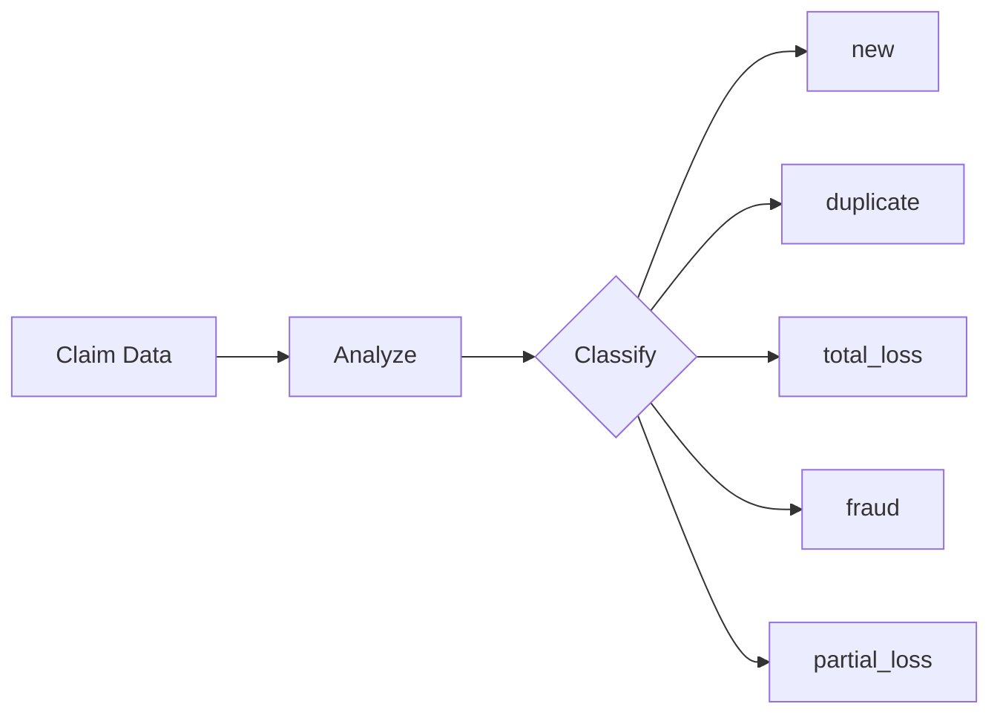
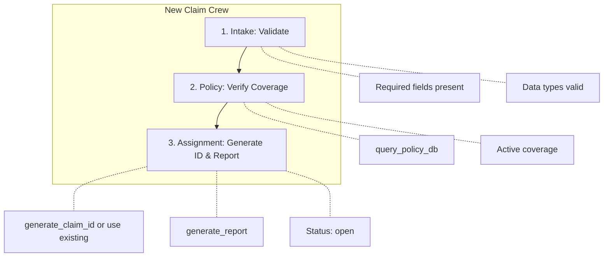
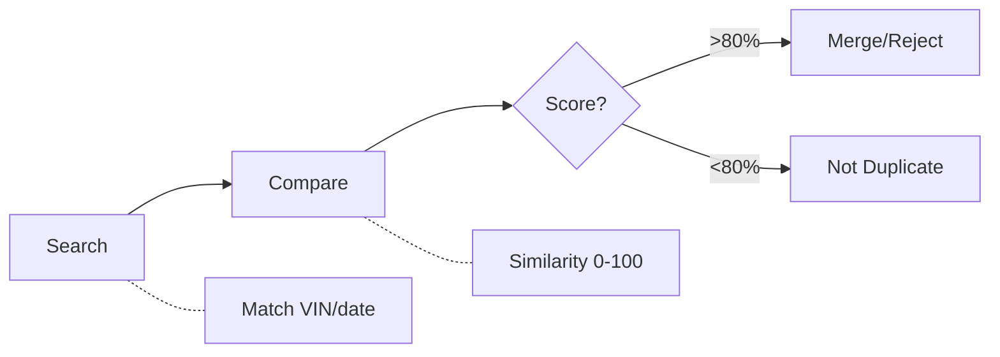
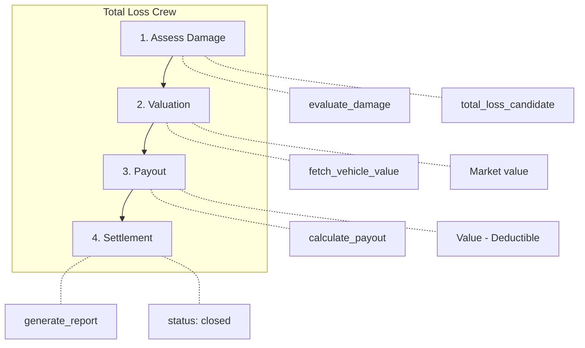
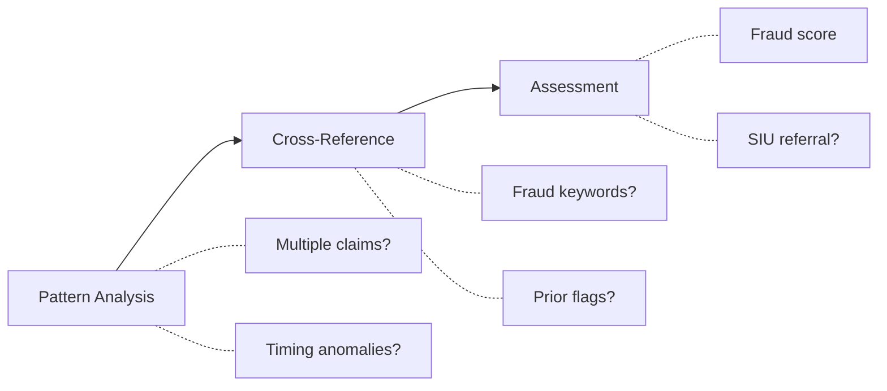
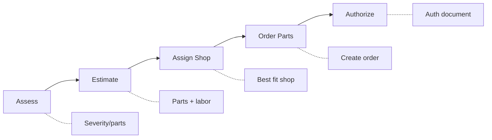

# Crews

Crews are collections of agents that work together to accomplish a specific workflow. Each crew handles a particular type of claim processing.

For classification criteria and claim examples, see [Claim Types](claim-types.md). For agent prompt definitions, see [Skills](skills.md).

## Overview

| Crew | Agents | Purpose |
|------|--------|---------|
| [Router](#router-crew) | 1 | Classify incoming claims |
| [New Claim](#new-claim-crew) | 3 | Process first-time claims |
| [Duplicate](#duplicate-crew) | 3 | Handle potential duplicates |
| [Total Loss](#total-loss-crew) | 4 | Process total loss claims |
| [Fraud Detection](#fraud-detection-crew) | 3 | Analyze suspicious claims |
| [Partial Loss](#partial-loss-crew) | 5 | Handle repairable damage |

---

## Router Crew

**Location**: `src/claim_agent/crews/main_crew.py`

The Router Crew is the entry point for all claim processing. It contains a single agent that classifies claims into one of five types.

### Agent

| Agent | Role | Goal |
|-------|------|------|
| Claim Router Supervisor | Classify claims | Route to appropriate workflow |

### Flow

```mermaid
flowchart LR
    A[Claim Data] --> B[Analyze] --> C{Classify}
    C --> D[new]
    C --> E[duplicate]
    C --> F[total_loss]
    C --> G[fraud]
    C --> H[partial_loss]
```

For classification criteria, see [Claim Types](claim-types.md).

---

## New Claim Crew

**Location**: `src/claim_agent/crews/new_claim_crew.py`

Handles first-time claim submissions through validation, policy verification, and assignment. This section is the **formal specification** for the New Claim workflow.

### Entry Conditions

- **Claim type:** `new` (from Router classification)
- **Classification criteria:**
  - First-time submission for this incident
  - No duplicate indicators (different VIN or date from existing claims)
  - No fraud indicators in description
  - Damage not clearly total or partial loss
- **Escalation:** If `needs_review` from escalation check, return early with escalation details (no crew execution)

### Agents

| Agent | Tools Used |
|-------|------------|
| Intake Specialist | - |
| Policy Verification Specialist | [`query_policy_db`](tools.md#query_policy_db) |
| Claim Assignment Specialist | [`generate_claim_id`](tools.md#generate_claim_id), [`generate_report`](tools.md#generate_report) |

### Flow Sequence

```mermaid
flowchart TB
    subgraph NewClaim["New Claim Crew"]
        A[1. Intake: Validate] --> B[2. Policy: Verify Coverage]
        B --> C[3. Assignment: Generate ID & Report]
    end
    
    A -.- A1[Required fields present]
    A -.- A2[Data types valid]
    
    B -.- B1[query_policy_db]
    B -.- B2[Active coverage]
    
    C -.- C1[generate_claim_id or use existing]
    C -.- C2[generate_report]
    C -.- C3[Status: open]
```

### Step 1: Intake Validation

| Aspect | Specification |
|--------|---------------|
| **Agent** | Intake Specialist |
| **Input** | `claim_data` JSON |
| **Required fields** | `policy_number`, `vin`, `vehicle_year`, `vehicle_make`, `vehicle_model`, `incident_date`, `incident_description`, `damage_description` |
| **Output** | `valid` with no missing fields, OR list of missing/invalid fields |
| **Tools** | None |

### Step 2: Policy Verification

| Aspect | Specification |
|--------|---------------|
| **Agent** | Policy Verification Specialist |
| **Input** | `claim_data` + validation result |
| **Action** | Query policy DB for `policy_number` |
| **Output** | Policy validity, coverage type, deductible |
| **Tools** | `query_policy_db` |

### Step 3: Assignment

| Aspect | Specification |
|--------|---------------|
| **Agent** | Claim Assignment Specialist |
| **Input** | `claim_data` (with `claim_id` if provided), validation + policy results |
| **Action** | Use `claim_id` from `claim_data` if present; else call `generate_claim_id` (prefix `CLM`) |
| **Output** | Claim ID, status `open`, one-line summary |
| **Tools** | `generate_claim_id`, `generate_report` |

### Exit Conditions

| Outcome | Status | Notes |
|---------|--------|-------|
| Success | `open` | Claim ID assigned, report generated |
| Escalated | `needs_review` | Returned before crew execution (main flow) |
| Failed | `failed` | Error during crew execution |

### Integration with Main Flow

The New Claim crew is invoked **after**:

1. Pydantic validation (CLI)
2. Claim creation in SQLite (`repo.create_claim`)
3. Router classification → `claim_type == "new"`
4. Escalation check (if not escalated)

**Note:** The main flow creates the claim record and assigns `claim_id` before routing. The New Claim crew receives `claim_id` in `claim_data` and should use it rather than generating a new one (except when `claim_id` is absent for edge cases).

### Acceptance Criteria

- **AC1:** Intake task validates all required fields and data types; outputs `valid` or list of issues
- **AC2:** Policy task calls `query_policy_db` and returns coverage details
- **AC3:** Assignment task uses existing `claim_id` when present, otherwise generates via `generate_claim_id`
- **AC4:** Assignment task calls `generate_report` with `claim_type='new'`, `status='open'`
- **AC5:** Final status is `open` on success
- **AC6:** Task context flows correctly: Policy receives validation output; Assignment receives validation + policy output
- **AC7:** Documentation (`docs/crews.md`, `docs/agent-flow.md`) matches this specification

---

## Duplicate Crew

**Location**: `src/claim_agent/crews/duplicate_crew.py`

Identifies and resolves potential duplicate claims.

### Agents

| Agent | Tools Used |
|-------|------------|
| Claims Search Specialist | [`search_claims_db`](tools.md#search_claims_db) |
| Similarity Analyst | [`compute_similarity`](tools.md#compute_similarity) |
| Duplicate Resolution Specialist | - |

### Flow

```mermaid
flowchart LR
    A[Search] --> B[Compare] --> C{Score?}
    C -->|>80%| D[Merge/Reject]
    C -->|<80%| E[Not Duplicate]
    
    A -.- A1[Match VIN/date]
    B -.- B1[Similarity 0-100]
```

### Similarity Threshold

- **>80%**: Likely duplicate, recommend merge
- **<80%**: Not duplicate, process normally

---

## Total Loss Crew

**Location**: `src/claim_agent/crews/total_loss_crew.py`

Processes claims where the vehicle is unrepairable or repair cost exceeds 75% of value: assess damage, fetch vehicle value, calculate payout, and settle. This section is the **formal specification** for the Total Loss workflow.

### Entry Conditions

- **Claim type:** `total_loss` (from Router classification)
- **Classification criteria:**
  - Total loss keywords: totaled, flood, submerged, fire, burned, destroyed, frame damage, rollover
  - Repair cost > 75% of vehicle value
- **Escalation:** If `needs_review` from escalation check, return early (no crew execution)

### Flow Sequence

```mermaid
flowchart TB
    subgraph TotalLoss["Total Loss Crew"]
        A[1. Assess Damage] --> B[2. Valuation] --> C[3. Payout] --> D[4. Settlement]
    end
    
    A -.- A1[evaluate_damage]
    A -.- A2[total_loss_candidate]
    
    B -.- B1[fetch_vehicle_value]
    B -.- B2[Market value]
    
    C -.- C1[calculate_payout]
    C -.- C2[Value - Deductible]
    
    D -.- D1[generate_report]
    D -.- D2[status: closed]
```

### Step 1: Damage Assessment

| Aspect | Specification |
|--------|---------------|
| **Agent** | Damage Assessor |
| **Input** | `claim_data` JSON |
| **Action** | Evaluate damage_description, estimated_damage; check for total loss indicators |
| **Output** | Damage severity, estimated_repair_cost, total_loss_candidate (true/false) |
| **Tools** | `evaluate_damage` |

### Step 2: Vehicle Valuation

| Aspect | Specification |
|--------|---------------|
| **Agent** | Vehicle Valuation Specialist |
| **Input** | `claim_data` + damage assessment |
| **Action** | Fetch current market value using vin, vehicle_year, vehicle_make, vehicle_model |
| **Output** | Vehicle value (USD), condition, source |
| **Tools** | `fetch_vehicle_value` |

### Step 3: Payout Calculation

| Aspect | Specification |
|--------|---------------|
| **Agent** | Payout Calculator |
| **Input** | Damage assessment + valuation + policy_number |
| **Action** | Calculate payout (vehicle value minus deductible) |
| **Output** | Payout amount (USD), calculation details |
| **Tools** | `calculate_payout` |
| **Formula** | `Payout = Vehicle Market Value - Policy Deductible` |

### Step 4: Settlement

| Aspect | Specification |
|--------|---------------|
| **Agent** | Settlement Specialist |
| **Input** | All prior outputs + claim_data |
| **Action** | Generate report with claim_id, claim_type='total_loss', status='closed', payout_amount |
| **Output** | Settlement report summary, claim closed confirmation |
| **Tools** | `generate_claim_id`, `generate_report` |

### Exit Conditions

| Outcome | Status | Notes |
|---------|--------|-------|
| Success | `closed` | Payout calculated, report generated |
| Escalated | `needs_review` | Returned before crew execution |
| Failed | `failed` | Error during crew execution |

### Integration with Main Flow

The Total Loss crew is invoked **after**:

1. Pydantic validation (CLI)
2. Claim creation in SQLite (`repo.create_claim`)
3. Router classification → `claim_type == "total_loss"`
4. Escalation check (if not escalated)
5. Economic total loss pre-check may populate `is_economic_total_loss`, `vehicle_value`, etc. in claim_data

**RAG:** Crew supports `state` (jurisdiction) and `use_rag` for policy/compliance context.

### Agents

| Agent | Tools Used |
|-------|------------|
| Damage Assessor | [`evaluate_damage`](tools.md#evaluate_damage) |
| Vehicle Valuation Specialist | [`fetch_vehicle_value`](tools.md#fetch_vehicle_value) |
| Payout Calculator | [`calculate_payout`](tools.md#calculate_payout) |
| Settlement Specialist | [`generate_claim_id`](tools.md#generate_claim_id), [`generate_report`](tools.md#generate_report) |

### Acceptance Criteria

- **AC1:** Damage task calls `evaluate_damage` and outputs total_loss_candidate
- **AC2:** Valuation task calls `fetch_vehicle_value` with vehicle identifiers
- **AC3:** Payout task calls `calculate_payout` with vehicle value and policy_number
- **AC4:** Payout formula: value - deductible
- **AC5:** Settlement task calls `generate_report` with claim_type='total_loss', status='closed', payout_amount
- **AC6:** Final status is `closed` on success
- **AC7:** Task context flows: Valuation receives damage; Payout receives damage + valuation; Settlement receives all
- **AC8:** Documentation matches this specification

---

## Fraud Detection Crew

**Location**: `src/claim_agent/crews/fraud_detection_crew.py`

Analyzes claims flagged for potential fraud. This crew runs **directly without escalation check** (it performs its own assessment).

### Agents

| Agent | Tools Used |
|-------|------------|
| Pattern Analysis Specialist | [`analyze_claim_patterns`](tools.md#analyze_claim_patterns) |
| Cross-Reference Specialist | [`cross_reference_fraud_indicators`](tools.md#cross_reference_fraud_indicators), [`detect_fraud_indicators`](tools.md#detect_fraud_indicators) |
| Fraud Assessment Specialist | [`perform_fraud_assessment`](tools.md#perform_fraud_assessment), [`generate_fraud_report`](tools.md#generate_fraud_report) |

### Flow

```mermaid
flowchart LR
    A[Pattern Analysis] --> B[Cross-Reference] --> C[Assessment]
    
    A -.- A1[Multiple claims?]
    A -.- A2[Timing anomalies?]
    
    B -.- B1[Fraud keywords?]
    B -.- B2[Prior flags?]
    
    C -.- C1[Fraud score]
    C -.- C2[SIU referral?]
```

### Fraud Likelihood Levels

| Level | Score | Action |
|-------|-------|--------|
| Low | 0-25 | Process normally |
| Medium | 26-50 | Flag for review |
| High | 51-75 | SIU referral |
| Critical | 76-100 | Block claim |

---

## Partial Loss Crew

**Location**: `src/claim_agent/crews/partial_loss_crew.py`

Handles claims for repairable vehicle damage.

### Agents

| Agent | Tools Used |
|-------|------------|
| Damage Assessor | [`evaluate_damage`](tools.md#evaluate_damage), [`fetch_vehicle_value`](tools.md#fetch_vehicle_value) |
| Repair Estimator | [`calculate_repair_estimate`](tools.md#calculate_repair_estimate), [`get_parts_catalog`](tools.md#get_parts_catalog) |
| Repair Shop Coordinator | [`get_available_repair_shops`](tools.md#get_available_repair_shops), [`assign_repair_shop`](tools.md#assign_repair_shop) |
| Parts Ordering Specialist | [`get_parts_catalog`](tools.md#get_parts_catalog), [`create_parts_order`](tools.md#create_parts_order) |
| Repair Authorization Specialist | [`generate_repair_authorization`](tools.md#generate_repair_authorization), [`generate_report`](tools.md#generate_report) |

### Flow

```mermaid
flowchart LR
    A[Assess] --> B[Estimate] --> C[Assign Shop] --> D[Order Parts] --> E[Authorize]
    
    A -.- A1[Severity/parts]
    B -.- B1[Parts + labor]
    C -.- C1[Best fit shop]
    D -.- D1[Create order]
    E -.- E1[Auth document]
```

### Damage Severity Levels

| Severity | Repair Days | Examples |
|----------|-------------|----------|
| Minor | 3 days | Scratches, dents, mirrors |
| Moderate | 5 days | Bumper, fender, lights |
| Severe | 7 days | Door, hood, multiple panels |

---

## Creating a Custom Crew

To add a new claim type workflow, see [Architecture](architecture.md) for the overall pattern, then:

1. **Create skill files** in `src/claim_agent/skills/` for each agent (see [Skills](skills.md))
2. **Create agents** in `src/claim_agent/agents/your_type.py` that load skills
3. **Create crew** in `src/claim_agent/crews/your_type_crew.py`
4. **Register** in `main_crew.py` `run_claim_workflow()`
5. **Update router** skill to recognize the new type
