# Crews

Crews are collections of agents that work together to accomplish a specific workflow. Each crew handles a particular type of claim processing.

For classification criteria and claim examples, see [Claim Types](claim-types.md). Agents have specific roles, goals, and backstories defined in [skill files](skills.md).

## Overview

| Crew | Agents | Purpose |
|------|--------|---------|
| [Router](#router-crew) | 1 | Classify incoming claims |
| [New Claim](#new-claim-crew) | 3 | Process first-time claims |
| [Duplicate](#duplicate-crew) | 3 | Handle potential duplicates |
| [Total Loss](#total-loss-crew) | 3 | Process total loss claims |
| [Fraud Detection](#fraud-detection-crew) | 3 | Analyze suspicious claims |
| [Partial Loss](#partial-loss-crew) | 5 | Handle repairable damage |
| [Bodily Injury](#bodily-injury-crew) | 3 | Handle injury-related claims |
| [Reopened](#reopened-crew) | 3 | Validate and route reopened settled claims |
| [Rental Reimbursement](#rental-reimbursement-crew) | 3 | Manage loss-of-use / rental coverage (runs after Partial Loss) |
| [Settlement](#settlement-crew) | 3 | Shared final settlement for payout-ready claims |
| [Subrogation](#subrogation-crew) | 3 | Post-settlement recovery from at-fault parties |
| [Salvage](#salvage-crew) | 3 | Total-loss vehicle disposition (runs after Settlement and Subrogation for total_loss only) |
| [Denial / Coverage Dispute](#denial--coverage-dispute-crew) | 3 | Handle denials and coverage disputes (sub-workflow) |
| [Supplemental](#supplemental-crew) | 3 | Handle additional damage during repair (sub-workflow) |
| [Human Review Handback](#human-review-handback-crew) | 1 | Process claims returned from human review with a decision (post-escalation) |

---

## Router Crew

**Location**: `src/claim_agent/crews/main_crew.py`

The Router Crew is the entry point for all claim processing. It contains a single agent that classifies claims into one of seven types.

### Agent

| Agent | Role | Goal |
|-------|------|------|
| Claim Router Supervisor | Classify claims | Route to appropriate workflow |

### Flow

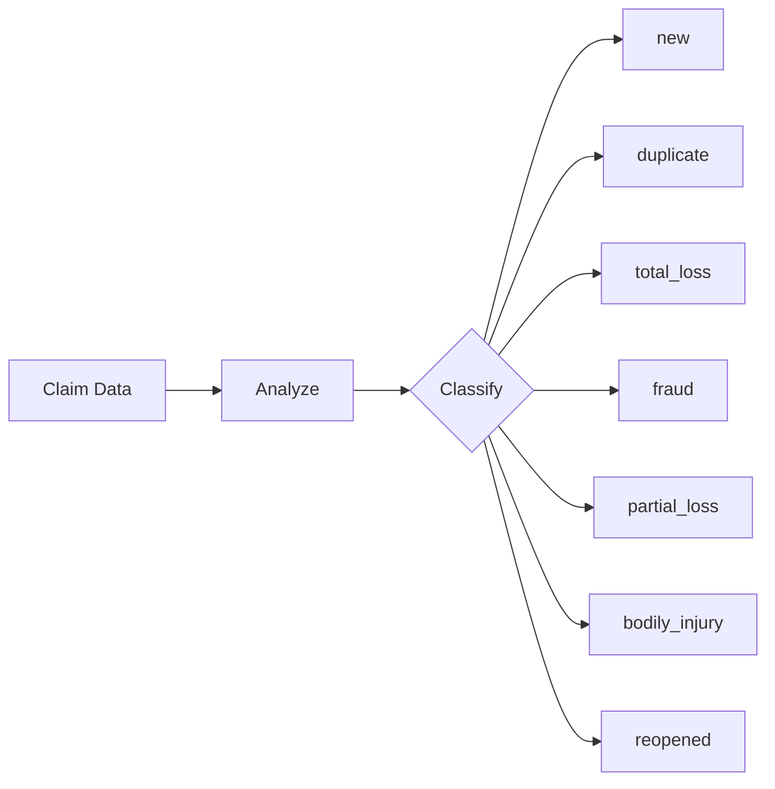
```mermaid
flowchart LR
    A[Claim Data] --> B[Analyze] --> C{Classify}
    C --> D[new]
    C --> E[duplicate]
    C --> F[total_loss]
    C --> G[fraud]
    C --> H[partial_loss]
    C --> I[bodily_injury]
    C --> J[reopened]
```

For classification criteria, see [Claim Types](claim-types.md).

---

## New Claim Crew

**Location**: `src/claim_agent/crews/new_claim_crew.py`

Handles first-time claim submissions through validation, policy verification, and assignment.

### Entry Conditions

- **Claim type:** `new` (from Router classification)
- **Classification criteria:**
  - First-time submission for this incident
  - No duplicate indicators (different VIN or date from existing claims)
  - No fraud indicators in description
  - Damage not clearly total or partial loss
- **Escalation:** If `needs_review` from escalation check, return early with escalation details (no crew execution)

### Agents

| Agent | Tools Used |
|-------|------------|
| Intake Specialist | - |
| Policy Verification Specialist | [`query_policy_db`](tools.md#query_policy_db) |
| Claim Assignment Specialist | [`generate_claim_id`](tools.md#generate_claim_id), [`generate_report`](tools.md#generate_report) |

### Flow Sequence

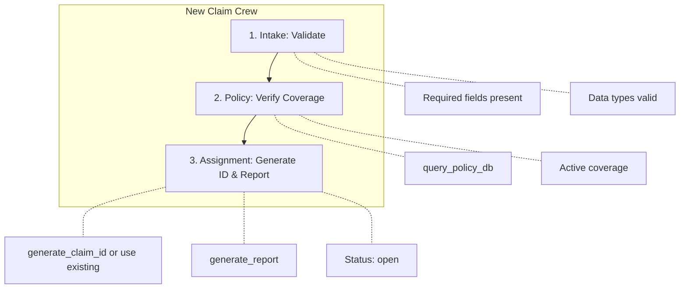
```mermaid
flowchart TB
    subgraph NewClaim["New Claim Crew"]
        A[1. Intake: Validate] --> B[2. Policy: Verify Coverage]
        B --> C[3. Assignment: Generate ID & Report]
    end
    
    A -.- A1[Required fields present]
    A -.- A2[Data types valid]
    
    B -.- B1[query_policy_db]
    B -.- B2[Active coverage]
    
    C -.- C1[generate_claim_id or use existing]
    C -.- C2[generate_report]
    C -.- C3[Status: open]
```

### Step 1: Intake Validation

| Aspect | Specification |
|--------|---------------|
| **Agent** | Intake Specialist |
| **Input** | `claim_data` JSON |
| **Required fields** | `policy_number`, `vin`, `vehicle_year`, `vehicle_make`, `vehicle_model`, `incident_date`, `incident_description`, `damage_description` |
| **Output** | `valid` with no missing fields, OR list of missing/invalid fields |
| **Tools** | None |

### Step 2: Policy Verification

| Aspect | Specification |
|--------|---------------|
| **Agent** | Policy Verification Specialist |
| **Input** | `claim_data` + validation result |
| **Action** | Query policy DB for `policy_number` |
| **Output** | Policy validity, coverage type, deductible |
| **Tools** | `query_policy_db` |

### Step 3: Assignment

| Aspect | Specification |
|--------|---------------|
| **Agent** | Claim Assignment Specialist |
| **Input** | `claim_data` (with `claim_id` if provided), validation + policy results |
| **Action** | Use `claim_id` from `claim_data` if present; else call `generate_claim_id` (prefix `CLM`) |
| **Output** | Claim ID, status `open`, one-line summary |
| **Tools** | `generate_claim_id`, `generate_report` |

### Exit Conditions

| Outcome | Status | Notes |
|---------|--------|-------|
| Success | `open` | Claim ID assigned, report generated |
| Escalated | `needs_review` | Returned before crew execution (main flow) |
| Failed | `failed` | Error during crew execution |

### Integration with Main Flow

The New Claim crew is invoked **after**:

1. Pydantic validation (CLI)
2. Claim creation in SQLite (`repo.create_claim`)
3. Router classification → `claim_type == "new"`
4. Escalation check (if not escalated)

**Note:** The main flow creates the claim record and assigns `claim_id` before routing. The New Claim crew receives `claim_id` in `claim_data` and should use it rather than generating a new one (except when `claim_id` is absent for edge cases).

### Acceptance Criteria

- **AC1:** Intake task validates all required fields and data types; outputs `valid` or list of issues
- **AC2:** Policy task calls `query_policy_db` and returns coverage details
- **AC3:** Assignment task uses existing `claim_id` when present, otherwise generates via `generate_claim_id`
- **AC4:** Assignment task calls `generate_report` with `claim_type='new'`, `status='open'`
- **AC5:** Final status is `open` on success
- **AC6:** Task context flows correctly: Policy receives validation output; Assignment receives validation + policy output
- **AC7:** Documentation (`docs/crews.md`, `docs/agent-flow.md`) matches this specification

---

## Duplicate Crew

**Location**: `src/claim_agent/crews/duplicate_crew.py`

Identifies and resolves potential duplicate claims by searching existing claims, comparing similarity, and recommending merge or reject.

### Entry Conditions

- **Claim type:** `duplicate` (from Router classification)
- **Classification criteria:**
  - Same VIN as an existing claim
  - Same or similar incident date
  - Similar incident description
- **Escalation:** If `needs_review` from escalation check (e.g., similarity 60–80%), return early with escalation details (no crew execution)

### Flow Sequence

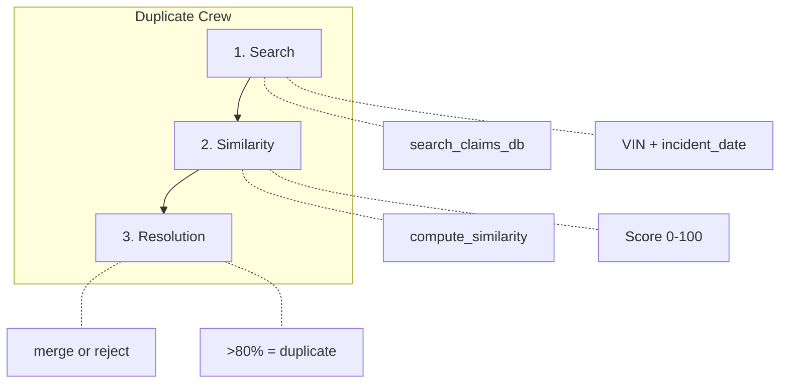
```mermaid
flowchart TB
    subgraph Duplicate["Duplicate Crew"]
        A[1. Search] --> B[2. Similarity] --> C[3. Resolution]
    end
    
    A -.- A1[search_claims_db]
    A -.- A2[VIN + incident_date]
    
    B -.- B1[compute_similarity]
    B -.- B2[Score 0-100]
    
    C -.- C1[merge or reject]
    C -.- C2[>80% = duplicate]
```

### Step 1: Search

| Aspect | Specification |
|--------|---------------|
| **Agent** | Claims Search Specialist |
| **Input** | `claim_data` JSON |
| **Action** | Search existing claims by VIN and incident_date |
| **Output** | List of matching or similar claims (or empty list) |
| **Tools** | `search_claims_db` |

### Step 2: Similarity Analysis

| Aspect | Specification |
|--------|---------------|
| **Agent** | Similarity Analyst |
| **Input** | `claim_data` + search results |
| **Action** | Compare incident_description with found claims using compute_similarity |
| **Output** | Similarity score (0–100), is_duplicate (true/false), brief reasoning |
| **Tools** | `compute_similarity` |
| **Threshold** | >80% = likely duplicate |

### Step 3: Resolution

| Aspect | Specification |
|--------|---------------|
| **Agent** | Duplicate Resolution Specialist |
| **Input** | Search results + similarity result |
| **Action** | If similarity >80%, decide merge or reject |
| **Output** | Resolution: `merge` or `reject`, one-line summary |
| **Tools** | None |

### Similarity Thresholds

| Score | Interpretation | Action |
|-------|----------------|--------|
| 0–50 | Low similarity | Not duplicate, process normally |
| 51–79 | Moderate | Review recommended (may escalate) |
| 80–100 | High similarity | Likely duplicate, recommend merge/reject |

### Exit Conditions

| Outcome | Status | Notes |
|---------|--------|-------|
| Success | `duplicate` | Resolution (merge/reject) with summary |
| Escalated | `needs_review` | Returned before crew execution (main flow) |
| Failed | `failed` | Error during crew execution |

### Integration with Main Flow

The Duplicate crew is invoked **after**:

1. Pydantic validation (CLI)
2. Claim creation in SQLite (`repo.create_claim`)
3. Router classification → `claim_type == "duplicate"`
4. Escalation check (if not escalated)
5. Pre-routing duplicate check (`_check_for_duplicates`) may populate `existing_claims_for_vin` in claim_data

### Agents

| Agent | Tools Used |
|-------|------------|
| Claims Search Specialist | [`search_claims_db`](tools.md#search_claims_db) |
| Similarity Analyst | [`compute_similarity`](tools.md#compute_similarity) |
| Duplicate Resolution Specialist | - |

### Acceptance Criteria

- **AC1:** Search task calls `search_claims_db` with vin and incident_date from claim_data
- **AC2:** Search task returns list of matching claims (or empty list)
- **AC3:** Similarity task calls `compute_similarity` comparing incident descriptions
- **AC4:** Similarity task outputs score (0–100), is_duplicate, and reasoning
- **AC5:** Resolution task outputs `merge` or `reject` when similarity >80%
- **AC6:** Final status is `duplicate` on success
- **AC7:** Task context flows: Similarity receives search output; Resolution receives search + similarity
- **AC8:** Documentation matches this specification

---

## Total Loss Crew

**Location**: `src/claim_agent/crews/total_loss_crew.py`

Processes claims where the vehicle is unrepairable or repair cost exceeds 75% of value: assess damage, fetch vehicle value, calculate payout, then hand off to the shared Settlement Crew.

### Entry Conditions

- **Claim type:** `total_loss` (from Router classification)
- **Classification criteria:**
  - Total loss keywords: totaled, flood, submerged, fire, burned, destroyed, frame damage, rollover
  - Repair cost > 75% of vehicle value
- **Escalation:** If `needs_review` from escalation check, return early (no crew execution)

### Flow Sequence

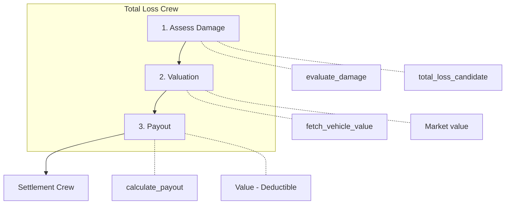
```mermaid
flowchart TB
    subgraph TotalLoss["Total Loss Crew"]
        A[1. Assess Damage] --> B[2. Valuation] --> C[3. Payout]
    end
    C --> S[Settlement Crew]
    
    A -.- A1[evaluate_damage]
    A -.- A2[total_loss_candidate]
    
    B -.- B1[fetch_vehicle_value]
    B -.- B2[Market value]
    
    C -.- C1[calculate_payout]
    C -.- C2[Value - Deductible]
```

### Step 1: Damage Assessment

| Aspect | Specification |
|--------|---------------|
| **Agent** | Damage Assessor |
| **Input** | `claim_data` JSON |
| **Action** | Evaluate damage_description, estimated_damage; check for total loss indicators |
| **Output** | Damage severity, estimated_repair_cost, total_loss_candidate (true/false) |
| **Tools** | `evaluate_damage` |

### Step 2: Vehicle Valuation

| Aspect | Specification |
|--------|---------------|
| **Agent** | Vehicle Valuation Specialist |
| **Input** | `claim_data` + damage assessment |
| **Action** | Fetch current market value using vin, vehicle_year, vehicle_make, vehicle_model |
| **Output** | Vehicle value (USD), condition, source |
| **Tools** | `fetch_vehicle_value` |

### Step 3: Payout Calculation

| Aspect | Specification |
|--------|---------------|
| **Agent** | Payout Calculator |
| **Input** | Damage assessment + valuation + policy_number |
| **Action** | Calculate payout (vehicle value minus deductible) |
| **Output** | Payout amount (USD), calculation details |
| **Tools** | `calculate_payout` |
| **Formula** | `Payout = Vehicle Market Value - Policy Deductible` |

### Exit Conditions

| Outcome | Status | Notes |
|---------|--------|-------|
| Success | `processing` | Payout calculated; claim remains in PROCESSING until Settlement Crew completes, then becomes `settled` |
| Escalated | `needs_review` | Returned before crew execution |
| Failed | `failed` | Error during crew execution |

### Integration with Main Flow

The Total Loss crew is invoked **after**:

1. Pydantic validation (CLI)
2. Claim creation in SQLite (`repo.create_claim`)
3. Router classification → `claim_type == "total_loss"`
4. Escalation check (if not escalated)
5. Economic total loss pre-check may populate `is_economic_total_loss`, `vehicle_value`, etc. in claim_data
6. On success, main flow invokes Settlement Crew with the payout-ready workflow output

**RAG:** Crew supports `state` (jurisdiction) and `use_rag` for policy/compliance context.

### Agents

| Agent | Tools Used |
|-------|------------|
| Damage Assessor | [`evaluate_damage`](tools.md#evaluate_damage) |
| Vehicle Valuation Specialist | [`fetch_vehicle_value`](tools.md#fetch_vehicle_value) |
| Payout Calculator | [`calculate_payout`](tools.md#calculate_payout) |

### Acceptance Criteria

- **AC1:** Damage task calls `evaluate_damage` and outputs total_loss_candidate
- **AC2:** Valuation task calls `fetch_vehicle_value` with vehicle identifiers
- **AC3:** Payout task calls `calculate_payout` with vehicle value and policy_number
- **AC4:** Payout formula: value - deductible
- **AC5:** Total Loss crew ends at payout and hands off to Settlement Crew
- **AC6:** Final claim status is set by Settlement Crew (`settled`) on success
- **AC7:** Task context flows: Valuation receives damage; Payout receives damage + valuation
- **AC8:** Documentation matches this specification

---

## Fraud Detection Crew

**Location**: `src/claim_agent/crews/fraud_detection_crew.py`

Analyzes claims flagged for potential fraud through pattern analysis, cross-reference with fraud indicators, and comprehensive assessment with SIU referral recommendations.

### Entry Conditions

- **Claim type:** `fraud` (from Router classification)
- **Classification criteria:**
  - Staged accident indicators (multiple occupants, witnesses left, inconsistent damage)
  - Financial red flags (inflated estimates, prior fraud history)
  - Pattern anomalies (multiple claims in 90 days, new policy + quick filing)
- **Escalation:** **Skipped** for fraud—crew always runs (no pre-escalation return)

### Agents

| Agent | Tools Used |
|-------|------------|
| Pattern Analysis Specialist | [`analyze_claim_patterns`](tools.md#analyze_claim_patterns) |
| Cross-Reference Specialist | [`cross_reference_fraud_indicators`](tools.md#cross_reference_fraud_indicators), [`detect_fraud_indicators`](tools.md#detect_fraud_indicators) |
| Fraud Assessment Specialist | [`perform_fraud_assessment`](tools.md#perform_fraud_assessment), [`generate_fraud_report`](tools.md#generate_fraud_report) |

### Flow Sequence

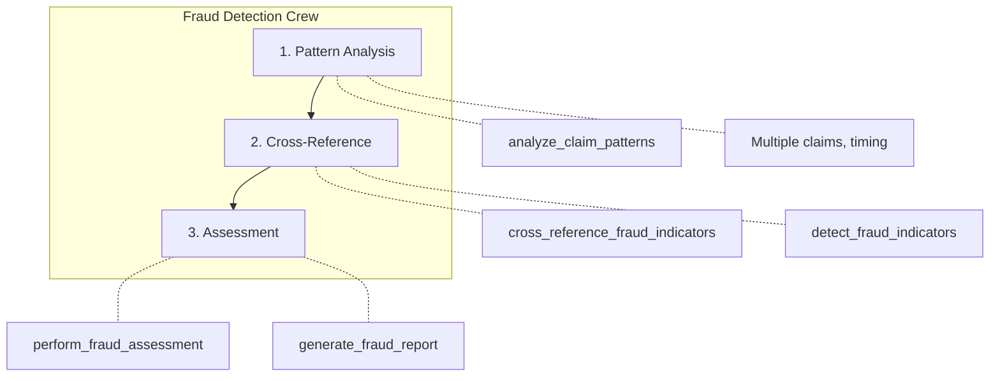
```mermaid
flowchart TB
    subgraph Fraud["Fraud Detection Crew"]
        A[1. Pattern Analysis] --> B[2. Cross-Reference] --> C[3. Assessment]
    end
    
    A -.- A1[analyze_claim_patterns]
    A -.- A2[Multiple claims, timing]
    
    B -.- B1[cross_reference_fraud_indicators]
    B -.- B2[detect_fraud_indicators]
    
    C -.- C1[perform_fraud_assessment]
    C -.- C2[generate_fraud_report]
```

### Step 1: Pattern Analysis

| Aspect | Specification |
|--------|---------------|
| **Agent** | Pattern Analysis Specialist |
| **Input** | `claim_data` JSON |
| **Action** | Analyze for suspicious patterns |
| **Checks** | Multiple claims on same VIN (90 days), timing anomalies, staged accident indicators, claim frequency |
| **Output** | patterns_detected, timing_flags, claim_history, risk_factors, pattern_score |
| **Tools** | `analyze_claim_patterns` |

### Step 2: Cross-Reference

| Aspect | Specification |
|--------|---------------|
| **Agent** | Cross-Reference Specialist |
| **Input** | `claim_data` + pattern analysis |
| **Action** | Match against known fraud indicators |
| **Checks** | Fraud keywords, damage vs value mismatches, prior fraud flags |
| **Output** | fraud_keywords_found, database_matches, risk_level, cross_reference_score |
| **Tools** | `cross_reference_fraud_indicators`, `detect_fraud_indicators` |

### Step 3: Fraud Assessment

| Aspect | Specification |
|--------|---------------|
| **Agent** | Fraud Assessment Specialist |
| **Input** | Pattern + cross-reference results |
| **Action** | Combine scores, determine likelihood, recommend action |
| **Output** | fraud_score, fraud_likelihood, should_block, siu_referral, recommended_action |
| **Tools** | `perform_fraud_assessment`, `generate_fraud_report` |

### Fraud Likelihood Levels

| Level | Score | Action |
|-------|-------|--------|
| Low | 0–25 | Process normally |
| Medium | 26–50 | Flag for review |
| High | 51–75 | SIU referral |
| Critical | 76–100 | Block claim |

### Exit Conditions

| Outcome | Status | Notes |
|---------|--------|-------|
| Success | `fraud_suspected` | Assessment complete, report generated |
| Failed | `failed` | Error during crew execution |

### Integration with Main Flow

The Fraud crew is invoked **after**:

1. Pydantic validation (CLI)
2. Claim creation in SQLite (`repo.create_claim`)
3. Router classification → `claim_type == "fraud"`
4. **Escalation check is skipped** (unlike other claim types)

### Acceptance Criteria

- **AC1:** Pattern task calls `analyze_claim_patterns` with claim_data
- **AC2:** Pattern task outputs patterns_detected, timing_flags, risk_factors
- **AC3:** Cross-reference task calls `cross_reference_fraud_indicators` and `detect_fraud_indicators`
- **AC4:** Cross-reference task outputs fraud_keywords_found, database_matches
- **AC5:** Assessment task calls `perform_fraud_assessment` and `generate_fraud_report`
- **AC6:** Assessment task outputs fraud_score, fraud_likelihood, siu_referral, should_block
- **AC7:** Final status is `fraud_suspected` on success
- **AC8:** Task context flows: Cross-reference receives pattern; Assessment receives both
- **AC9:** Documentation matches this specification

---

## Partial Loss Crew

**Location**: `src/claim_agent/crews/partial_loss_crew.py`

Handles claims for repairable vehicle damage: assess damage, calculate repair estimate, assign repair shop, order parts, generate repair authorization, then hand off to the shared Settlement Crew.

### Entry Conditions

- **Claim type:** `partial_loss` (from Router classification)
- **Classification criteria:**
  - Repairable damage (bumper, fender, door, mirror, light, windshield, dent, scratch, crack)
  - Typically < $10,000, repair cost < 75% of vehicle value
- **Escalation:** If `needs_review` from escalation check, return early (no crew execution)

### Agents

| Agent | Tools Used |
|-------|------------|
| Damage Assessor (Partial Loss) | [`evaluate_damage`](tools.md#evaluate_damage), [`fetch_vehicle_value`](tools.md#fetch_vehicle_value) |
| Repair Estimator | [`calculate_repair_estimate`](tools.md#calculate_repair_estimate), [`get_parts_catalog`](tools.md#get_parts_catalog) |
| Repair Shop Coordinator | [`get_available_repair_shops`](tools.md#get_available_repair_shops), [`assign_repair_shop`](tools.md#assign_repair_shop) |
| Parts Ordering Specialist | [`get_parts_catalog`](tools.md#get_parts_catalog), [`create_parts_order`](tools.md#create_parts_order) |
| Repair Authorization Specialist | [`generate_repair_authorization`](tools.md#generate_repair_authorization) |

### Flow Sequence

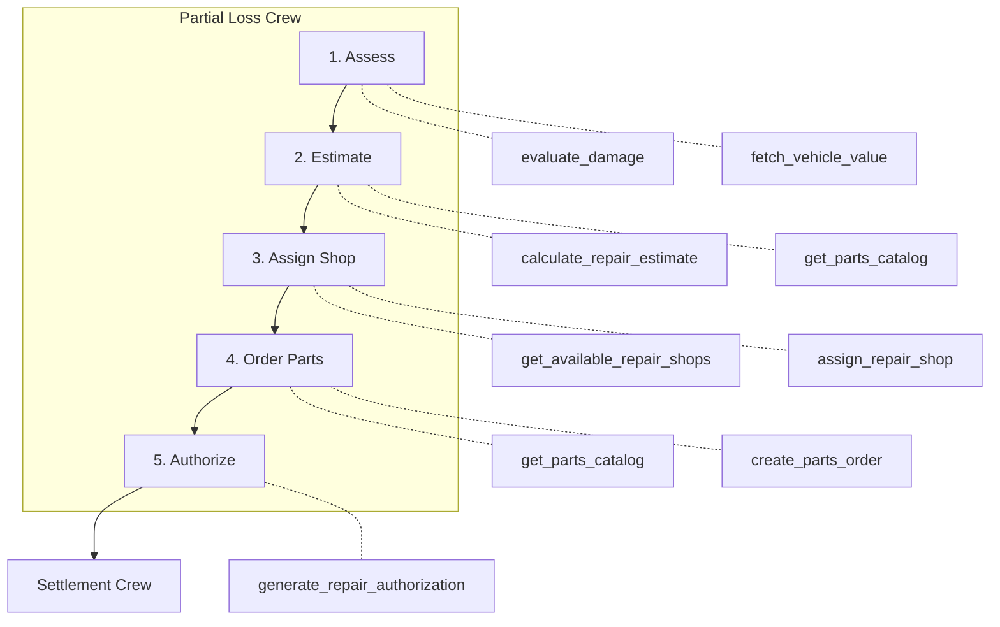
```mermaid
flowchart TB
    subgraph PartialLoss["Partial Loss Crew"]
        A[1. Assess] --> B[2. Estimate] --> C[3. Assign Shop] --> D[4. Order Parts] --> E[5. Authorize]
    end
    E --> S[Settlement Crew]
    
    A -.- A1[evaluate_damage]
    A -.- A2[fetch_vehicle_value]
    
    B -.- B1[calculate_repair_estimate]
    B -.- B2[get_parts_catalog]
    
    C -.- C1[get_available_repair_shops]
    C -.- C2[assign_repair_shop]
    
    D -.- D1[get_parts_catalog]
    D -.- D2[create_parts_order]
    
    E -.- E1[generate_repair_authorization]
```

### Step 1: Damage Assessment

| Aspect | Specification |
|--------|---------------|
| **Agent** | Damage Assessor (Partial Loss) |
| **Input** | `claim_data` JSON |
| **Action** | Evaluate damage_description; fetch vehicle value; confirm repairable |
| **Output** | Severity (minor/moderate/severe), damaged components, vehicle value, partial loss confirmation |
| **Tools** | `evaluate_damage`, `fetch_vehicle_value` |
| **Note** | Flag if repair > 75% of value (potential total loss) |

### Step 2: Repair Estimate

| Aspect | Specification |
|--------|---------------|
| **Agent** | Repair Estimator |
| **Input** | `claim_data` + damage assessment |
| **Action** | Calculate parts + labor, deductible, customer vs insurance responsibility |
| **Output** | Parts list, labor hours, total cost, deductible, customer_pays, insurance_pays |
| **Tools** | `calculate_repair_estimate`, `get_parts_catalog` |

### Step 3: Shop Assignment

| Aspect | Specification |
|--------|---------------|
| **Agent** | Repair Shop Coordinator |
| **Input** | `claim_data` + damage + estimate |
| **Action** | Get available shops, select best (rating, wait time, certifications), assign |
| **Output** | Shop name, address, phone, confirmation, start/completion dates |
| **Tools** | `get_available_repair_shops`, `assign_repair_shop` |
| **Repair days** | Minor: 3, Moderate: 5, Severe: 7 |

### Step 4: Parts Order

| Aspect | Specification |
|--------|---------------|
| **Agent** | Parts Ordering Specialist |
| **Input** | `claim_data` + damage + estimate + shop assignment |
| **Action** | Get parts catalog, create order with claim_id, shop_id |
| **Output** | order_id, parts list, total cost, delivery date |
| **Tools** | `get_parts_catalog`, `create_parts_order` |

### Step 5: Authorization

| Aspect | Specification |
|--------|---------------|
| **Agent** | Repair Authorization Specialist |
| **Input** | All prior outputs |
| **Action** | Generate repair authorization and return settlement handoff details |
| **Output** | authorization_id, authorized amounts, insurance_pays, settlement handoff summary |
| **Tools** | `generate_repair_authorization` |
| **Handoff** | Shared Settlement Crew uses this output to finalize documentation and payment distribution |

### Damage Severity → Repair Days

| Severity | Repair Days | Examples |
|----------|-------------|----------|
| Minor | 3 days | Scratches, dents, mirrors |
| Moderate | 5 days | Bumper, fender, lights |
| Severe | 7 days | Door, hood, multiple panels |

### Exit Conditions

| Outcome | Status | Notes |
|---------|--------|-------|
| Success | `processing` | Authorization issued; claim remains in PROCESSING until Settlement Crew completes, then becomes `settled` |
| Escalated | `needs_review` | Returned before crew execution |
| Failed | `failed` | Error during crew execution |

### Integration with Main Flow

The Partial Loss crew is invoked **after**:

1. Pydantic validation (CLI)
2. Claim creation in SQLite (`repo.create_claim`)
3. Router classification → `claim_type == "partial_loss"`
4. Escalation check (if not escalated)
5. On success, Rental Reimbursement Crew runs (check coverage → arrange rental → process reimbursement)
6. Settlement Crew receives combined Partial Loss + Rental output

### Acceptance Criteria

- **AC1:** Damage task calls `evaluate_damage` and `fetch_vehicle_value`; confirms repairable
- **AC2:** Estimate task calls `calculate_repair_estimate`; outputs parts, labor, deductible, insurance_pays
- **AC3:** Shop task calls `get_available_repair_shops` and `assign_repair_shop` with claim_id
- **AC4:** Parts task calls `create_parts_order` with claim_id, shop_id, parts list
- **AC5:** Authorization task calls `generate_repair_authorization` and prepares settlement handoff details
- **AC6:** Partial Loss hands off to Settlement Crew for formal settlement documentation
- **AC7:** Final claim status is set by Settlement Crew (`settled`) on success
- **AC8:** Task context flows correctly through all five steps
- **AC9:** Documentation matches this specification

---

## Bodily Injury Crew

**Location**: `src/claim_agent/crews/bodily_injury_crew.py`

Handles injury-related claims: intake injury details → review medical records → assess liability → propose settlement. Routes to Settlement Crew on completion.

### Entry Conditions

- **Claim type:** `bodily_injury` (from Router classification)
- **Classification criteria:** Incident or damage description mentions injury to persons (whiplash, hospital, medical treatment, etc.); `injury_related` or `bodily_injury` true in claim data when present

### Agents

| Agent | Tools Used |
|-------|------------|
| BI Intake Specialist | `add_claim_note`, `get_claim_notes`, `escalate_claim` |
| Medical Records Reviewer | `query_medical_records`, `assess_injury_severity`, `add_claim_note`, `get_claim_notes`, `escalate_claim` |
| Settlement Negotiator | `calculate_bi_settlement`, `add_claim_note`, `get_claim_notes`, `escalate_claim` |

### Flow Sequence

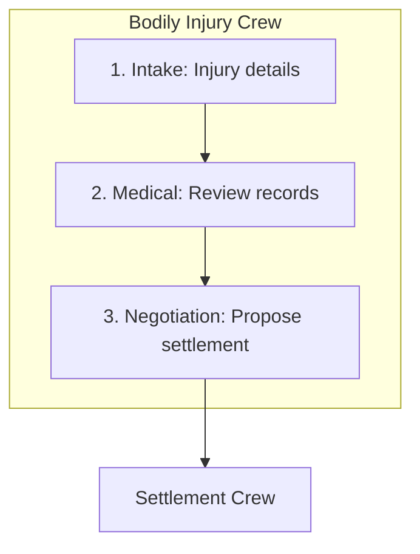
```mermaid
flowchart TB
    subgraph BI["Bodily Injury Crew"]
        A[1. Intake: Injury details] --> B[2. Medical: Review records]
        B --> C[3. Negotiation: Propose settlement]
    end
    C --> Settlement[Settlement Crew]
```

### Exit Conditions

| Outcome | Status | Notes |
|---------|--------|-------|
| Success | `settled` | Via Settlement Crew |
| Escalated | `needs_review` | Returned before crew execution |
| Failed | `failed` | Error during crew execution |

**Note:** Claims with both vehicle damage and injury are routed to BI when injury is significant. Vehicle damage is not handled by this crew; consider a combined workflow for such claims.

---

## Reopened Crew

**Location**: `src/claim_agent/crews/reopened_crew.py`

Validates reopening reason, loads the prior settled claim, and routes to partial_loss, total_loss, or bodily_injury based on prior claim type and new damage.

### Entry Conditions

- **Claim type:** `reopened` (from Router classification)
- **Classification criteria:** `prior_claim_id`, `reopening_reason`, or `is_reopened` present in claim data (and `definitive_duplicate` is NOT true)

### Agents

| Agent | Tools Used |
|-------|------------|
| Reopened Validator | `query_policy_db`, `get_claim_notes` |
| Prior Claim Loader | `lookup_original_claim` |
| Reopened Router | `evaluate_damage`, `get_claim_notes` |

### Flow Sequence

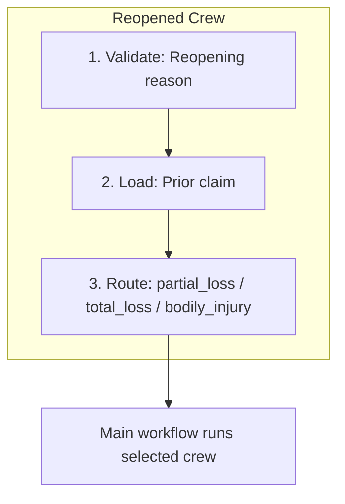
```mermaid
flowchart TB
    subgraph Reopened["Reopened Crew"]
        A[1. Validate: Reopening reason] --> B[2. Load: Prior claim]
        B --> C[3. Route: partial_loss / total_loss / bodily_injury]
    end
    C --> D[Main workflow runs selected crew]
```

### Exit Conditions

The Reopened crew outputs `target_claim_type` (partial_loss, total_loss, or bodily_injury). The main workflow then runs the selected crew; final status depends on that crew.

---

## Rental Reimbursement Crew

**Location**: `src/claim_agent/crews/rental_crew.py`

Manages loss-of-use (rental) coverage for partial loss claims. Runs as a sequential stage after Partial Loss and before Settlement. Flow: check coverage → arrange/approve rental → process reimbursement. Compliance: RCC-001 through RCC-004, DISC-006 in [california_auto_compliance.json](../data/california_auto_compliance.json).

### Entry Conditions

- **Claim type:** `partial_loss` only (runs after Partial Loss crew)
- **Trigger:** Automatic; runs when `claim_type == "partial_loss"` after workflow crew completes
- **Input:** `claim_data` and `workflow_output` (from Partial Loss crew)

### Agents

| Agent | Tools Used |
|-------|------------|
| Rental Eligibility Specialist | [`check_rental_coverage`](tools.md#check_rental_coverage), [`get_rental_limits`](tools.md#get_rental_limits), [`search_california_compliance`](tools.md#search_california_compliance) |
| Rental Coordinator | [`get_rental_limits`](tools.md#get_rental_limits) |
| Reimbursement Processor | [`process_rental_reimbursement`](tools.md#process_rental_reimbursement), [`get_rental_limits`](tools.md#get_rental_limits) |

### Flow Sequence

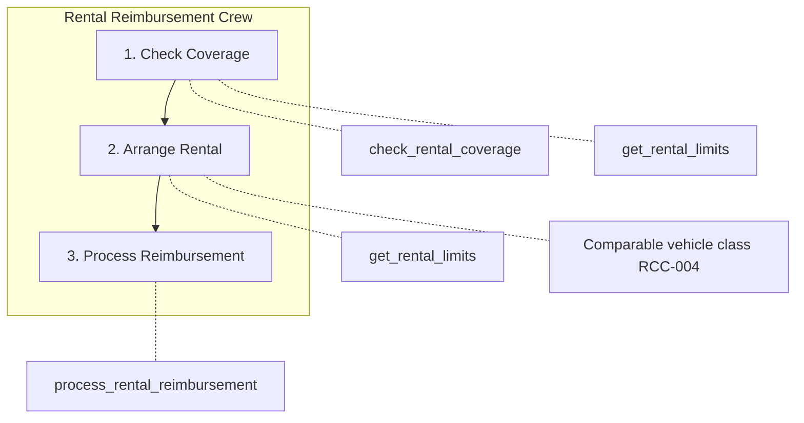
```mermaid
flowchart TB
    subgraph Rental["Rental Reimbursement Crew"]
        A[1. Check Coverage] --> B[2. Arrange Rental] --> C[3. Process Reimbursement]
    end
    
    A -.- A1[check_rental_coverage]
    A -.- A2[get_rental_limits]
    
    B -.- B1[get_rental_limits]
    B -.- B2[Comparable vehicle class RCC-004]
    
    C -.- C1[process_rental_reimbursement]
```

### Step 1: Check Coverage

| Aspect | Specification |
|--------|---------------|
| **Agent** | Rental Eligibility Specialist |
| **Input** | `claim_data`, `workflow_output` (repair duration context) |
| **Action** | Check policy for rental coverage; get limits; reference CCR 2695.7(l), RCC-001–RCC-004 |
| **Output** | eligible (bool), daily_limit, aggregate_limit, max_days, message |
| **Tools** | `check_rental_coverage`, `get_rental_limits`, `search_california_compliance` |

### Step 2: Arrange Rental

| Aspect | Specification |
|--------|---------------|
| **Agent** | Rental Coordinator |
| **Input** | Eligibility result + `workflow_output` (estimated_repair_days) |
| **Action** | Arrange rental within limits; ensure comparable vehicle class (RCC-004) |
| **Output** | rental_arranged, provider, vehicle_class, daily_rate, estimated_days, estimated_total |
| **Tools** | `get_rental_limits` |

### Step 3: Process Reimbursement

| Aspect | Specification |
|--------|---------------|
| **Agent** | Reimbursement Processor |
| **Input** | Eligibility + rental arrangement |
| **Action** | Validate amount against limits; call process_rental_reimbursement |
| **Output** | reimbursement_id, amount, status |
| **Tools** | `process_rental_reimbursement`, `get_rental_limits` |

### Compliance References

- **RCC-001:** Loss of use when liable for damage to another's vehicle
- **RCC-002:** Reasonable rental period (repair period + replacement time for total loss)
- **RCC-003:** First-party rental reimbursement; explain daily/aggregate limits (CCR 2695.7(l))
- **RCC-004:** Rental class comparable to damaged vehicle
- **DISC-006:** Rental Car Coverage Disclosure at time of loss

### Integration with Main Flow

The Rental crew runs **after** Partial Loss crew and **before** Settlement crew when `claim_type == "partial_loss"`. Output is combined with Partial Loss output and passed to Settlement.

---

## Settlement Crew

**Location**: `src/claim_agent/crews/settlement_crew.py`

Runs as a shared post-workflow settlement phase for payout-ready Total Loss and Partial Loss claims. It standardizes settlement documentation, payment distribution, and closure.

### Flow Sequence

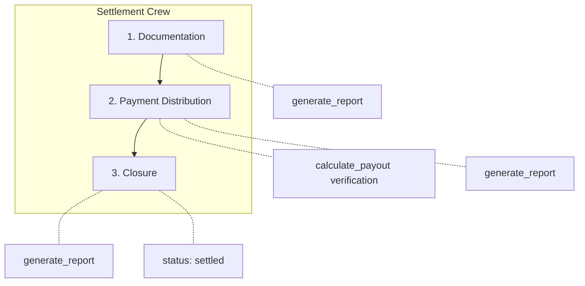
```mermaid
flowchart TB
    subgraph Settlement["Settlement Crew"]
        A[1. Documentation] --> B[2. Payment Distribution] --> C[3. Closure]
    end

    A -.- A1[generate_report]
    B -.- B1[calculate_payout verification]
    B -.- B2[generate_report]
    C -.- C1[generate_report]
    C -.- C2[status: settled]
```

### Acceptance Criteria

- **AC1:** Settlement Crew has 3 agents: Documentation, Payment Distribution, Closure
- **AC2:** Entry input includes `claim_id`, `claim_type`, `claim_data`, and prior workflow output
- **AC3:** Documentation task generates a settlement report with claim-type-specific sections
- **AC4:** Payment Distribution task documents insured, lienholder, and repair shop breakdowns as applicable
- **AC5:** Closure task generates the final settlement report with status `settled` and `next_steps`
- **AC6:** Total Loss and Partial Loss invoke Settlement Crew from main flow instead of inline settlement/report finalization
- **AC7:** Documentation matches this specification

---

## Subrogation Crew

**Location**: `src/claim_agent/crews/subrogation_crew.py`

Post-settlement recovery from at-fault parties. Runs for total_loss and partial_loss after Settlement. Flow: assess liability → build case → send demand → track recovery.

### Entry Conditions

- **Claim type:** `total_loss` or `partial_loss` (runs after Settlement)
- **Trigger:** Automatic when `_requires_settlement(claim_type)` is True

### Agents

| Agent | Tools Used |
|-------|------------|
| Liability Investigator | `assess_liability`, `escalate_claim` |
| Demand Specialist | `build_subrogation_case`, `send_demand_letter`, `generate_report`, `escalate_claim` |
| Recovery Tracker | `record_recovery`, `generate_report`, `escalate_claim` |

---

## Salvage Crew

**Location**: `src/claim_agent/crews/salvage_crew.py`

Handles total-loss vehicle disposition. Runs **only for total_loss** claims, after Settlement and Subrogation. Flow: assess salvage value → arrange disposition → transfer title → track auction/recovery.

### Entry Conditions

- **Claim type:** `total_loss` only (runs after Subrogation)
- **Trigger:** Automatic when `_requires_salvage(claim_type)` is True

### Agents

| Agent | Tools Used |
|-------|------------|
| Salvage Coordinator | [`get_salvage_value`](tools.md#get_salvage_value), `generate_report`, `escalate_claim` |
| Title Specialist | [`initiate_title_transfer`](tools.md#initiate_title_transfer), `generate_report`, `escalate_claim` |
| Auction Liaison | [`record_salvage_disposition`](tools.md#record_salvage_disposition), `generate_report`, `escalate_claim` |

### Flow Sequence

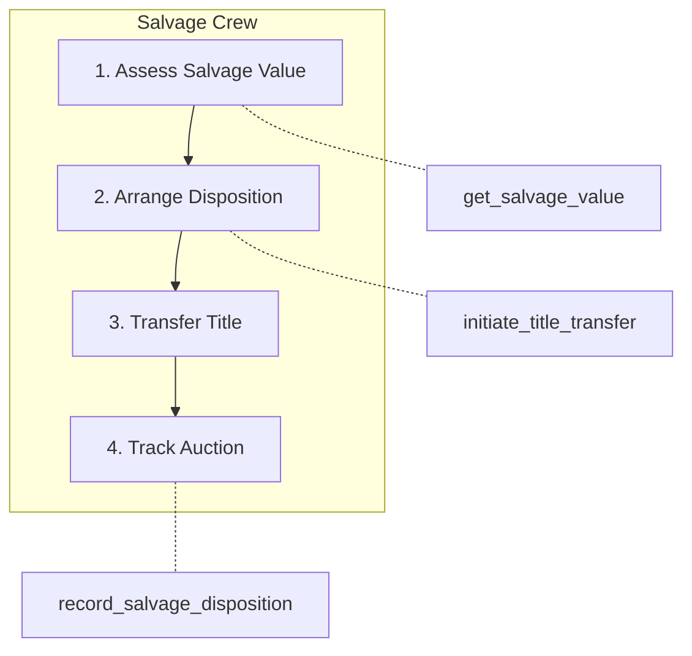
```mermaid
flowchart TB
    subgraph Salvage["Salvage Crew"]
        A[1. Assess Salvage Value] --> B[2. Arrange Disposition] --> C[3. Transfer Title] --> D[4. Track Auction]
    end

    A -.- A1[get_salvage_value]
    B -.- B1[initiate_title_transfer]
    D -.- D1[record_salvage_disposition]
```

### Disposition Types

- **auction** – Standard total loss disposition; vehicle sent to salvage auction
- **owner_retention** – Policyholder retains vehicle; salvage deduction applied per state requirements
- **scrap** – Very low salvage value; vehicle scrapped

---

## Denial / Coverage Dispute Crew

**Location**: `src/claim_agent/crews/denial_coverage_crew.py`

Handles denials and coverage disputes. Flow: review denial reason → verify coverage/exclusions → generate denial letter or route to appeal.

### Entry Conditions

- **Claim status:** `denied` (STATUS_DENIED)
- **Trigger:** `POST /claims/{claim_id}/denial-coverage` with `{ "denial_reason": "...", "policyholder_evidence": "..." }`

### Agents

| Agent | Tools Used |
|-------|------------|
| Coverage Analyst | `lookup_original_claim`, `query_policy_db`, `get_coverage_exclusions`, `search_policy_compliance` |
| Denial Letter Specialist | `generate_denial_letter`, `get_required_disclosures`, `get_compliance_deadlines`, `search_policy_compliance` |
| Appeal Reviewer | `route_to_appeal`, `escalate_claim`, `generate_report`, `get_compliance_deadlines` |

### Flow

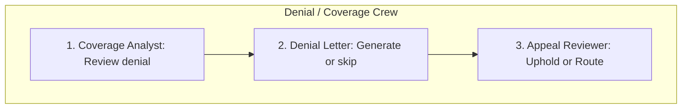
```mermaid
flowchart TB
    subgraph DenialCoverage["Denial / Coverage Crew"]
        A[1. Coverage Analyst: Review denial] --> B[2. Denial Letter: Generate or skip] --> C[3. Appeal Reviewer: Uphold or Route]
    end
```

### Outcomes

- **uphold_denial**: Denial letter generated, status remains `denied`
- **route_to_appeal**: Claim routed to appeal, status set to `needs_review`
- **escalated**: Complex case escalated for human review, status set to `needs_review`

---

## Supplemental Crew

**Location**: `src/claim_agent/crews/supplemental_crew.py`

Sub-workflow for additional damage discovered during repair on existing partial loss claims. Invoked via `POST /claims/{claim_id}/supplemental` when a shop or adjuster reports supplemental damage. California CCR 2695.8 requires prompt inspection and authorization of supplemental payment.

### Entry Conditions

- **Claim type:** `partial_loss` (existing claim)
- **Claim status:** `processing` or `settled`
- **Trigger:** Supplemental damage report with `supplemental_damage_description`

### Agents

| Agent | Tools Used |
|-------|------------|
| Supplemental Intake Specialist | `get_original_repair_estimate`, `query_policy_db`, `get_repair_standards` |
| Damage Verifier | `get_original_repair_estimate`, `evaluate_damage` |
| Estimate Adjuster | `calculate_supplemental_estimate`, `update_repair_authorization` |

### Flow Sequence

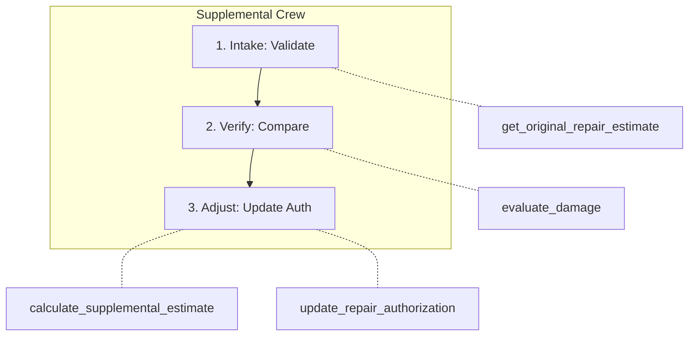
```mermaid
flowchart TB
    subgraph Supplemental["Supplemental Crew"]
        A[1. Intake: Validate] --> B[2. Verify: Compare] --> C[3. Adjust: Update Auth]
    end

    A -.- A1[get_original_repair_estimate]
    B -.- B1[evaluate_damage]
    C -.- C1[calculate_supplemental_estimate]
    C -.- C2[update_repair_authorization]
```

### Integration

Supplemental is a **sub-workflow** (like Dispute), not a router-classified claim type. Entry point: `POST /claims/{claim_id}/supplemental` with body `{ "supplemental_damage_description": "...", "reported_by": "shop" }`.

---

## Human Review Handback Crew

**Location**: `src/claim_agent/crews/human_review_handback_crew.py`

Processes claims returned from human review with an approval decision. Handles the needs_review → processing transition.

### Flow

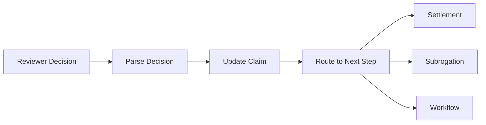
```mermaid
flowchart LR
    A[Reviewer Decision] --> B[Parse Decision] --> C[Update Claim] --> D[Route to Next Step]
    D --> E[Settlement]
    D --> F[Subrogation]
    D --> G[Workflow]
```

### Integration

- **Post-escalation**: Runs when a supervisor approves a claim via `POST /claims/{claim_id}/review/approve` or `claim-agent approve`
- **Optional reviewer decision**: Pass `reviewer_decision` with `confirmed_claim_type` and/or `confirmed_payout` to apply overrides
- **Tools**: `get_escalation_context`, `parse_reviewer_decision`, `apply_reviewer_decision`

### Agent

| Agent | Role | Tools |
|-------|------|-------|
| Human Review Handback Specialist | Process post-escalation handback | `get_escalation_context`, `parse_reviewer_decision`, `apply_reviewer_decision` |

---

## Creating a Custom Crew

To add a new claim type workflow, see [Architecture](architecture.md) for the overall pattern, then:

1. **Create skill files** in `src/claim_agent/skills/` for each agent (see [Skills](skills.md))
2. **Create agents** in `src/claim_agent/agents/your_type.py` that load skills
3. **Create crew** in `src/claim_agent/crews/your_type_crew.py`
4. **Register** in `main_crew.py` `run_claim_workflow()`
5. **Update router** skill to recognize the new type
