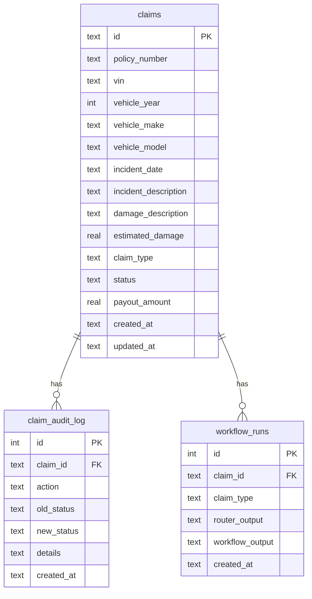

# Database Schema

The system uses SQLite for persistent storage of claims, audit logs, and workflow results.

For configuration options, see [Configuration](configuration.md).

## Configuration

| Environment Variable | Default | Description |
|---------------------|---------|-------------|
| `CLAIMS_DB_PATH` | `data/claims.db` | Path to SQLite database file |

## Schema Overview



## Tables

### claims

Main table storing claim records.

```sql
CREATE TABLE IF NOT EXISTS claims (
    id TEXT PRIMARY KEY,
    policy_number TEXT NOT NULL,
    vin TEXT NOT NULL,
    vehicle_year INTEGER,
    vehicle_make TEXT,
    vehicle_model TEXT,
    incident_date TEXT,
    incident_description TEXT,
    damage_description TEXT,
    estimated_damage REAL,
    claim_type TEXT,
    status TEXT DEFAULT 'pending',
    payout_amount REAL,
    created_at TEXT DEFAULT (datetime('now')),
    updated_at TEXT DEFAULT (datetime('now'))
);

-- Indexes for search performance
CREATE INDEX IF NOT EXISTS idx_claims_vin ON claims(vin);
CREATE INDEX IF NOT EXISTS idx_claims_incident_date ON claims(incident_date);
```

| Column | Type | Description |
|--------|------|-------------|
| `id` | TEXT | Primary key (e.g., CLM-11EEF959) |
| `policy_number` | TEXT | Insurance policy number |
| `vin` | TEXT | Vehicle identification number |
| `vehicle_year` | INTEGER | Year of vehicle |
| `vehicle_make` | TEXT | Vehicle manufacturer |
| `vehicle_model` | TEXT | Vehicle model |
| `incident_date` | TEXT | Date of incident (YYYY-MM-DD) |
| `incident_description` | TEXT | Description of the incident |
| `damage_description` | TEXT | Description of vehicle damage |
| `estimated_damage` | REAL | Estimated repair cost (optional) |
| `claim_type` | TEXT | Classification (new, duplicate, etc.) |
| `status` | TEXT | Current status |
| `payout_amount` | REAL | Settlement amount (if applicable) |
| `created_at` | TEXT | Creation timestamp |
| `updated_at` | TEXT | Last update timestamp |

### claim_audit_log

Audit trail of all status changes and actions.

```sql
CREATE TABLE IF NOT EXISTS claim_audit_log (
    id INTEGER PRIMARY KEY AUTOINCREMENT,
    claim_id TEXT NOT NULL,
    action TEXT NOT NULL,
    old_status TEXT,
    new_status TEXT,
    details TEXT,
    created_at TEXT DEFAULT (datetime('now')),
    FOREIGN KEY (claim_id) REFERENCES claims(id)
);
```

| Column | Type | Description |
|--------|------|-------------|
| `id` | INTEGER | Auto-increment primary key |
| `claim_id` | TEXT | Foreign key to claims.id |
| `action` | TEXT | Action type (created, status_changed) |
| `old_status` | TEXT | Previous status (for status_changed) |
| `new_status` | TEXT | New status |
| `details` | TEXT | Additional details/notes |
| `created_at` | TEXT | Timestamp of action |

### workflow_runs

Preserves output from each workflow execution.

```sql
CREATE TABLE IF NOT EXISTS workflow_runs (
    id INTEGER PRIMARY KEY AUTOINCREMENT,
    claim_id TEXT NOT NULL,
    claim_type TEXT,
    router_output TEXT,
    workflow_output TEXT,
    created_at TEXT DEFAULT (datetime('now')),
    FOREIGN KEY (claim_id) REFERENCES claims(id)
);
```

| Column | Type | Description |
|--------|------|-------------|
| `id` | INTEGER | Auto-increment primary key |
| `claim_id` | TEXT | Foreign key to claims.id |
| `claim_type` | TEXT | Classification from router |
| `router_output` | TEXT | Raw output from router crew |
| `workflow_output` | TEXT | Output from workflow crew |
| `created_at` | TEXT | Timestamp of run |

## Status Constants

Defined in `src/claim_agent/db/constants.py`:

| Constant | Value | Description |
|----------|-------|-------------|
| `STATUS_PENDING` | "pending" | Initial state after creation |
| `STATUS_PROCESSING` | "processing" | Workflow is running |
| `STATUS_OPEN` | "open" | New claim opened |
| `STATUS_CLOSED` | "closed" | Claim finalized (total loss) |
| `STATUS_DUPLICATE` | "duplicate" | Marked as duplicate |
| `STATUS_FRAUD_SUSPECTED` | "fraud_suspected" | Flagged for fraud |
| `STATUS_PARTIAL_LOSS` | "partial_loss" | Partial loss processed |
| `STATUS_NEEDS_REVIEW` | "needs_review" | Escalated for HITL |
| `STATUS_FAILED` | "failed" | Processing failed |

## Status Flow

```
┌─────────────────────────────────────────────────────────────────────────────┐
│                           STATUS TRANSITIONS                                 │
├─────────────────────────────────────────────────────────────────────────────┤
│                                                                              │
│                        ┌─────────┐                                          │
│                        │ pending │ (initial)                                │
│                        └────┬────┘                                          │
│                             │                                                │
│                             ▼                                                │
│                       ┌───────────┐                                         │
│                       │processing │                                         │
│                       └─────┬─────┘                                         │
│                             │                                                │
│          ┌──────────────────┼──────────────────┐                            │
│          │                  │                  │                            │
│          ▼                  ▼                  ▼                            │
│    ┌────────────┐    ┌─────────────┐    ┌──────────┐                       │
│    │needs_review│    │   failed    │    │(success) │                       │
│    └────────────┘    └─────────────┘    └────┬─────┘                       │
│                                              │                              │
│                ┌────────────┬────────────┬───┴───────┬────────────┐        │
│                │            │            │           │            │        │
│                ▼            ▼            ▼           ▼            ▼        │
│           ┌────────┐  ┌───────────┐  ┌────────┐  ┌─────────────┐  ┌──────┐ │
│           │  open  │  │ duplicate │  │ closed │  │partial_loss │  │fraud │ │
│           │ (new)  │  │           │  │ (t.l.) │  │             │  │      │ │
│           └────────┘  └───────────┘  └────────┘  └─────────────┘  └──────┘ │
│                                                                              │
└─────────────────────────────────────────────────────────────────────────────┘
```

## Repository Operations

The `ClaimRepository` class (`src/claim_agent/db/repository.py`) provides:

- All updates use **parameterized queries** (no string interpolation of user input) to avoid SQL injection.

### create_claim

```python
def create_claim(self, claim_input: ClaimInput) -> str:
    """Insert new claim, generate ID, log 'created' audit entry. Returns claim_id."""
```

- Generates unique claim ID (CLM-XXXXXXXX)
- Inserts claim record with status 'pending'
- Creates audit log entry with action 'created'

### get_claim

```python
def get_claim(self, claim_id: str) -> dict[str, Any] | None:
    """Fetch claim by ID."""
```

- Returns claim as dictionary or None if not found

### update_claim_status

```python
def update_claim_status(
    self,
    claim_id: str,
    new_status: str,
    details: str | None = None,
    claim_type: str | None = None,
    payout_amount: float | None = None,
) -> None:
    """Update status, optionally claim_type and payout_amount; log state change."""
```

- Updates claim status
- Optionally updates claim_type and payout_amount
- Creates audit log entry with action 'status_changed'

### save_workflow_result

```python
def save_workflow_result(
    self,
    claim_id: str,
    claim_type: str,
    router_output: str,
    workflow_output: str,
) -> None:
    """Save workflow run result to workflow_runs."""
```

- Preserves router and workflow outputs
- Allows multiple runs per claim (reprocessing)

### get_claim_history

```python
def get_claim_history(self, claim_id: str) -> list[dict[str, Any]]:
    """Get audit log entries for a claim."""
```

- Returns ordered list of all status changes

### search_claims

```python
def search_claims(
    self,
    vin: str | None = None,
    incident_date: str | None = None,
) -> list[dict[str, Any]]:
    """Search claims by VIN and/or incident_date."""
```

- Used for duplicate detection
- Returns matching claims

## Initialization

Database is automatically initialized on first use. The schema is applied **once per database path** per process; repeated `get_connection()` calls do not re-run the schema script.

```python
from claim_agent.db.database import get_connection

with get_connection() as conn:
    # Schema is created automatically (idempotent)
    # Connection is returned ready to use
    pass
```

## Seeding Historical Data

To load mock claims for duplicate detection testing:

```bash
python scripts/seed_claims_from_mock_db.py
```

This loads claims from `data/mock_db.json` into SQLite.

## Querying via CLI

```bash
# Get claim status
claim-agent status CLM-11EEF959

# Get claim history (audit log)
claim-agent history CLM-11EEF959
```

## Example Audit Log

```json
[
  {
    "id": 1,
    "claim_id": "CLM-11EEF959",
    "action": "created",
    "old_status": null,
    "new_status": "pending",
    "details": "Claim record created",
    "created_at": "2025-01-28 10:00:00"
  },
  {
    "id": 2,
    "claim_id": "CLM-11EEF959",
    "action": "status_changed",
    "old_status": "pending",
    "new_status": "processing",
    "details": null,
    "created_at": "2025-01-28 10:00:01"
  },
  {
    "id": 3,
    "claim_id": "CLM-11EEF959",
    "action": "status_changed",
    "old_status": "processing",
    "new_status": "open",
    "details": "Claim ID: CLM-11EEF959, Status: open, Summary: ...",
    "created_at": "2025-01-28 10:00:15"
  }
]
```

## Backup and Migration

### Backup

```bash
cp data/claims.db data/claims.db.backup
```

### Reset

```bash
rm data/claims.db
# Database will be recreated on next use
```

### Export to JSON

```python
import sqlite3
import json

conn = sqlite3.connect('data/claims.db')
conn.row_factory = sqlite3.Row
claims = [dict(row) for row in conn.execute('SELECT * FROM claims').fetchall()]
with open('claims_export.json', 'w') as f:
    json.dump(claims, f, indent=2)
```
