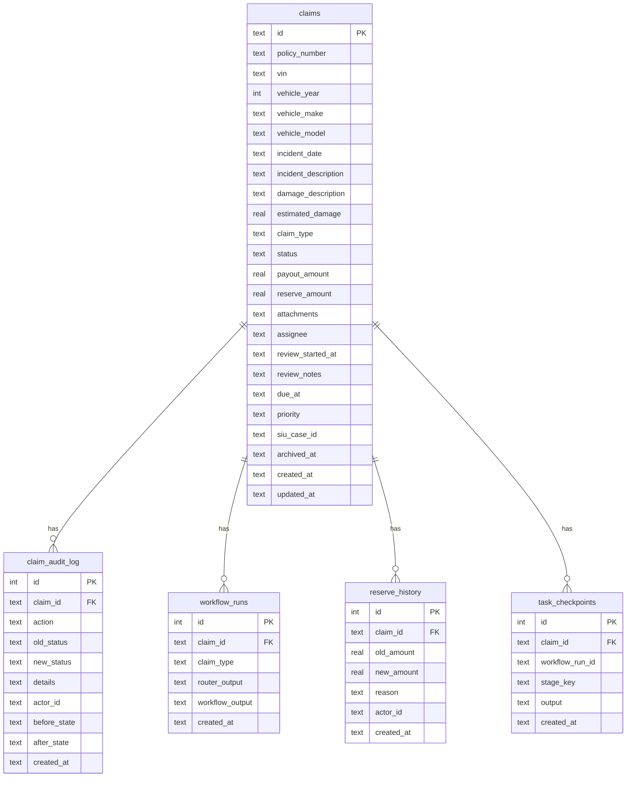
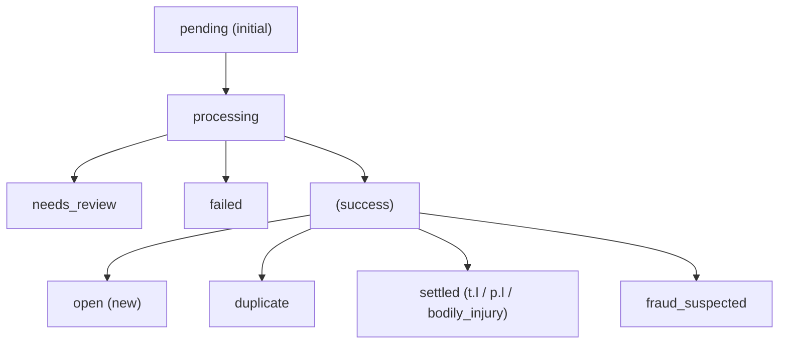

# Database Schema

The system uses SQLite for persistent storage of claims, audit logs, and workflow results.

For configuration options, see [Configuration](configuration.md).

## Configuration

| Environment Variable | Default | Description |
|---------------------|---------|-------------|
| `CLAIMS_DB_PATH` | `data/claims.db` | Path to SQLite database file |

## Schema Change Process

The schema is defined in two places and both must be kept in sync:

1. **`src/claim_agent/db/database.py`** – `SCHEMA_SQL` used by `init_db()`. New installs and tests use this; `CREATE TABLE IF NOT EXISTS` applies the full schema when tables do not exist.

2. **`alembic/versions/`** – Incremental migrations for existing databases. Production upgrades use `alembic upgrade head`.

**When changing the schema:**

- Add an Alembic migration for the change (e.g. `alembic revision -m "description"`).
- Update `SCHEMA_SQL` in `database.py` so new installs and tests get the same schema.
- Run migrations on existing DBs; `init_db` will not modify existing table columns, although `SCHEMA_SQL` may still create new indexes or triggers defined there. All schema changes for existing databases must go through Alembic.

## Schema Overview


```mermaid
erDiagram
    claims ||--o{ claim_audit_log : "has"
    claims ||--o{ workflow_runs : "has"
    claims ||--o{ reserve_history : "has"
    
    claims {
        text id PK
        text policy_number
        text vin
        int vehicle_year
        text vehicle_make
        text vehicle_model
        text incident_date
        text incident_description
        text damage_description
        real estimated_damage
        text claim_type
        text status
        real payout_amount
        real reserve_amount
        text attachments
        text assignee
        text review_started_at
        text review_notes
        text due_at
        text priority
        text siu_case_id
        text archived_at
        text created_at
        text updated_at
    }
    
    claims ||--o{ task_checkpoints : "has"
    
    claim_audit_log {
        int id PK
        text claim_id FK
        text action
        text old_status
        text new_status
        text details
        text actor_id
        text before_state
        text after_state
        text created_at
    }
    
    reserve_history {
        int id PK
        text claim_id FK
        real old_amount
        real new_amount
        text reason
        text actor_id
        text created_at
    }
    
    workflow_runs {
        int id PK
        text claim_id FK
        text claim_type
        text router_output
        text workflow_output
        text created_at
    }
    
    task_checkpoints {
        int id PK
        text claim_id FK
        text workflow_run_id
        text stage_key
        text output
        text created_at
    }
```

## Tables

### claims

Main table storing claim records.

```sql
CREATE TABLE IF NOT EXISTS claims (
    id TEXT PRIMARY KEY,
    policy_number TEXT NOT NULL,
    vin TEXT NOT NULL,
    vehicle_year INTEGER,
    vehicle_make TEXT,
    vehicle_model TEXT,
    incident_date TEXT,
    incident_description TEXT,
    damage_description TEXT,
    estimated_damage REAL,
    claim_type TEXT,
    status TEXT DEFAULT 'pending',
    payout_amount REAL,
    reserve_amount REAL,
    attachments TEXT DEFAULT '[]',
    assignee TEXT,
    review_started_at TEXT,
    review_notes TEXT,
    due_at TEXT,
    priority TEXT,
    siu_case_id TEXT,
    archived_at TEXT,
    created_at TEXT DEFAULT (datetime('now')),
    updated_at TEXT DEFAULT (datetime('now'))
);

-- Indexes for search performance
CREATE INDEX IF NOT EXISTS idx_claims_vin ON claims(vin);
CREATE INDEX IF NOT EXISTS idx_claims_incident_date ON claims(incident_date);
```

| Column | Type | Description |
|--------|------|-------------|
| `id` | TEXT | Primary key (e.g., CLM-11EEF959) |
| `policy_number` | TEXT | Insurance policy number |
| `vin` | TEXT | Vehicle identification number |
| `vehicle_year` | INTEGER | Year of vehicle |
| `vehicle_make` | TEXT | Vehicle manufacturer |
| `vehicle_model` | TEXT | Vehicle model |
| `incident_date` | TEXT | Date of incident (YYYY-MM-DD) |
| `incident_description` | TEXT | Description of the incident |
| `damage_description` | TEXT | Description of vehicle damage |
| `estimated_damage` | REAL | Estimated repair cost (optional) |
| `claim_type` | TEXT | Classification (new, duplicate, etc.) |
| `status` | TEXT | Current status |
| `payout_amount` | REAL | Settlement amount (if applicable) |
| `reserve_amount` | REAL | Estimated ultimate cost (reserve) set aside for claim |
| `attachments` | TEXT | JSON array of attachment metadata |
| `assignee` | TEXT | Adjuster/user ID (review queue) |
| `review_started_at` | TEXT | When claim entered needs_review |
| `review_notes` | TEXT | Adjuster notes |
| `due_at` | TEXT | SLA target datetime (ISO) |
| `priority` | TEXT | critical \| high \| medium \| low (from escalation) |
| `siu_case_id` | TEXT | SIU case ID when fraud workflow creates a referral |
| `archived_at` | TEXT | When claim was archived (retention enforcement) |
| `created_at` | TEXT | Creation timestamp |
| `updated_at` | TEXT | Last update timestamp |

### claim_audit_log

Audit trail of all status changes and actions. **Append-only**: no UPDATE or DELETE. Records are immutable for compliance.

```sql
CREATE TABLE IF NOT EXISTS claim_audit_log (
    id INTEGER PRIMARY KEY AUTOINCREMENT,
    claim_id TEXT NOT NULL,
    action TEXT NOT NULL,
    old_status TEXT,
    new_status TEXT,
    details TEXT,
    actor_id TEXT DEFAULT 'system',
    before_state TEXT,
    after_state TEXT,
    created_at TEXT DEFAULT (datetime('now')),
    FOREIGN KEY (claim_id) REFERENCES claims(id)
);

CREATE INDEX IF NOT EXISTS idx_claim_audit_log_claim_id ON claim_audit_log(claim_id);
```

| Column | Type | Description |
|--------|------|-------------|
| `id` | INTEGER | Auto-increment primary key |
| `claim_id` | TEXT | Foreign key to claims.id |
| `action` | TEXT | Event type (see Audit Event Types below) |
| `old_status` | TEXT | Previous status (for status_change) |
| `new_status` | TEXT | New status |
| `details` | TEXT | Additional details/notes |
| `actor_id` | TEXT | Who performed the action: `system`, `workflow`, or adjuster ID |
| `before_state` | TEXT | JSON of state before change (status, claim_type, payout_amount) |
| `after_state` | TEXT | JSON of state after change |
| `created_at` | TEXT | Timestamp of action |

#### Audit Event Types

| Event | Description |
|-------|-------------|
| `created` | Claim record created |
| `status_change` | Status, claim_type, or payout_amount changed |
| `approval` | Human approval for continued processing |
| `rejection` | Human rejection with reason |
| `reprocess` | Workflow reprocessed |
| `escalation` | Escalated for HITL |
| `payout_set` | Payout amount set |
| `attachments_updated` | Attachments modified |
| `request_info` | Adjuster requested more info from claimant |
| `escalate_to_siu` | Escalated to Special Investigations Unit |
| `siu_case_created` | SIU case created by fraud workflow (automated referral) |
| `assign` | Claim assigned to adjuster |
| `reserve_set` | Reserve amount set (initial or first) |
| `reserve_adjusted` | Reserve amount changed |

#### Actor Identity

- `system` – System-level actions (e.g. initialization)
- `workflow` – Automated workflow actions (default for `run_claim_workflow`)
- `<adjuster_id>` – Human adjuster when populated from auth context (API)

#### Retention

Audit log retention is compliance-dependent. Configure via backup/archival policies. The audit table may outlive claims for regulatory requirements. See your compliance team for retention periods.

### reserve_history

Append-only audit of reserve changes. Used for actuarial analysis, compliance, and reserve adequacy tracking. **Append-only**: no UPDATE or DELETE.

```sql
CREATE TABLE IF NOT EXISTS reserve_history (
    id INTEGER PRIMARY KEY AUTOINCREMENT,
    claim_id TEXT NOT NULL,
    old_amount REAL,
    new_amount REAL NOT NULL,
    reason TEXT DEFAULT '',
    actor_id TEXT DEFAULT 'workflow',
    created_at TEXT DEFAULT (datetime('now')),
    FOREIGN KEY (claim_id) REFERENCES claims(id)
);
CREATE INDEX IF NOT EXISTS idx_reserve_history_claim_id ON reserve_history(claim_id);
```

| Column | Type | Description |
|--------|------|-------------|
| `id` | INTEGER | Auto-increment primary key |
| `claim_id` | TEXT | Foreign key to claims.id |
| `old_amount` | REAL | Previous reserve (NULL for initial set) |
| `new_amount` | REAL | New reserve amount |
| `reason` | TEXT | Reason for change |
| `actor_id` | TEXT | Who made the change |
| `created_at` | TEXT | Timestamp |

### workflow_runs

Preserves output from each workflow execution.

```sql
CREATE TABLE IF NOT EXISTS workflow_runs (
    id INTEGER PRIMARY KEY AUTOINCREMENT,
    claim_id TEXT NOT NULL,
    claim_type TEXT,
    router_output TEXT,
    workflow_output TEXT,
    created_at TEXT DEFAULT (datetime('now')),
    FOREIGN KEY (claim_id) REFERENCES claims(id)
);
```

| Column | Type | Description |
|--------|------|-------------|
| `id` | INTEGER | Auto-increment primary key |
| `claim_id` | TEXT | Foreign key to claims.id |
| `claim_type` | TEXT | Classification from router |
| `router_output` | TEXT | Raw output from router crew |
| `workflow_output` | TEXT | Output from workflow crew |
| `created_at` | TEXT | Timestamp of run |

### task_checkpoints

Task-level checkpoints for resumable workflows. Stores output per stage so reprocessing can resume from a specific point.

**Relationship to workflow_runs:** `workflow_run_id` is a logical run identifier (UUID hex string, e.g. `uuid.uuid4().hex`) generated per workflow execution. It is *not* a foreign key to `workflow_runs.id`—those tables track runs independently. `workflow_runs` stores router/workflow output with an autoincrement `id`; `task_checkpoints` groups stage outputs by `workflow_run_id`. When resuming, the orchestrator loads checkpoints for a given `(claim_id, workflow_run_id)` and can skip completed stages.

```sql
CREATE TABLE IF NOT EXISTS task_checkpoints (
    id INTEGER PRIMARY KEY AUTOINCREMENT,
    claim_id TEXT NOT NULL,
    workflow_run_id TEXT NOT NULL,
    stage_key TEXT NOT NULL,
    output TEXT NOT NULL,
    created_at TEXT DEFAULT (datetime('now')),
    FOREIGN KEY (claim_id) REFERENCES claims(id),
    UNIQUE(claim_id, workflow_run_id, stage_key)
);
CREATE INDEX IF NOT EXISTS idx_task_checkpoints_claim_run ON task_checkpoints(claim_id, workflow_run_id);
```

| Column | Type | Description |
|--------|------|-------------|
| `id` | INTEGER | Auto-increment primary key |
| `claim_id` | TEXT | Foreign key to claims.id |
| `workflow_run_id` | TEXT | Logical run identifier (UUID hex); groups checkpoints for one execution. Not a FK to workflow_runs.id. |
| `stage_key` | TEXT | Stage identifier (e.g. router, escalation_check, workflow, settlement) |
| `output` | TEXT | Serialized output from that stage |
| `created_at` | TEXT | Timestamp |

## Status Constants

Defined in `src/claim_agent/db/constants.py`:

| Constant | Value | Description |
|----------|-------|-------------|
| `STATUS_PENDING` | "pending" | Initial state after creation |
| `STATUS_PROCESSING` | "processing" | Workflow is running |
| `STATUS_OPEN` | "open" | New claim opened |
| `STATUS_CLOSED` | "closed" | Claim finalized (legacy) |
| `STATUS_DUPLICATE` | "duplicate" | Marked as duplicate |
| `STATUS_FRAUD_SUSPECTED` | "fraud_suspected" | Flagged for fraud |
| `STATUS_PARTIAL_LOSS` | "partial_loss" | Reserved for schema/validation |
| `STATUS_SETTLED` | "settled" | Total loss or partial loss settlement complete |
| `STATUS_NEEDS_REVIEW` | "needs_review" | Escalated for HITL |
| `STATUS_PENDING_INFO` | "pending_info" | Awaiting info from claimant |
| `STATUS_FAILED` | "failed" | Processing failed |

## Status Flow

Status transitions are enforced by the [Claim State Machine](state-machine.md). Invalid transitions raise `InvalidClaimTransitionError`.


```mermaid
flowchart TD
    pending["pending (initial)"]
    processing["processing"]
    needs_review["needs_review"]
    failed["failed"]
    success["(success)"]
    open["open (new)"]
    duplicate["duplicate"]
    settled["settled (t.l / p.l / bodily_injury)"]
    fraud["fraud_suspected"]

    pending --> processing
    processing --> needs_review
    processing --> failed
    processing --> success
    success --> open
    success --> duplicate
    success --> settled
    success --> fraud
```

## Repository Operations

The `ClaimRepository` class (`src/claim_agent/db/repository.py`) provides:

- All updates use **parameterized queries** (no string interpolation of user input) to avoid SQL injection.

### create_claim

```python
def create_claim(self, claim_input: ClaimInput) -> str:
    """Insert new claim, generate ID, log 'created' audit entry. Returns claim_id."""
```

- Generates unique claim ID (CLM-XXXXXXXX)
- Inserts claim record with status 'pending'
- Creates audit log entry with action `created`, actor_id (default `workflow`)

### get_claim

```python
def get_claim(self, claim_id: str) -> dict[str, Any] | None:
    """Fetch claim by ID."""
```

- Returns claim as dictionary or None if not found

### update_claim_status

```python
def update_claim_status(
    self,
    claim_id: str,
    new_status: str,
    details: str | None = None,
    claim_type: str | None = None,
    payout_amount: float | None = None,
    *,
    actor_id: str = "workflow",
    skip_validation: bool = False,
) -> None:
    """Update status, optionally claim_type and payout_amount; log state change."""
```

- Updates claim status
- **State machine enforced**: Valid transitions only; invalid transitions raise `InvalidClaimTransitionError`
- See [State Machine](state-machine.md) for full transition matrix and guards
- Optionally updates claim_type and payout_amount
- Creates audit log entry with action `status_change`, actor_id, before_state, after_state

### save_workflow_result

```python
def save_workflow_result(
    self,
    claim_id: str,
    claim_type: str,
    router_output: str,
    workflow_output: str,
) -> None:
    """Save workflow run result to workflow_runs."""
```

- Preserves router and workflow outputs
- Allows multiple runs per claim (reprocessing)

### get_claim_history

```python
def get_claim_history(
    self,
    claim_id: str,
    *,
    limit: int | None = None,
    offset: int = 0,
) -> tuple[list[dict[str, Any]], int]:
    """Get audit log entries for a claim with optional pagination."""
```

- Returns (rows, total_count). Use limit/offset for pagination on large claims

### search_claims

```python
def search_claims(
    self,
    vin: str | None = None,
    incident_date: str | None = None,
) -> list[dict[str, Any]]:
    """Search claims by VIN and/or incident_date."""
```

- Used for duplicate detection
- Returns matching claims

## Initialization

Database is automatically initialized on first use. The schema is applied **once per database path** per process; repeated `get_connection()` calls do not re-run the schema script.

```python
from claim_agent.db.database import get_connection

with get_connection() as conn:
    # Schema is created automatically (idempotent)
    # Connection is returned ready to use
    pass
```

## Seeding Historical Data

To load mock claims for duplicate detection testing:

```bash
python scripts/seed_claims_from_mock_db.py
```

This loads claims from `data/mock_db.json` into SQLite.

## Querying via CLI

```bash
# Get claim status
claim-agent status CLM-11EEF959

# Get claim history (audit log)
claim-agent history CLM-11EEF959
```

## Example Audit Log

```json
[
  {
    "id": 1,
    "claim_id": "CLM-11EEF959",
    "action": "created",
    "old_status": null,
    "new_status": "pending",
    "details": "Claim record created",
    "actor_id": "workflow",
    "before_state": null,
    "after_state": "{\"status\": \"pending\", \"claim_type\": null, \"payout_amount\": null}",
    "created_at": "2025-01-28 10:00:00"
  },
  {
    "id": 2,
    "claim_id": "CLM-11EEF959",
    "action": "status_change",
    "old_status": "pending",
    "new_status": "processing",
    "details": null,
    "actor_id": "workflow",
    "before_state": "{\"status\": \"pending\", \"claim_type\": null, \"payout_amount\": null}",
    "after_state": "{\"status\": \"processing\", \"claim_type\": null, \"payout_amount\": null}",
    "created_at": "2025-01-28 10:00:01"
  },
  {
    "id": 3,
    "claim_id": "CLM-11EEF959",
    "action": "status_change",
    "old_status": "processing",
    "new_status": "open",
    "details": "Claim ID: CLM-11EEF959, Status: open, Summary: ...",
    "actor_id": "workflow",
    "before_state": "{\"status\": \"processing\", \"claim_type\": \"new\", \"payout_amount\": null}",
    "after_state": "{\"status\": \"open\", \"claim_type\": \"new\", \"payout_amount\": null}",
    "created_at": "2025-01-28 10:00:15"
  }
]
```

## Backup and Migration

### Backup

```bash
cp data/claims.db data/claims.db.backup
```

### Reset

```bash
rm data/claims.db
# Database will be recreated on next use
```

### Export to JSON

```python
import sqlite3
import json

conn = sqlite3.connect('data/claims.db')
conn.row_factory = sqlite3.Row
claims = [dict(row) for row in conn.execute('SELECT * FROM claims').fetchall()]
with open('claims_export.json', 'w') as f:
    json.dump(claims, f, indent=2)
```
