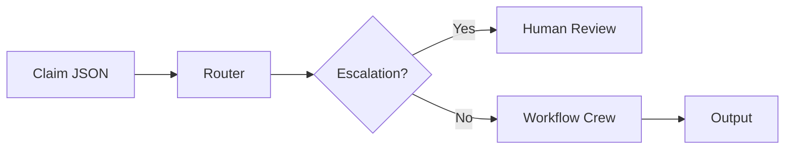

# Agentic Claim Representative Documentation

Welcome to the documentation for the Agentic Claim Representative POC - an AI-powered auto insurance claims processing system built with CrewAI.

## Overview

This system uses multi-agent AI architecture to automate auto insurance claim processing. A router agent classifies incoming claims and delegates them to specialized workflow crews.



## Documentation

### Getting Started

- **[Getting Started](getting-started.md)** - Installation, setup, and quick start guide

### Core Concepts

- **[Architecture](architecture.md)** - System design, components, and patterns
- **[Agent Flow](agent-flow.md)** - Execution flow and state management
- **[Crews](crews.md)** - Workflow crew details and agent composition
- **[Claim Types](claim-types.md)** - Classification criteria and examples

### Reference

- **[Tools](tools.md)** - Complete tool reference
- **[Database](database.md)** - Schema and repository operations
- **[Configuration](configuration.md)** - Environment and LLM setup
- **[MCP Server](mcp-server.md)** - Optional external tool access

## Quick Reference

### CLI Commands

```bash
claim-agent process <claim.json>   # Process a new claim
claim-agent status <claim_id>      # Get claim status
claim-agent history <claim_id>     # Get claim audit log
claim-agent reprocess <claim_id>   # Re-run workflow
```

### Claim Types at a Glance

| Type | Crew | Description |
|------|------|-------------|
| `new` | [New Claim](crews.md#new-claim-crew) | First-time claim → validates, assigns ID |
| `duplicate` | [Duplicate](crews.md#duplicate-crew) | Matches existing → merge or reject |
| `total_loss` | [Total Loss](crews.md#total-loss-crew) | Unrepairable → value and settle |
| `fraud` | [Fraud](crews.md#fraud-detection-crew) | Suspicious → investigate and assess |
| `partial_loss` | [Partial Loss](crews.md#partial-loss-crew) | Repairable → estimate, shop, authorize |

See [Claim Types](claim-types.md) for classification criteria and examples.

## Key Features

- **Multi-Agent Architecture** - Specialized agents collaborate on tasks
- **Router-Based Classification** - Intelligent claim routing ([Architecture](architecture.md#router-delegator-pattern))
- **Human-in-the-Loop** - Escalation for high-risk claims ([Agent Flow](agent-flow.md#4-escalation-check-hitl))
- **Persistent State** - SQLite with full audit trail ([Database](database.md))
- **Extensible Tools** - Easy to add capabilities ([Tools](tools.md))
- **MCP Integration** - Optional external access ([MCP Server](mcp-server.md))
