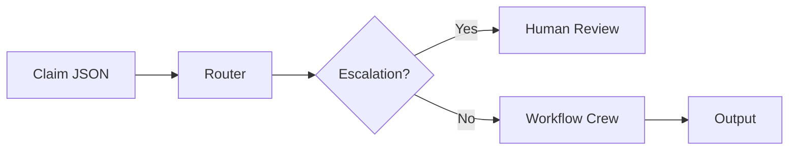

# Agentic Claim Representative Documentation

Welcome to the documentation for the Agentic Claim Representative POC - an AI-powered auto insurance claims processing system built with CrewAI.

## Overview

This system uses multi-agent AI architecture to automate auto insurance claim processing. A router agent classifies incoming claims and delegates them to specialized workflow crews.

```mermaid
flowchart LR
    A[Claim JSON] --> B[Router] --> C{Escalation?}
    C -->|Yes| D[Human Review]
    C -->|No| E[Workflow Crew] --> F[Output]
```

## Documentation

### Getting Started

- **[Getting Started](getting-started.md)** - Installation, setup, and quick start guide

### Core Concepts

- **[Architecture](architecture.md)** - System design, components, and patterns
- **[Agent Flow](agent-flow.md)** - Execution flow and state management
- **[Crews](crews.md)** - Workflow crew details and agent composition
- **[Skills](skills.md)** - Agent prompts and operational procedures
- **[Claim Types](claim-types.md)** - Classification criteria and examples

### Reference

- **[Tools](tools.md)** - Complete tool reference
- **[Webhooks](webhooks.md)** - Outbound webhooks for status changes and repair authorization
- **[Adapters](adapters.md)** - Pluggable external-system integrations (policy, valuation, repair shops, parts, SIU)
- **[RAG](rag.md)** - Retrieval-Augmented Generation for policy and compliance
- **[Database](database.md)** - Schema and repository operations
- **[State Machine](state-machine.md)** - Claim status transitions and guards
- **[Configuration](configuration.md)** - Environment and LLM setup
- **[Compliance API](compliance-api.md)** - Fraud reporting and compliance HTTP endpoints
- **[Observability](observability.md)** - Logging, tracing, and metrics
- **[PII and Retention](pii-and-retention.md)** - PII masking in logs and data retention enforcement
- **[User Types](user-types.md)** - User types and follow-up agent for HITL flows
- **[MCP Server](mcp-server.md)** - Optional external tool access

### Human-in-the-Loop and Operations

- **[Adjuster Workflow](adjuster-workflow.md)** - Review queue API, CLI, and audit trail
- **[Review Queue](review-queue.md)** - Frontend planned implementation for review queue
- **[Alerting](alerting.md)** - Prometheus alert rules and configuration
- **[Compliance Corpus Requirements](compliance-corpus-requirements.md)** - RAG corpus requirements

## Quick Reference

### CLI Commands

| Command | Description |
|---------|-------------|
| `claim-agent serve [--reload] [--port <port>] [--host <host>]` | Start REST API server |
| `claim-agent process <claim.json> [--attachment <file> ...]` | Process a new claim (optionally attach photos, PDFs, estimates) |
| `claim-agent status <claim_id>` | Get claim status |
| `claim-agent history <claim_id>` | Get claim audit log |
| `claim-agent reprocess <claim_id> [--from-stage <stage>]` | Re-run workflow (optionally resume from a stage: `coverage_verification`, `economic_analysis`, `fraud_prescreening`, `duplicate_detection`, `router`, `escalation_check`, `workflow`, `task_creation`, `rental`, `liability_determination`, `settlement`, `subrogation`, `salvage`, `after_action`) |
| `claim-agent metrics [claim_id]` | Show metrics (optional claim ID) |
| `claim-agent review-queue [--assignee X] [--priority P]` | List claims needing review |
| `claim-agent assign <id> <assignee>` | Assign claim to adjuster |
| `claim-agent approve <id> [--confirmed-claim-type X] [--confirmed-payout N] [--notes "..."]` | Approve, run handback, then workflow (supervisor) |
| `claim-agent reject <id> [--reason "..."]` | Reject claim |
| `claim-agent request-info <id> [--note "..."]` | Request more info |
| `claim-agent escalate-siu <id>` | Escalate to SIU |
| `claim-agent retention-enforce [--dry-run] [--years N] [--include-litigation-hold]` | Archive claims older than retention |
| `claim-agent retention-report [--years N]` | Retention audit report (counts by tier, litigation hold, pending archive) |
| `claim-agent litigation-hold --claim-id X --on\|--off` | Set or clear litigation hold on a claim |
| `claim-agent dsar-access --claimant-email X [--claim-id Y \| --policy P --vin V] [--fulfill]` | Submit DSAR access request (right-to-know) |
| `claim-agent dsar-deletion --claimant-email X [--claim-id Y \| --policy P --vin V] [--fulfill]` | Submit DSAR deletion request (right-to-delete) |
| `claim-agent diary-escalate [--db PATH]` | Run deadline escalation (notify overdue, escalate to supervisor) |
| `claim-agent ucspa-deadlines [--days N] [--no-webhooks]` | Check UCSPA deadlines; webhook alerts dispatched by default (`--no-webhooks` to suppress) |

### Claim Types at a Glance

| Type | Crew | Description |
|------|------|-------------|
| `new` | [New Claim](crews.md#new-claim-crew) | First-time claim → validates, assigns ID |
| `duplicate` | [Duplicate](crews.md#duplicate-crew) | Matches existing → merge or reject |
| `total_loss` | [Total Loss](crews.md#total-loss-crew) | Unrepairable → value and settle |
| `fraud` | [Fraud](crews.md#fraud-detection-crew) | Suspicious → investigate and assess |
| `partial_loss` | [Partial Loss](crews.md#partial-loss-crew) | Repairable → estimate, shop, authorize |
| `bodily_injury` | [Bodily Injury](crews.md#bodily-injury-crew) | Injury to persons → intake, medical review, settlement |
| `reopened` | [Reopened](crews.md#reopened-crew) | Settled claim reopened → validate, load prior, route to crew |

See [Claim Types](claim-types.md) for classification criteria and examples.

## Key Features

- **Multi-Agent Architecture** - Specialized agents collaborate on tasks
- **Router-Based Classification** - Intelligent claim routing ([Architecture](architecture.md#router-delegator-pattern))
- **Skills-Based Prompts** - Agent prompts in readable markdown ([Skills](skills.md))
- **Human-in-the-Loop** - Escalation for high-risk claims ([Agent Flow](agent-flow.md#4-escalation-check-hitl))
- **Persistent State** - SQLite with full audit trail ([Database](database.md))
- **Extensible Tools** - Easy to add capabilities ([Tools](tools.md))
- **Pluggable Adapters** - Swap mock data for real integrations via env vars ([Adapters](adapters.md))
- **Observability** - Structured logging, correlation IDs, LangSmith/LiteLLM tracing, cost and latency metrics ([Observability](observability.md))
- **RAG for Policy/Compliance** - Semantic search over regulations ([RAG](rag.md))
- **MCP Integration** - Optional external access and health check ([MCP Server](mcp-server.md))
- **Configuration** - Centralized settings for escalation, fraud, valuation, token budgets ([Configuration](configuration.md#centralized-settings))
- **Security & Resilience** - Input sanitization, parameterized queries, retry for transient LLM failures ([Architecture](architecture.md#security-and-resilience))
