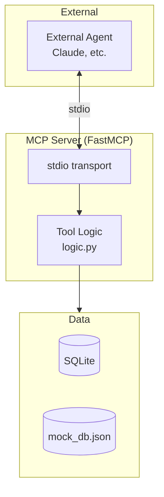

# MCP Server

The system includes an optional MCP (Model Context Protocol) server that exposes claim tools via stdio transport. This allows external AI agents to use the claim processing tools.

For tool details, see [Tools](tools.md). For configuration, see [Configuration](configuration.md).

## Overview



## What is MCP?

The Model Context Protocol (MCP) is an open protocol for connecting AI assistants to external tools and data sources. The claim agent MCP server exposes claim processing tools that can be used by any MCP-compatible client.

## Starting the Server

```bash
# Run the MCP server
python -m claim_agent.mcp_server.server
```

The server uses **stdio transport** (standard input/output), which is the default for local MCP servers.

## Available Tools

The MCP server exposes these tools:

| Tool | Description |
|------|-------------|
| `query_policy_db` | Validate policy and get coverage details |
| `search_claims_db` | Search claims by VIN and incident date |
| `compute_similarity` | Compare two descriptions for similarity |
| `fetch_vehicle_value` | Get vehicle market value (mock KBB) |
| `evaluate_damage` | Assess damage severity |
| `calculate_payout` | Calculate total loss payout |
| `generate_report` | Generate claim report document |
| `generate_claim_id` | Generate unique claim ID |
| `search_california_compliance` | Search CA compliance data |

## Tool Definitions

### query_policy_db

```python
@mcp.tool()
def query_policy_db(policy_number: str) -> str:
    """Query the policy database to validate policy and retrieve coverage details."""
```

**Parameters:**
- `policy_number` (string): Insurance policy number

**Returns:** JSON with valid, coverage, deductible, message

---

### search_claims_db

```python
@mcp.tool()
def search_claims_db(vin: str, incident_date: str) -> str:
    """Search existing claims by VIN and incident date for potential duplicates."""
```

**Parameters:**
- `vin` (string): Vehicle identification number
- `incident_date` (string): Date of incident (YYYY-MM-DD)

**Returns:** JSON array of matching claims

---

### compute_similarity

```python
@mcp.tool()
def compute_similarity(description_a: str, description_b: str) -> str:
    """Compare two incident descriptions and return similarity score 0-100."""
```

**Parameters:**
- `description_a` (string): First description
- `description_b` (string): Second description

**Returns:** JSON with similarity_score and is_duplicate

---

### fetch_vehicle_value

```python
@mcp.tool()
def fetch_vehicle_value(vin: str, year: int, make: str, model: str) -> str:
    """Fetch current market value for a vehicle (mock KBB API)."""
```

**Parameters:**
- `vin` (string): Vehicle identification number
- `year` (integer): Year of vehicle
- `make` (string): Vehicle manufacturer
- `model` (string): Vehicle model

**Returns:** JSON with value, condition, source

---

### evaluate_damage

```python
@mcp.tool()
def evaluate_damage(damage_description: str, estimated_repair_cost: float | None = None) -> str:
    """Evaluate damage description and optional repair cost to assess severity."""
```

**Parameters:**
- `damage_description` (string): Text description of damage
- `estimated_repair_cost` (float, optional): Estimated cost

**Returns:** JSON with severity, estimated_repair_cost, total_loss_candidate

---

### calculate_payout

```python
@mcp.tool()
def calculate_payout(vehicle_value: float, policy_number: str) -> str:
    """Calculate total loss payout by subtracting policy deductible from vehicle value."""
```

**Parameters:**
- `vehicle_value` (float): Vehicle market value
- `policy_number` (string): Policy number for deductible lookup

**Returns:** JSON with payout_amount, vehicle_value, deductible, calculation

---

### generate_report

```python
@mcp.tool()
def generate_report(
    claim_id: str,
    claim_type: str,
    status: str,
    summary: str,
    payout_amount: float | None = None,
) -> str:
    """Generate a claim report/summary document."""
```

**Parameters:**
- `claim_id` (string): Claim ID
- `claim_type` (string): Type of claim
- `status` (string): Claim status
- `summary` (string): Summary text
- `payout_amount` (float, optional): Settlement amount

**Returns:** Formatted report string

---

### generate_claim_id

```python
@mcp.tool()
def generate_claim_id(prefix: str = "CLM") -> str:
    """Generate a unique claim ID."""
```

**Parameters:**
- `prefix` (string, default: "CLM"): Prefix for the ID

**Returns:** Claim ID string (e.g., "CLM-11EEF959")

---

### search_california_compliance

```python
@mcp.tool()
def search_california_compliance(query: str = "") -> str:
    """Search California auto insurance compliance/regulatory reference data by keyword."""
```

**Parameters:**
- `query` (string, optional): Search keyword

**Returns:** JSON with matching compliance entries

## Server Implementation

```python
# src/claim_agent/mcp_server/server.py

from mcp.server.fastmcp import FastMCP
from claim_agent.tools.logic import (
    query_policy_db_impl,
    search_claims_db_impl,
    # ... other implementations
)

mcp = FastMCP("claim-tools", json_response=True)

@mcp.tool()
def query_policy_db(policy_number: str) -> str:
    """Query the policy database to validate policy and retrieve coverage details."""
    return query_policy_db_impl(policy_number)

# ... other tool definitions

def main() -> None:
    """Run the MCP server with stdio transport (default)."""
    mcp.run(transport="stdio")

if __name__ == "__main__":
    main()
```

## Using with CrewAI

CrewAI agents can connect to the MCP server:

```python
from crewai.tools import MCPServerStdio

mcp_tools = MCPServerStdio(
    command="python",
    args=["-m", "claim_agent.mcp_server.server"],
)

# Use mcp_tools in your agent
agent = Agent(
    role="Claims Processor",
    tools=[mcp_tools],
    # ...
)
```

## Using with Claude Desktop

Add to your Claude Desktop configuration (`claude_desktop_config.json`):

```json
{
  "mcpServers": {
    "claim-tools": {
      "command": "python",
      "args": ["-m", "claim_agent.mcp_server.server"],
      "cwd": "/path/to/auto-agent"
    }
  }
}
```

## Testing the Server

You can test the server manually:

```bash
# Start server (will wait for input)
python -m claim_agent.mcp_server.server

# In another terminal, send MCP messages via stdin
# (Requires MCP client or raw JSON-RPC)
```

## Extending the Server

To add new tools:

1. Add implementation in `tools/logic.py`:
```python
def my_new_tool_impl(param: str) -> str:
    """Implementation logic."""
    return json.dumps({"result": param})
```

2. Add tool decorator in `mcp_server/server.py`:
```python
@mcp.tool()
def my_new_tool(param: str) -> str:
    """Description for the tool."""
    return my_new_tool_impl(param)
```

## Security Considerations

1. **Local Only**: The stdio transport is local-only (no network exposure)
2. **Data Access**: The server has access to SQLite and mock data
3. **No Authentication**: No authentication is performed (trust local user)

For production deployment with network access:
- Use HTTP transport with authentication
- Implement rate limiting
- Add request logging/auditing

## Troubleshooting

### Server doesn't start

```bash
# Check Python path
which python

# Check module is importable
python -c "from claim_agent.mcp_server.server import main; print('OK')"
```

### Tools not appearing

Ensure FastMCP is installed:
```bash
pip install mcp
```

### Connection issues

Check that stdin/stdout are available (not redirected elsewhere).
