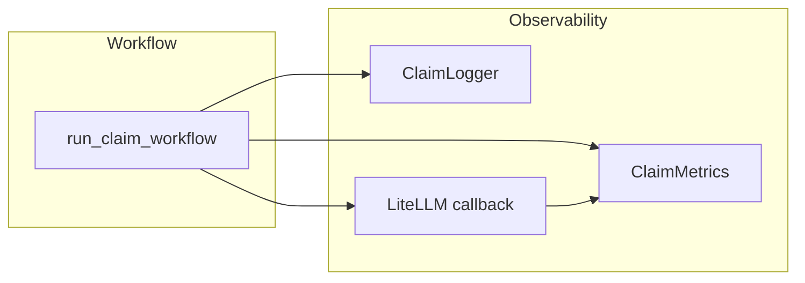

# Observability

This document describes the observability features built into the claim agent: structured logging with claim context, LLM call tracing (LangSmith and LiteLLM), and cost/latency metrics per claim.

For configuration details, see [Configuration](configuration.md). For MCP observability tools, see [MCP Server](mcp-server.md#observability-tools).

## Overview

The observability module (`claim_agent.observability`) provides:

- **Structured logging** – Logs tagged with `claim_id`, `claim_type`, and optional policy/context. Output can be human-readable or JSON for log aggregators.
- **Tracing** – LangSmith integration for LLM traces and a LiteLLM callback so all LLM calls (via CrewAI) report real token usage and cost.
- **Metrics** – Per-claim and global aggregates: LLM call count, tokens, estimated cost (USD), and latency (total, average, p50/p95/p99).



## Structured Logging

### Claim context

All logging within a claim run can carry claim context so you can filter or search by `claim_id` and `claim_type`.

- **`claim_context(claim_id, claim_type=..., policy_number=..., **extra)`** – Context manager. While active, any log record from the observability logger includes this context.
- **`get_logger(name, claim_id=..., structured=...)`** – Returns a `ClaimLogger` that adds claim fields to every log. You can also set `claim_id` / `claim_type` / context on the logger instance.
- **`log_claim_event(logger, event, claim_id=..., level=..., **data)`** – Log a named event (e.g. `claim_created`, `workflow_started`) with optional extra key-value data.

The main workflow uses `claim_context` and `get_logger` so that router start/complete, crew start/complete, escalation, and errors are all associated with the current claim.

### Log format

Controlled by `CLAIM_AGENT_LOG_FORMAT`:

| Value   | Description |
|--------|-------------|
| `human` | Human-readable lines with timestamp, level, optional `[claim=ID, type=TYPE]`, logger name, and message. |
| `json`  | One JSON object per line with `level`, `logger`, `message`, `timestamp`, `claim_id`, `claim_type`, `source` (file/line/function), and optional `data` / `exception`. |

CLI option `--json` overrides to JSON format for the run. `--debug` sets log level to DEBUG.

### Example (human format)

```
2025-01-31 12:00:00 INFO     [claim=CLM-001, type=new] claim_agent.crews.main_crew: [workflow_started] status=processing
2025-01-31 12:00:01 INFO     [claim=CLM-001, type=new] claim_agent.observability.metrics: [llm_metric] claim_id=CLM-001, model=gpt-4o-mini, tokens=500/200, cost=$0.0002, latency=1200ms, status=success
```

## Tracing

### LangSmith

When [LangSmith](https://smith.langchain.com) is enabled, the agent sets `LANGCHAIN_TRACING_V2`, `LANGCHAIN_API_KEY`, `LANGCHAIN_PROJECT`, and `LANGCHAIN_ENDPOINT` from your config so LangChain/LangSmith can record traces.

- Set `LANGSMITH_TRACING=true` and `LANGSMITH_API_KEY` (and optionally `LANGSMITH_PROJECT`, `LANGSMITH_ENDPOINT`).
- `setup_langsmith()` is called from `get_llm()` on first LLM use; no extra code required.

### LiteLLM callback

CrewAI uses LiteLLM under the hood. For each claim run, the workflow registers a **LiteLLMTracingCallback** with `litellm.callbacks` for the duration of that run, then restores the previous callbacks in a `finally` block. That callback:

- Receives real token usage from LLM responses (when the provider returns usage).
- Records each call into the global **ClaimMetrics** (see below) for the current claim.
- Logs success/failure and latency.

So you get accurate token and cost tracking per claim when the underlying provider supplies usage. The callback is scoped to a single workflow run and does not affect other code using `litellm.callbacks`.

### TracingConfig

`TracingConfig.from_env()` reads:

| Env var | Purpose |
|--------|--------|
| `LANGSMITH_TRACING` | Enable LangSmith (true/false) |
| `LANGSMITH_API_KEY`, `LANGSMITH_PROJECT`, `LANGSMITH_ENDPOINT` | LangSmith connection |
| `CLAIM_AGENT_TRACE_LLM` | Enable LLM call tracing (default: true) |
| `CLAIM_AGENT_TRACE_TOOLS` | Enable tool call tracing (default: true) |
| `CLAIM_AGENT_LOG_PROMPTS` | Log full prompts (may contain PII; default: false) |
| `CLAIM_AGENT_LOG_RESPONSES` | Log full responses (default: false) |

## Metrics

### What is tracked

For each claim, the workflow:

1. Calls **`metrics.start_claim(claim_id)`** at the start.
2. Records every LLM call via the LiteLLM callback with **`record_llm_call(claim_id, model, input_tokens, output_tokens, cost_usd, latency_ms, status, ...)`**. The LiteLLM callback automatically captures all LLM calls and provides accurate token counts and costs from the provider.
3. Calls **`metrics.end_claim(claim_id, status)`** and **`metrics.log_claim_summary(claim_id)`** on success, escalation, or error.

Per-claim summaries include:

- `total_llm_calls`, `successful_calls`, `failed_calls`
- `total_input_tokens`, `total_output_tokens`, `total_tokens`
- `total_cost_usd` (from model pricing or provider usage)
- `total_latency_ms`, `avg_latency_ms`, `p50_latency_ms`, `p95_latency_ms`, `p99_latency_ms`
- `models_used`, `status`

Global stats (across all claims in the process) are available via **`get_metrics().get_global_stats()`**: total claims, total LLM calls, total tokens, total cost, and averages per claim.

### Cost calculation

When the provider does not return cost, the metrics module estimates it using a built-in **model pricing** table (per 1K input/output tokens) for common OpenAI, Claude, and OpenRouter models. Unknown models fall back to a default rate. You can pass an explicit `cost_usd` into `record_llm_call` when you have provider-reported cost.

### Programmatic access

- **`get_metrics()`** – Returns the global `ClaimMetrics` singleton.
- **`get_metrics().get_claim_summary(claim_id)`** – Returns a `ClaimMetricsSummary` or `None`.
- **`get_metrics().get_all_summaries()`** – List of summaries for all tracked claims.
- **`get_metrics().get_global_stats()`** – Dict of global aggregates.
- **`track_llm_call(claim_id, model, input_tokens, output_tokens, ...)`** – Convenience wrapper that records on the global metrics instance.

Metrics are in-memory only (per process). They are cleared when the process exits; tests use **`reset_metrics()`** to clear the singleton between tests.

## Configuration

All observability behavior is controlled by environment variables. See `.env.example` for the full list.

### Logging

| Variable | Default | Description |
|----------|---------|-------------|
| `CLAIM_AGENT_LOG_FORMAT` | `human` | `human` or `json` |
| `CLAIM_AGENT_LOG_LEVEL` | `INFO` | `DEBUG`, `INFO`, `WARNING`, `ERROR` |

### LangSmith

| Variable | Default | Description |
|----------|---------|-------------|
| `LANGSMITH_TRACING` | `false` | Set to `true` to enable |
| `LANGSMITH_API_KEY` | (none) | Required when tracing is enabled |
| `LANGSMITH_PROJECT` | `claim-agent` | Project name in LangSmith |
| `LANGSMITH_ENDPOINT` | `https://api.smith.langchain.com` | API endpoint |

### Tracing options

| Variable | Default | Description |
|----------|---------|-------------|
| `CLAIM_AGENT_TRACE_LLM` | `true` | Enable LLM call tracing |
| `CLAIM_AGENT_TRACE_TOOLS` | `true` | Enable tool call tracing |
| `CLAIM_AGENT_LOG_PROMPTS` | `false` | Log full prompts (may contain PII) |
| `CLAIM_AGENT_LOG_RESPONSES` | `false` | Log full LLM responses |

## CLI

### metrics command

```bash
claim-agent metrics              # Global metrics for the current session
claim-agent metrics <claim_id>   # Metrics for a specific claim
```

Output is JSON. If no claims have been processed in the session, the global command prints a short message instead of empty stats.

### Global options

| Option | Effect |
|--------|--------|
| `--debug` | Set log level to DEBUG |
| `--json`  | Use JSON log format |

Example:

```bash
claim-agent --json --debug process claim.json
claim-agent metrics
```

## MCP observability tools

When using the [MCP server](mcp-server.md), two tools expose observability data:

| Tool | Description |
|------|-------------|
| **`get_claim_metrics`** | Takes optional `claim_id`. Returns JSON: per-claim summary for that ID, or global stats plus all per-claim summaries when no ID is given. |
| **`get_observability_config`** | Returns JSON with current tracing/config: `langsmith_enabled`, `langsmith_project`, `trace_llm_calls`, `trace_tool_calls`, `log_prompts`, `log_responses`. |

These are useful for external agents or dashboards that consume the MCP server.

## Optional dependency

The **observability** extra installs LangSmith support:

```bash
pip install -e ".[observability]"
```

If the observability module is not installed, the agent still runs; LangSmith setup is skipped and other observability features may be no-ops or use fallbacks.

## Summary

| Feature | Purpose |
|--------|---------|
| Structured logging | Claim-scoped logs; JSON or human format |
| ClaimLogger / claim_context | Attach claim_id and context to every log line |
| LangSmith | Optional external trace storage and UI |
| LiteLLM callback | Real token/cost per LLM call, recorded into ClaimMetrics |
| ClaimMetrics | Per-claim and global cost, latency, token counts |
| CLI `metrics` | Inspect metrics from the command line |
| MCP tools | `get_claim_metrics`, `get_observability_config` for external consumers |
