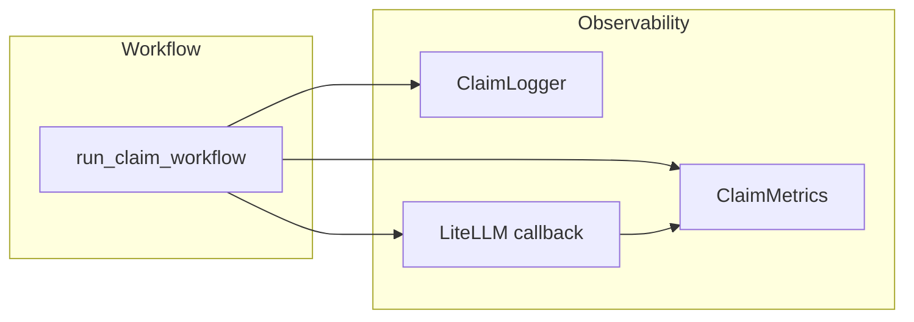

# Observability

This document describes the observability features built into the claim agent: structured logging with claim context, LLM call tracing (LangSmith and LiteLLM), and cost/latency metrics per claim.

For configuration details, see [Configuration](configuration.md). For MCP observability tools, see [MCP Server](mcp-server.md#observability-tools). For production alerting, see [Alerting](alerting.md).

## Overview

The observability module (`claim_agent.observability`) provides:

- **Health checks** – Production health endpoint with DB connectivity, optional LLM and claimant-notification readiness, and adapter probes. Returns 200 when healthy, 503 when critical dependencies are down.
- **Structured logging** – Logs tagged with `claim_id`, `claim_type`, and optional policy/context. Output can be human-readable or JSON for log aggregators. PII (policy_number, vin) is masked when `CLAIM_AGENT_MASK_PII=true` (default).
- **Tracing** – LangSmith integration for LLM traces and a LiteLLM callback so all LLM calls (via CrewAI) report real token usage and cost.
- **Metrics** – Per-claim and global aggregates: LLM call count, tokens, estimated cost (USD), and latency (total, average, p50/p95/p99). Prometheus export at `/metrics` for production monitoring.


```mermaid
flowchart LR
    subgraph Workflow
        A[run_claim_workflow]
    end
    subgraph Observability
        B[ClaimLogger]
        C[LiteLLM callback]
        D[ClaimMetrics]
    end
    A --> B
    A --> C
    A --> D
    C --> D
```

## Structured Logging

### Claim context

All logging within a claim run can carry claim context so you can filter or search by `claim_id` and `claim_type`.

- **`claim_context(claim_id, claim_type=..., policy_number=..., vin=..., correlation_id=..., **extra)`** – Context manager. While active, any log record from the observability logger includes this context. A **`correlation_id`** (UUID) is generated automatically if not provided, so all log lines for a run can be correlated. When `CLAIM_AGENT_MASK_PII=true`, policy_number and vin are masked in log output.
- **`get_logger(name, claim_id=..., structured=...)`** – Returns a `ClaimLogger` that adds claim fields to every log. You can also set `claim_id` / `claim_type` / context on the logger instance.
- **`log_claim_event(logger, event, claim_id=..., level=..., **data)`** – Log a named event (e.g. `claim_created`, `workflow_started`) with optional extra key-value data.

The main workflow uses `claim_context` and `get_logger` so that router start/complete, crew start/complete, escalation, and errors are all associated with the current claim.

### Log format

Controlled by `CLAIM_AGENT_LOG_FORMAT`:

| Value   | Description |
|--------|-------------|
| `human` | Human-readable lines with timestamp, level, optional `[claim=ID, type=TYPE]`, logger name, and message. |
| `json`  | One JSON object per line with `level`, `logger`, `message`, `timestamp`, `claim_id`, `claim_type`, `correlation_id`, `source` (file/line/function), and optional `data` / `exception`. |

CLI option `--json` overrides to JSON format for the run. `--debug` sets log level to DEBUG.

## Log Aggregation (Loki)

The monitoring stack includes **Grafana Loki** for centralized log collection and **Promtail** as the log shipper.
Start the full monitoring stack (Prometheus + Alertmanager + Grafana + **Loki** + **Promtail**) with:

```bash
docker compose --profile monitoring up
```

### Architecture

```
claim-agent container  →  Promtail (Docker socket)  →  Loki  →  Grafana (Explore / Logs panel)
```

Promtail scrapes container logs via the Docker socket, parses JSON log lines produced when
`CLAIM_AGENT_LOG_FORMAT=json`, and ships them to Loki with **low-cardinality** labels: `level`,
`claim_type`, and `logger`. Fields such as `claim_id` and `correlation_id` stay in the JSON log
line; filter with LogQL (e.g. ``{job="claim-agent"} | json | claim_id="CLM-12345"``). Human-readable
lines are forwarded as raw text.

### Querying logs in Grafana

1. Open Grafana at **http://localhost:3000**.
2. Go to **Explore** and select the **Loki** datasource.
3. Use LogQL to filter by claim or severity:

| Query | Description |
|-------|-------------|
| `{job="claim-agent"}` | All claim-agent logs |
| `{job="claim-agent", level="ERROR"}` | Errors only |
| `{job="claim-agent"} \| json \| claim_id="CLM-12345"` | Single claim trace |
| `{job="claim-agent"} \| json \| claim_type="fraud"` | All fraud-type claims |
| `{job="claim-agent"} \|= "escalat"` | Escalation events |

Set `CLAIM_AGENT_LOG_FORMAT=json` (in `.env` or `docker-compose.yml`) so Promtail can parse lines
and apply the labels above; use ``| json`` in LogQL for claim-scoped fields. Human-readable format
still works but structured parsing is skipped.

### Log retention

Retention is controlled by `LOG_RETENTION_DAYS` (default **90 days**).

| Location | Setting |
|----------|---------|
| `.env` / environment | `LOG_RETENTION_DAYS=90` |
| `monitoring/loki-config.yml` → `limits_config.retention_period` | `2160h` (= 90 × 24 h) |

**Keep both values in sync.** To change retention to 30 days:

```bash
# In .env:
LOG_RETENTION_DAYS=30

# In monitoring/loki-config.yml, set:
#   limits_config.retention_period: 720h   # 30 × 24 h
```

Loki compaction runs every 10 minutes and purges chunks older than the retention period after a
2-hour deletion delay (see `compactor` block in `monitoring/loki-config.yml`).

### Configuration files

| File | Purpose |
|------|---------|
| `monitoring/loki-config.yml` | Loki server, storage, schema, retention, compactor |
| `monitoring/promtail-config.yml` | Promtail scrape targets, Docker socket, pipeline stages |
| `monitoring/grafana/provisioning/datasources/loki.yml` | Auto-provisioned Loki datasource in Grafana |

### Production notes

- In production (`docker-compose.prod.yml`), set `LOG_RETENTION_DAYS` to match your compliance
  requirements (e.g. `LOG_RETENTION_DAYS=365` for one year) and update `loki-config.yml` accordingly.
- Mount a persistent volume for `/loki` in Loki to survive container restarts (already configured
  as the `loki-data` named volume in `docker-compose.yml`).
- For high-availability or cloud deployments, replace the `filesystem` storage backend in
  `loki-config.yml` with an S3-compatible store (`s3`, `gcs`, or `azure`).
- Promtail requires read access to the Docker socket (`/var/run/docker.sock`). In environments
  where this is restricted, switch Promtail to scrape log files from a shared volume instead.
- **Kubernetes deployments:** the Docker socket is not available in Kubernetes. See
  [Kubernetes log shipping](#kubernetes-log-shipping) below for the Kubernetes-native Promtail
  configuration.

## Kubernetes log shipping

Operators running claim-agent on Kubernetes (using the manifests in `k8s/` or the Helm chart in
`helm/claim-agent/`) cannot use the Docker socket-based Promtail configuration from
`monitoring/promtail-config.yml`. Instead, Promtail must run as a **DaemonSet** and read pod logs
directly from the host filesystem (`/var/log/pods/`).

**`monitoring/promtail-config-k8s.yml.example`** is a full Promtail document for operators who
mount config directly (e.g. raw ConfigMap at `/etc/promtail/config.yml` or a custom DaemonSet).

**`monitoring/promtail-helm-values-k8s.example.yaml`** is the matching fragment for the official
**`grafana/promtail`** Helm chart: that chart assembles config from `config.*` values (not from a
flat Promtail file), so use `-f` on this values file rather than pointing Helm at
`promtail-config-k8s.yml.example`.

Both provide the same JSON log pipeline (label extraction for `level`, `claim_type`, `logger`) and
the same LogQL query patterns as the Docker Compose setup, adapted for Kubernetes:

| Feature | Docker Compose | Kubernetes |
|---------|---------------|-----------|
| Discovery | `docker_sd_configs` (socket) | `kubernetes_sd_configs` (role: pod) |
| Log path | Docker daemon buffer | `/var/log/pods/…` on each node |
| Deployment | Single container in Compose | DaemonSet + RBAC |
| CRI parsing | Not needed | `cri: {}` stage strips containerd/CRI-O envelope |

### Quick start (Helm)

The **`grafana/promtail`** chart renders Promtail’s `config.file` from Helm values (`config.clients`,
`config.snippets.scrapeConfigs`, `config.snippets.extraScrapeConfigs`, etc.). Do **not** pass
`monitoring/promtail-config-k8s.yml.example` as `--values` to that chart — it is a standalone Promtail
document. Use **`monitoring/promtail-helm-values-k8s.example.yaml`** instead, which sets
`config.clients` and appends the claim-agent scrape job via `extraScrapeConfigs`.

```bash
helm repo add grafana https://grafana.github.io/helm-charts
helm repo update

# Deploy Loki (single-binary mode for a small cluster)
helm upgrade --install loki grafana/loki \
  --namespace monitoring --create-namespace \
  --set loki.auth_enabled=false \
  --set loki.commonConfig.replication_factor=1 \
  --set loki.storage.type=filesystem

# Deploy Promtail: chart defaults include hostPath /var/log/pods and RBAC; merge claim-agent job
helm upgrade --install promtail grafana/promtail \
  --namespace monitoring --create-namespace \
  -f monitoring/promtail-helm-values-k8s.example.yaml
```

To supply the entire Promtail config yourself, use the chart’s pattern for a self-managed
ConfigMap (see **`grafana/promtail`** README: disable the chart-generated config and mount your
own file). For GitOps, copy and adapt `promtail-helm-values-k8s.example.yaml` into your values
repository.

### Required RBAC

The Promtail ServiceAccount needs read access to pod metadata for discovery:

```yaml
apiVersion: rbac.authorization.k8s.io/v1
kind: ClusterRole
metadata:
  name: promtail
rules:
  - apiGroups: [""]
    resources: ["nodes", "nodes/proxy", "pods"]
    verbs: ["get", "watch", "list"]
```

The `grafana/promtail` Helm chart creates this automatically.

### DaemonSet volume mounts

Promtail reads host log files via a `hostPath` volume:

```yaml
volumes:
  - name: varlogpods
    hostPath:
      path: /var/log/pods
  - name: positions
    emptyDir: {}       # use hostPath for persistence across pod restarts

volumeMounts:
  - name: varlogpods
    mountPath: /var/log/pods
    readOnly: true
  - name: positions
    mountPath: /run/promtail
```

### Querying logs (same LogQL patterns)

After deploying Promtail on Kubernetes the Loki labels and LogQL patterns are identical to the
Docker Compose setup:

| Query | Description |
|-------|-------------|
| `{job="claim-agent"}` | All claim-agent logs |
| `{job="claim-agent", level="ERROR"}` | Errors only |
| `{job="claim-agent"} \| json \| claim_id="CLM-12345"` | Single claim trace |
| `{job="claim-agent"} \| json \| claim_type="fraud"` | All fraud-type claims |
| `{job="claim-agent"} \|= "escalat"` | Escalation events |

Additional labels available on Kubernetes (not present in the Docker Compose setup):

| Label | Example value | Description |
|-------|---------------|-------------|
| `namespace` | `claim-agent` | Kubernetes namespace |
| `pod` | `claim-agent-7d9c8b-xkpqz` | Pod name |
| `node` | `ip-10-0-1-42` | Node name |
| `container` | `claim-agent` | Container name |

### Configuration file reference

| File | Purpose |
|------|---------|
| `monitoring/promtail-config.yml` | Docker Compose / Docker socket log shipping |
| `monitoring/promtail-config-k8s.yml.example` | Standalone Promtail YAML for K8s (ConfigMap / raw mount) |
| `monitoring/promtail-helm-values-k8s.example.yaml` | `grafana/promtail` Helm values (claim-agent scrape job) |

### Loki security: auth and tenant hardening

`docker-compose.prod.yml` binds Loki to **127.0.0.1:3100** so it is only reachable from the host
itself.  `auth_enabled: false` is acceptable in that configuration because all external access
flows through Grafana (which requires a login) or an authenticated nginx reverse proxy.

**If Loki becomes reachable from other hosts** (e.g. you change the port binding, deploy to
Kubernetes, or put Loki on a shared network), apply one of the hardening options below.

#### Hardening checklist

- [ ] **Keep Loki localhost-only (current default)**
  - `ports: ["127.0.0.1:3100:3100"]` in `docker-compose.prod.yml` — ✅ already set.
  - `auth_enabled: false` is safe; all queries go through Grafana or nginx.
  - Ensure no other service in the Docker network publishes Loki externally.

- [ ] **Option A – Reverse-proxy auth (recommended when Loki must be remotely accessible)**
  1. Do **not** expose port 3100 on a public or shared network interface.
  2. Set `auth_enabled: true` in `monitoring/loki-config.yml`.
  3. Add an nginx `location` block that authenticates requests and injects the tenant
     header before proxying to Loki (add inside your `server {}` block):
     ```nginx
     location /loki/ {
         auth_basic            "Loki";
         auth_basic_user_file  /etc/nginx/.htpasswd;  # created with htpasswd(1)
         proxy_pass            http://loki:3100/;
         proxy_set_header      Host              $host;
         proxy_set_header      X-Real-IP         $remote_addr;
         proxy_set_header      X-Scope-OrgID     claimagent;
     }
     ```
  4. Update Promtail to include the tenant header when pushing logs:
     ```yaml
     clients:
       - url: http://loki:3100/loki/api/v1/push
         tenant_id: claimagent
     ```
  5. Update the Grafana Loki datasource
     (`monitoring/grafana/provisioning/datasources/loki.yml`) to send the header:
     ```yaml
     jsonData:
       httpHeaderName1: "X-Scope-OrgID"
     secureJsonData:
       httpHeaderValue1: "claimagent"
     ```

- [ ] **Option B – Grafana-only access (simpler; no nginx auth layer needed)**
  1. Keep `auth_enabled: false` and Loki bound to `127.0.0.1` (no change).
  2. Enable Grafana authentication (`GF_AUTH_*` env vars or LDAP/OAuth); set
     `GF_USERS_ALLOW_SIGN_UP=false` (already set in `docker-compose.prod.yml`).
  3. All Loki queries must flow through Grafana **Explore** or dashboards — never
     expose Loki's port publicly.
  4. Do **not** grant Grafana the `Editor` or `Admin` role to untrusted users, as those
     roles can modify datasource URLs.

- [ ] **Verify no unintended exposure**
  - Run `ss -tlnp | grep 3100` on the host to confirm Loki listens only on 127.0.0.1.
  - Review firewall / security-group rules to block port 3100 from external traffic.
  - In Kubernetes, ensure Loki's `Service` is `ClusterIP` (not `NodePort`/`LoadBalancer`)
    and access is through an Ingress with auth annotations.

## Health Endpoint

When running the API server (`claim-agent serve`), production health checks are available at:

| Path | Description |
|------|-------------|
| `GET /api/health` | Primary health check |
| `GET /health` | Alias for k8s/load balancers |
| `GET /healthz` | Alias for k8s/load balancers |

**Response:** `checks` includes `database`, `database_replica`, `llm`, `notifications`, and `adapter_*` keys (see [Configuration](configuration.md)).

- **200** when the database is connected and no other **critical** optional check forces degradation
- **503** when the database is unreachable, or when `HEALTH_CHECK_NOTIFICATIONS=true` and **no** notification channel is ready (email or SMS)

Set `HEALTH_CHECK_LLM=true` to include an optional LLM configuration/client initialization check. LLM failure marks `llm: degraded` but does not change the overall status.

Set `HEALTH_CHECK_NOTIFICATIONS=true` to require at least one of email or SMS to be **enabled and fully configured** (API keys and sender/from set). Otherwise `notifications` is `degraded:...` and the top-level `status` becomes `degraded` (503). When unset, `notifications` is `skipped`.

On API startup, claimant notification readiness is evaluated once and misconfiguration is logged at WARNING (independent of `HEALTH_CHECK_NOTIFICATIONS`).

## Prometheus Metrics

The server exposes Prometheus-format metrics at `GET /metrics` (no auth required, suitable for scraping).

| Metric | Type | Description |
|--------|------|-------------|
| `claims_processed_total` | Counter | Claims successfully processed |
| `claims_failed_total` | Counter | Claims that failed processing |
| `claims_escalated_total` | Counter | Claims escalated to human review |
| `claim_processing_duration_seconds` | Histogram | Processing duration per claim |
| `llm_tokens_total` | Counter | LLM tokens used (labels: `type=input|output`) |
| `claims_in_progress` | Gauge | Claims currently being processed |
| `review_queue_size` | Gauge | Claims in review queue (needs_review) |
| `adapter_http_requests_total` | Counter | Outbound REST adapter HTTP calls (one sample per **logical** request after retries). Labels: `adapter` (fixed name, e.g. `policy`, `valuation_ccc`, `state_bureau_CA`), `method` (`GET`, `POST`, …), `status_class` (`2xx`, `4xx`, `5xx`, `error`, `circuit_open`). **No URLs or secrets in labels.** |
| `adapter_http_request_duration_seconds` | Histogram | Wall time per logical adapter HTTP request (includes retry wait). Same labels as above. |

**On-call / dashboards:** scrape `GET /metrics` and alert or graph on `rate(adapter_http_requests_total{status_class=~"5xx|error|circuit_open"}[5m])` by `adapter`, or on histogram quantiles for latency. LangSmith / LiteLLM tracing covers **LLM** calls only; outbound vendor REST traffic is visible via these metrics and structured logs from each adapter.

When the database is unreachable, `claims_in_progress` and `review_queue_size` are set to `-1` to indicate unknown/error.

See [Alerting](alerting.md) for recommended Prometheus alert rules and scrape configuration.

### Example (human format)

```
2025-01-31 12:00:00 INFO     [claim=CLM-001, type=new] claim_agent.workflow.orchestrator: [workflow_started] status=processing
2025-01-31 12:00:01 INFO     [claim=CLM-001, type=new] claim_agent.observability.metrics: [llm_metric] claim_id=CLM-001, model=gpt-4o-mini, tokens=500/200, cost=$0.0002, latency=1200ms, status=success
```

## Tracing

### LangSmith

When [LangSmith](https://smith.langchain.com) is enabled, the agent sets `LANGCHAIN_TRACING_V2`, `LANGCHAIN_API_KEY`, `LANGCHAIN_PROJECT`, and `LANGCHAIN_ENDPOINT` from your config so LangChain/LangSmith can record traces.

- Set `LANGSMITH_TRACING=true` and `LANGSMITH_API_KEY` (and optionally `LANGSMITH_PROJECT`, `LANGSMITH_ENDPOINT`).
- `setup_langsmith()` is called from `get_llm()` on first LLM use; no extra code required.

### LiteLLM callback

CrewAI uses LiteLLM under the hood. For each claim run, the workflow registers a **LiteLLMTracingCallback** with `litellm.callbacks` for the duration of that run, then restores the previous callbacks in a `finally` block. That callback:

- Receives real token usage from LLM responses (when the provider returns usage).
- Records each call into the global **ClaimMetrics** (see below) for the current claim.
- Logs success/failure and latency.

So you get accurate token and cost tracking per claim when the underlying provider supplies usage. The callback is scoped to a single workflow run and does not affect other code using `litellm.callbacks`. Callback registration and removal are **thread-safe** (protected by a lock) so concurrent claim processing does not race on the global callback list.

### TracingConfig

`TracingConfig.from_env()` reads:

| Env var | Purpose |
|--------|--------|
| `LANGSMITH_TRACING` | Enable LangSmith (true/false) |
| `LANGSMITH_API_KEY`, `LANGSMITH_PROJECT`, `LANGSMITH_ENDPOINT` | LangSmith connection |
| `CLAIM_AGENT_TRACE_LLM` | Enable LLM call tracing (default: true) |
| `CLAIM_AGENT_TRACE_TOOLS` | Enable tool call tracing (default: true) |
| `CLAIM_AGENT_LOG_PROMPTS` | Log full prompts (may contain PII; default: false) |
| `CLAIM_AGENT_LOG_RESPONSES` | Log full responses (default: false) |

## Metrics

### What is tracked

For each claim, the workflow:

1. Calls **`metrics.start_claim(claim_id)`** at the start.
2. Records every LLM call via the LiteLLM callback with **`record_llm_call(claim_id, model, input_tokens, output_tokens, cost_usd, latency_ms, status, ...)`**. The LiteLLM callback automatically captures all LLM calls and provides accurate token counts and costs from the provider.
3. Calls **`metrics.end_claim(claim_id, status)`** and **`metrics.log_claim_summary(claim_id)`** on success, escalation, or error.

Per-claim summaries include:

- `total_llm_calls`, `successful_calls`, `failed_calls`
- `total_input_tokens`, `total_output_tokens`, `total_tokens`
- `total_cost_usd` (from model pricing or provider usage)
- `total_latency_ms`, `avg_latency_ms`, `p50_latency_ms`, `p95_latency_ms`, `p99_latency_ms`
- `models_used`, `status`

Global stats (across all claims in the process) are available via **`get_metrics().get_global_stats()`**: total claims, total LLM calls, total tokens, total cost, and averages per claim.

### Cost calculation

When the provider does not return cost, the metrics module estimates it using a built-in **model pricing** table (per 1K input/output tokens) for common OpenAI, Claude, and OpenRouter models. Unknown models fall back to a default rate. You can pass an explicit `cost_usd` into `record_llm_call` when you have provider-reported cost.

### Programmatic access

- **`get_metrics()`** – Returns the global `ClaimMetrics` singleton.
- **`get_metrics().get_claim_summary(claim_id)`** – Returns a `ClaimMetricsSummary` or `None`.
- **`get_metrics().get_all_summaries()`** – List of summaries for all tracked claims.
- **`get_metrics().get_global_stats()`** – Dict of global aggregates.
- **`track_llm_call(claim_id, model, input_tokens, output_tokens, ...)`** – Convenience wrapper that records on the global metrics instance.

Metrics are in-memory only (per process). They are cleared when the process exits; tests use **`reset_metrics()`** to clear the singleton between tests. `GET /api/metrics/cost` and `get_cost_breakdown()` therefore reflect spend for the current process unless you export/aggregate metrics in an external system (for example Prometheus, LangSmith, or your own telemetry backend).

### LLM cost threshold alert (optional)

You can configure a process-local LLM spend alert that triggers when `total_cost_usd` first crosses a threshold after server start:

| Variable | Default | Description |
|----------|---------|-------------|
| `LLM_COST_ALERT_THRESHOLD_USD` | unset | When set to a positive float, enables threshold checks. |
| `LLM_COST_ALERT_WEBHOOK_URL` | unset | Optional URL to receive a JSON POST when threshold is crossed. |

Behavior:

- Alerting is **process-local** and fires at most once per process lifetime.
- If no webhook URL is configured, the threshold crossing is still logged.
- Webhook payload includes `threshold_usd`, `total_cost_usd`, and a debugging snapshot (`by_crew`, `by_claim_type`, `daily`).

## Configuration

All observability behavior is controlled by environment variables. See `.env.example` for the full list.

### Logging

| Variable | Default | Description |
|----------|---------|-------------|
| `CLAIM_AGENT_LOG_FORMAT` | `human` | `human` or `json` |
| `CLAIM_AGENT_LOG_LEVEL` | `INFO` | `DEBUG`, `INFO`, `WARNING`, `ERROR` |

### LangSmith

| Variable | Default | Description |
|----------|---------|-------------|
| `LANGSMITH_TRACING` | `false` | Set to `true` to enable |
| `LANGSMITH_API_KEY` | (none) | Required when tracing is enabled |
| `LANGSMITH_PROJECT` | `claim-agent` | Project name in LangSmith |
| `LANGSMITH_ENDPOINT` | `https://api.smith.langchain.com` | API endpoint |

### Tracing options

| Variable | Default | Description |
|----------|---------|-------------|
| `CLAIM_AGENT_TRACE_LLM` | `true` | Enable LLM call tracing |
| `CLAIM_AGENT_TRACE_TOOLS` | `true` | Enable tool call tracing |
| `CLAIM_AGENT_LOG_PROMPTS` | `false` | Log full prompts (may contain PII) |
| `CLAIM_AGENT_LOG_RESPONSES` | `false` | Log full LLM responses |

## CLI

### metrics command

```bash
claim-agent metrics              # Global metrics for the current session
claim-agent metrics <claim_id>   # Metrics for a specific claim
```

Output is JSON. If no claims have been processed in the session, the global command prints a short message instead of empty stats.

### Global options

| Option | Effect |
|--------|--------|
| `--debug` | Set log level to DEBUG |
| `--json`  | Use JSON log format |

Example:

```bash
claim-agent --json --debug process claim.json
claim-agent metrics
```

## MCP observability tools

When using the [MCP server](mcp-server.md), two tools expose observability data:

| Tool | Description |
|------|-------------|
| **`get_claim_metrics`** | Takes optional `claim_id`. Returns JSON: per-claim summary for that ID, or global stats plus all per-claim summaries when no ID is given. |
| **`get_observability_config`** | Returns JSON with `langsmith_enabled`, `trace_llm_calls`, `trace_tool_calls`. Sensitive fields (langsmith_project, log_prompts, log_responses) are redacted. |

These are useful for external agents or dashboards that consume the MCP server.

## Optional dependency

The **observability** extra installs LangSmith support:

```bash
pip install -e ".[observability]"
```

If the observability module is not installed, the agent still runs; LangSmith setup is skipped and other observability features may be no-ops or use fallbacks.

## Summary

| Feature | Purpose |
|--------|---------|
| Health endpoint | `/api/health`, `/health`, `/healthz` – DB (and optional LLM) checks |
| Prometheus metrics | `/metrics` – Counters, histograms, gauges for production monitoring |
| Structured logging | Claim-scoped logs; JSON or human format |
| ClaimLogger / claim_context | Attach claim_id and context to every log line |
| Loki log aggregation | Centralized log collection with Promtail → Loki → Grafana (`--profile monitoring`) |
| Log retention | Configurable via `LOG_RETENTION_DAYS` (default 90 days) |
| LangSmith | Optional external trace storage and UI |
| LiteLLM callback | Real token/cost per LLM call, recorded into ClaimMetrics |
| ClaimMetrics | Per-claim and global cost, latency, token counts |
| CLI `metrics` | Inspect metrics from the command line |
| MCP tools | `get_claim_metrics`, `get_observability_config` for external consumers |
