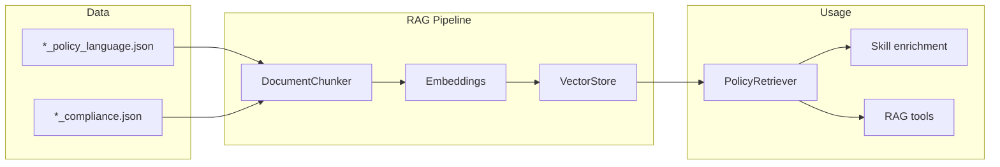

# RAG (Retrieval-Augmented Generation)

RAG provides semantic search over policy language and compliance regulations so agents can retrieve relevant context for claim processing. Agents get both **pre-loaded context** in their prompts (skill enrichment) and **on-demand search** via RAG tools.

## Overview

- **Data**: Policy and compliance JSON in `data/` (see [Data sources](#data-sources)).
- **Chunking**: Documents are split into semantic units (e.g., provisions, exclusions, deadlines).
- **Embeddings**: Chunks are embedded via sentence-transformers (default) or OpenAI.
- **Vector store**: In-memory store with cosine similarity search; can be cached to disk.
- **Retrieval**: `PolicyRetriever` searches by query and metadata (state, type, section).
- **Integration**: Skills are enriched with RAG context; agents also have RAG tools for dynamic lookup.

## Supported states

RAG is scoped by state. Supported jurisdictions:

| State     | Policy / compliance data |
|----------|---------------------------|
| California | Yes (default)            |
| Texas    | Yes                      |
| Florida  | Yes                      |
| New York | Yes                      |

Constants: `claim_agent.rag.constants.SUPPORTED_STATES`, `DEFAULT_STATE` ("California"). Use `normalize_state(value)` to validate and get canonical title-case names.

## Data sources

- **Policy language**: `data/<state>_auto_policy_language.json` — policy terms, coverage, exclusions, definitions.
- **Compliance**: `data/<state>_auto_compliance.json` — regulations, deadlines, disclosures, prohibited practices.

Files must include a `metadata` section with at least `data_type` (`"policy_language"` or `"compliance"`) and `state`. The chunker uses structure (sections, provisions, exclusions, deadlines, etc.) to produce meaningful chunks.

## Module layout

| Component   | Module / path              | Role |
|------------|----------------------------|------|
| Chunking   | `claim_agent.rag.chunker`  | Split JSON into `Chunk` + `ChunkMetadata` |
| Embeddings | `claim_agent.rag.embeddings` | `EmbeddingProvider` (sentence-transformers, OpenAI) |
| Vector store | `claim_agent.rag.vector_store` | Store/search embeddings; save/load cache |
| Retriever  | `claim_agent.rag.retriever` | High-level search, claim-type/coverage helpers |
| Context    | `claim_agent.rag.context`  | Enrich skills with RAG context; `RAGContextProvider` |
| Tools      | `claim_agent.tools.rag_tools` | CrewAI tools for agents |

## Chunking

- **DocumentChunker**: Reads JSON, dispatches by `metadata.data_type` to policy or compliance chunking.
- **Policy documents**: Sections → insuring agreements, exclusions, definitions, provisions, endorsements, sample language, limit of liability.
- **Compliance documents**: Sections → provisions, deadlines, disclosures, prohibited practices, requirements, limitations, scenarios.
- **Chunk**: `content`, `metadata` (`ChunkMetadata`), `chunk_id` (from content hash).
- Helpers: `chunk_policy_data(data_dir)`, `chunk_compliance_data(data_dir)`.

Chunk size is capped (`DocumentChunker.MAX_CHUNK_SIZE`, default 2000 chars) for context-window safety.

## Embeddings

- **EmbeddingProvider**: Abstract `embed(text)`, `embed_batch(texts)`, `dimension`.
- **SentenceTransformerEmbedding** (default): Local model, e.g. `all-MiniLM-L6-v2`; no API key.
- **OpenAIEmbedding**: API-based; uses `OPENAI_API_KEY`; retries on rate/transient errors.
- Factory: `get_embedding_provider(provider="sentence-transformers"|"openai", model_name=..., **kwargs)`.

Dependencies: `sentence-transformers` and `numpy` are in project deps; OpenAI needs `openai` if used.

## Vector store

- **VectorStore**: In-memory; `add_chunks(chunks)`, `search(query, top_k, state_filter, data_type_filter, section_filter, min_score)` (cosine similarity), `search_by_metadata(...)`, `get_chunk_by_id(id)`.
- Persistence: `save(path)`, `load(path)`, `VectorStore.load_from_disk(path)`.
- Stored files: `meta.json` (dimension, chunk count), `embeddings.npy`, `chunks.json`, `index.json`. Loading checks embedding dimension; mismatch raises `ValueError` (rebuild with `force_rebuild` or clear cache).

## Retriever

- **PolicyRetriever**: Wraps data dir, cache dir, embedding provider, and vector store.
  - **Index**: On init (`auto_load=True`), loads from cache if present and compatible; otherwise builds from `data_dir` (policy + compliance chunks), then saves cache.
  - **Paths**: Data dir defaults to project `data/`; cache dir from `CLAIM_AGENT_CACHE_DIR` or `~/.cache/claim_agent` (or Windows equivalent).
- **Search**: `search(query, top_k, state, data_type, section, min_score)` → list of `(Chunk, score)`.
- **Convenience**: `get_context_for_claim_type(claim_type, state, top_k)`, `get_context_for_coverage(coverage_type, state, top_k)`, `get_compliance_deadlines(state, action_type)`, `get_required_disclosures(state)`, `get_exclusions(coverage_type, state)`.
- **Formatting**: `format_context(chunks, include_metadata, max_length)` for prompt insertion.
- **Refresh**: `refresh_index()` clears and rebuilds from source; `load_or_build_index(force_rebuild=True)` forces rebuild.

**Global retriever**: `get_retriever(data_dir=None, force_new=False)` returns a singleton; different `data_dir` without `force_new=True` raises `ValueError`.

## Context integration (skill enrichment)

Skills can be loaded with RAG context so agents start with relevant policy/compliance in their backstory.

- **load_skill_with_context(skill_name, state, claim_type, use_rag)**  
  Loads the skill and, if `use_rag`, enriches it via a global `RAGContextProvider` (lazy). On RAG failure (e.g. missing data), falls back to un-enriched skill and logs a warning.

- **get_rag_context(skill_name, state, claim_type, top_k, retriever)**  
  Uses `SKILL_CONTEXT_QUERIES` (queries + sections per skill) and optional claim-type context; returns a single formatted context string.

- **enrich_skill_with_context(skill_dict, skill_name, state, claim_type, retriever)**  
  Gets RAG context and appends it to the skill’s backstory under a “Applicable Regulations and Policy Language” section (or sets a `context` field if no backstory).

- **RAGContextProvider(default_state, data_dir)**  
  - `get_context(skill_name, state, claim_type, use_cache)`  
  - `enrich_skill(skill_dict, skill_name, state, claim_type)`  
  - `get_claim_context(claim_type, state)`, `get_deadlines(state)`, `get_disclosures(state)`  
  - Caches context in an LRU (max 100 entries); `clear_cache()`, `get_stats()`.

Crews that use RAG (e.g. Total Loss) pass `state` and `use_rag` into agent factory functions; agents get enriched skills and optional RAG tools.

## RAG tools (agents)

Defined in `claim_agent.tools.rag_tools`; all accept state (California, Texas, Florida, New York) and use `normalize_state`. Listed in [Tools](tools.md) under RAG.

| Tool | Purpose |
|------|--------|
| **search_policy_compliance** | Natural language search over policy + compliance (`query`, `state`, optional `data_type`) |
| **get_compliance_deadlines** | Deadlines and time limits for a state |
| **get_required_disclosures** | Required disclosures (e.g. repair shop choice, parts type) |
| **get_coverage_exclusions** | Exclusions for a coverage type and state |
| **get_total_loss_requirements** | Total loss threshold, ACV, valuation, salvage, disclosures |
| **get_fraud_detection_guidance** | Fraud/SIU reporting and investigation guidance |
| **get_repair_standards** | Repair shop choice, DRP, parts, labor, supplementals |

Tools call the global retriever and return formatted text; on missing data or errors they return user-friendly messages and log details.

## Configuration

- **States**: Only supported states are indexed; use `normalize_state` in tools and callers.
- **Cache**: Set `CLAIM_AGENT_CACHE_DIR` to control where the vector store is saved/loaded.
- **Embedding provider**: Retriever uses default `get_embedding_provider()`; for custom provider, construct `PolicyRetriever(embedding_provider=...)` or `VectorStore(embedding_provider=...)`.
- **Rebuild**: After changing data files or embedding model, rebuild: `PolicyRetriever(..., auto_load=False).load_or_build_index(force_rebuild=True)` or `refresh_index()` on an existing instance.

## Usage summary

1. **Data**: Add or update `*_auto_policy_language.json` and `*_auto_compliance.json` in `data/`.
2. **Index**: First run (or after cache clear) builds and caches the vector store; subsequent runs load from cache when dimension matches.
3. **Crews/agents**: Use `state` and `use_rag=True` (e.g. `create_total_loss_crew(state="Texas", use_rag=True)`) so agents get enriched skills and RAG tools.
4. **Tools**: Agents call RAG tools when they need current policy/compliance during a run.

For tool-by-tool details and which agents use RAG tools, see [Tools](tools.md). For crew/agent wiring, see [Crews](crews.md) and [Skills](skills.md).
